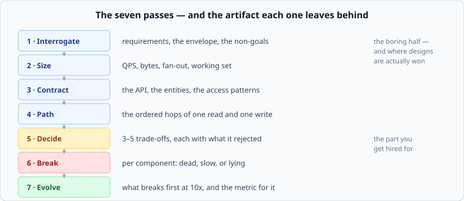

# The seven passes

*Week 1 · Day 1 · about 30 minutes*

> By the end of this you can name the seven passes in order and say what each one
> produces. You will not be good at them yet. Nobody is on day one.

---

## Why an order at all

Because the mistakes are ordered. Almost every bad design in this course will fail for
one of two reasons, and both are sequencing errors:

- **Components chosen before the load was counted.** You cannot know whether one
  database is enough until you know how many writes per second there are. Guess the
  architecture first and you spend the rest of the hour defending a guess.
- **A decision made before its alternative was named.** "We'll use a queue" is not a
  decision. "We'll use a queue rather than writing synchronously, because the write
  spike is 20x the average and the client does not need the result" is a decision. The
  difference is the second half of the sentence.

The seven passes exist to make those two mistakes structurally difficult.



Run them in order, every time, on every system, until the order stops feeling like a
checklist and starts feeling like impatience — the point where being handed a component
diagram makes you want to ask "how many requests per second?" before anything else.
That is what fluency here feels like.

---

## The worked example

One small system, carried through all seven. Deliberately not a famous one:

> **Notify me when a product is back in stock.** A shopper on a retail site clicks
> "tell me when this is available". When the item is restocked, they get an email.

Small enough to hold in your head. Big enough to have every interesting problem in it.

---

## Pass 1 — Interrogate

**Produces:** requirements, the non-functional envelope, and the non-goals.

The brief above is one sentence and it is not a specification. Before anything else you
turn it into something with edges.

| Question | Why it changes the design |
|---|---|
| How many products, how many shoppers? | decides whether this fits on one machine |
| How soon after restock must the email go? | one second and one hour are different systems |
| What if 50,000 people want the same product? | this is the whole problem, and the brief hides it |
| Can someone get two emails? Zero emails? | decides whether you need exactly-once anything |
| Who restocks — a human, or a feed? | decides whether you get an event or must poll |

And the one everyone forgets: **what are we not building?** No SMS. No push
notifications. No "notify me when the price drops". Not internationalised. Writing the
non-goals down takes ninety seconds and is the difference between finishing and drifting.

Tomorrow is entirely this pass.

## Pass 2 — Size

**Produces:** requests per second, bytes, fan-out, working set.

Arithmetic, before architecture. Say the retailer has 10 million products, 5 million
monthly shoppers, and 2% of them set a notification each month.

```
100,000 notification signups/month  ->  ~0.04 writes/s average
```

Forty writes per *thousand* seconds. That number changes everything: the signup path is
not a scaling problem and any suggestion that it is has been refuted by ten seconds of
multiplication.

But the *fan-out* is a different story. A restock of one popular item can mean 50,000
emails at once — and the spike matters more than the average, because systems fall over
at peak and nowhere else.

This is the pass that most people skip and it is the one that decides the design.
Wednesday is entirely this pass.

## Pass 3 — Contract

**Produces:** the API, the entities, the access patterns.

What can a client ask for, and what comes back?

```
POST /watches        {product_id, email}   -> 201
DELETE /watches/{id}                       -> 204
(internal) product restocked               -> event
```

Then the entities — and, crucially, **the queries they must serve**:

| Entity | Fields | Must answer |
|---|---|---|
| `watch` | id, product_id, email, created_at | "who is watching product X?" |

That one query is the entire data model decision. "Who is watching product X" means
`product_id` is how you look things up, which means it is the key you organise by. A
table keyed by email would be correct, sorted, tidy — and useless, because the question
you actually ask is the other one.

**A data model that cannot serve the query is not a data model.** Week 3 is this pass.

## Pass 4 — Path

**Produces:** the ordered hops of one read and one write.

Not a picture. A numbered list, because a list cannot hide a step the way a diagram can.

**Write — a shopper clicks "notify me":**

1. `POST /watches` reaches the API server
2. validate the email, check the product exists
3. insert one row
4. return 201

**Write — the item is restocked:**

1. restock event arrives
2. look up every watch for that product — *could be 50,000 rows*
3. for each one, send an email
4. delete the watch

Step 2 and 3 are where the system lives or dies, and writing them as a list is what made
that visible. A box diagram would have shown one arrow from "restock" to "email service"
and hidden the fifty thousand entirely.

## Pass 5 — Decide

**Produces:** three to five decisions, each with the alternative it rejected.

This is the pass you are hired for. The format matters:

> **Fan-out goes through a queue, not the restock request.**
> Rejected: emailing inline during the restock handler. At 50,000 recipients that
> request takes minutes and any retry re-sends every email already sent.
> **Price:** an email can now be delayed by however long the queue is backed up, and we
> need somewhere to put the queue.

Decision, alternative, reason, price. A "decision" missing the price is a preference.

Note that a technology has still not been named. It is a *queue* — the property needed
is "accept work quickly, process it slowly, survive the consumer being down". Which
queue is a question for later and a smaller one than it feels.

## Pass 6 — Break

**Produces:** for each component — dead, slow, or lying.

Three failure modes, and the middle one is the one that kills systems:

| Component | Dead | Slow | Lying |
|---|---|---|---|
| Database | no signups accepted | signups time out, clients retry, load doubles | returns stale rows — someone gets no email |
| Queue | events lost, or rejected | emails arrive hours late | delivers the same event twice — duplicate emails |
| Email provider | nothing sends | queue backs up | reports success, delivers nothing |

**A dead component is the easy case.** It is obvious, it pages someone, it gets fixed. A
slow one is subtle: it holds connections open, fills queues, triggers retries that add
load, and takes down healthy things around it. Most outages you will read about are a
slow dependency, not a dead one.

The queue row exposes the design's real question: it will deliver some events twice, so
either a shopper occasionally gets two emails, or you need something that makes the
second delivery a no-op. That is a requirement, and it should have come out in pass 1.
It didn't. This is normal — the passes are a loop, not a pipeline, and pass 6 sending
you back to pass 1 is the system working.

Week 9 is this pass.

## Pass 7 — Evolve

**Produces:** what breaks first at 10x, and the metric that shows it.

Not "how would I make this bigger". **What is the first thing to break, and how would I
know before a customer told me?**

At 10x: 1 million signups a month is still nothing. The fan-out is not — a viral restock
becomes half a million emails, and the email provider's rate limit becomes the binding
constraint rather than anything you built.

The metric that shows it: **queue depth**, and more precisely the age of the oldest
unprocessed message. Not CPU, not request count. The number that tells you the system is
losing is the one that measures how far behind it is.

---

## The passes are a loop

Written out, this looks like a waterfall. It is not. Pass 6 sent us back to pass 1 to
add a requirement about duplicate emails, and that is the normal case rather than a
failure.

What the order actually buys you is that **you never make a decision you have no
information for.** You can revisit as often as you like, as long as sizing precedes
architecture and alternatives precede decisions.

---

## Now go and be bad at it

Open [day 1's README](../../../week-01/day-1/README.md) and do the three timed designs.
Fifteen minutes each, a timer running, no AI, no reading.

You will not get through seven passes in fifteen minutes. You are not supposed to.
Finding out precisely where you stall — and it is nearly always pass 2, because
arithmetic feels like it is not real work — is the entire exercise.

---

> **Sources for this article**
> The seven passes are this course's own framing — **Tier 3**, our opinion, no authority
> behind it beyond the fact that it works. The individual ideas are not ours: sizing
> before architecture and the dead/slow/lying taxonomy both come from operational
> practice documented in the [AWS Builders' Library](https://aws.amazon.com/builders-library/)
> and the [Google SRE Book](https://sre.google/sre-book/) (both Tier 1).
> Where a course invents a framework, it should say so.
