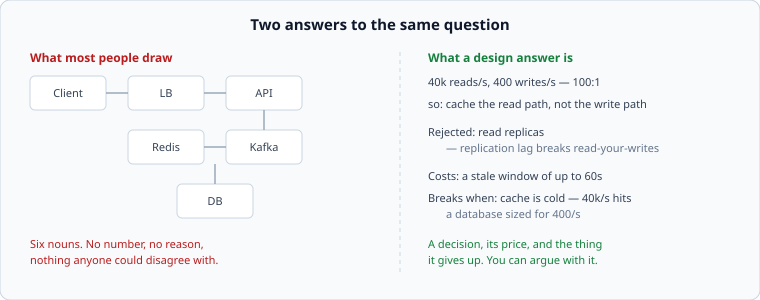

# What a design answer actually is

*Week 1 · Day 1 · about 25 minutes*

> By the end of this you can tell the difference between a diagram and a design, and
> you know which one you are being asked for.

---

## There is no official documentation for this

That sentence is the first lesson of the course, so read it twice.

Python has docs.python.org. HTTP has the RFCs and MDN. **System design has no
specification.** Nobody owns it, nobody standardised it, and the loudest sources — the
interview-prep sites, the newsletters, the YouTube whiteboard videos — are all Tier 3:
people interpreting systems they did not build.

What *does* exist is first-hand evidence of how real teams decide things:

| Source | Tier | What it gives you |
|---|---|---|
| [**Google SRE Book — Service Level Objectives**](https://sre.google/sre-book/service-level-objectives/) | 1 | How one company that runs enormous systems states its reliability targets, in their own words |
| [**AWS Builders' Library**](https://aws.amazon.com/builders-library/) | 1 | Amazon engineers describing the techniques they actually use, with the reasoning left in |
| [**Slack Engineering — Real-time Messaging**](https://slack.engineering/real-time-messaging/) | 1 | A named engineer describing a system she operates. You will take this one apart on Thursday |

Skim the first two now. Not to memorise — to notice something about the *shape* of how
they write. Nowhere in either does anyone say "we use Kafka because it is scalable".
Every claim has a number attached or a failure it prevents.

That is the shape you are learning.

---

## The question you are actually being asked

"Design a system that lets people shorten long URLs."

Almost everyone hears: *draw me the components*. So they draw a client, a load balancer,
an app server, a cache, a database, and a queue, and connect them with arrows, and stop.

The diagram on the left is not wrong. It is *empty*. Every system in the world could be
drawn that way, which means it distinguishes nothing and can be argued with by nobody.
Ask its author why the cache is there and you get "for performance". Ask what happens
when the cache is empty and the conversation ends.

**A design is a set of decisions, each with a reason, a rejected alternative, and a
price.** The boxes are a by-product. If you make the decisions honestly, the boxes draw
themselves; if you draw the boxes first, you will spend the rest of the hour defending
choices you never made.

---

## The three answers that fail

You will produce all three in the next hour. That is the point of today.

### 1. The box drawing

Components with no numbers. The tell: **nothing in the answer would change if the
system had a thousand users or a billion.** A design that works identically at every
scale has not engaged with the problem, because scale is the problem.

### 2. The name-drop

"I'd put Kafka here, Redis in front of Postgres, Cassandra for the writes."

Nouns, arranged. The tell: ask *what property of Kafka you need* and there is no answer,
because the technology was chosen before the requirement was known. Real engineers pick
tools late and grudgingly, and can usually tell you the two things they gave up.

There is a diagnostic for this, and it is brutal: **delete every proper noun from your
design. Is there anything left?** If the document collapses into nothing, you had a
shopping list, not a design.

### 3. The scope drift

Forty minutes in, still discussing whether the analytics pipeline should be real-time,
having never said how a URL gets stored. The tell: no non-goals were ever written down.
An engineer who cannot say what they are *not* building will not finish anything.

---

## What a good answer contains

Six things. Notice that only one of them is a picture.

| | |
|---|---|
| **Numbers** | derived, not asserted, and consistent with each other |
| **A contract** | what a client can ask for, and what comes back |
| **A path** | the ordered list of hops for one read and one write |
| **Decisions** | 3–5 of them, each naming what it rejected and why |
| **Failures** | what happens when each piece is dead, slow, or lying |
| **A limit** | what breaks first when this gets ten times bigger |

Week 1 is these six things, in that order, on a system small enough to finish. The rest
of the course is doing them on systems that are not.

---

## Who the answer is for

Two readers, and they want the same thing for different reasons.

**A colleague who has to build it.** They need to know what to type on Monday. They do
not care that you know what a bloom filter is; they care whether the write path is
specified precisely enough to implement without asking you six questions.

**An interviewer deciding whether to trust you with a system.** They are not checking
whether you know the answer — they know you can look it up. They are watching what you
do when the requirement is vague, whether you reach for arithmetic before architecture,
and whether you can say "I don't know, here's how I'd find out" without flinching.

Both of them are asking one question: *can this person be left alone with an ambiguous
problem?*

---

## The document is the deliverable

In this course you will write a design document every week. Not slides, not a diagram
with labels — a document, in prose, that someone could read without you in the room.

That is not an academic exercise. It is how the decision actually gets made at every
company you would want to work for: someone writes it down, other people attack the
writing, and the version that survives is what gets built. Amazon's meetings famously
open with everyone silently reading a document, precisely because a document cannot
hide behind a confident presenter and a nice diagram.

Writing exposes you. A vague thought survives being spoken and dies on the page, which
is exactly why the page is the tool.

---

## What today is

Three timed designs, fifteen minutes each, on three small systems. You will do all
three before you have learned anything about how to do them.

They will be bad. Mine were. The point is that on Friday, after four days, you redo one
of them and see the difference — and "I improved" is a feeling, while two documents side
by side is evidence.

Go to [the seven passes](the-seven-passes.md) next, then start the timer.

---

> **Sources for this article**
> [Google SRE Book](https://sre.google/sre-book/service-level-objectives/) (Tier 1, 2016) ·
> [AWS Builders' Library](https://aws.amazon.com/builders-library/) (Tier 1, updated continuously).
> Everything else here is this course's own opinion — Tier 3 — and is marked as such
> because a course that will not apply its own rule to itself is not worth much.
