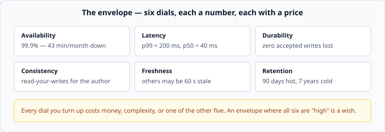
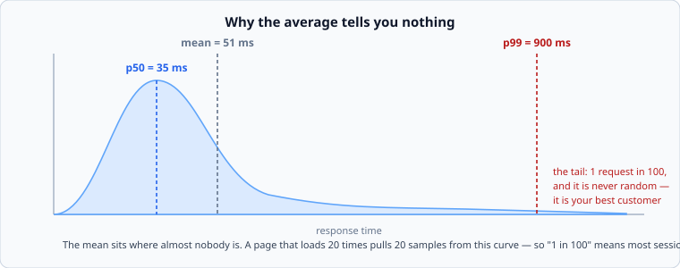

# The non-functional envelope

*Week 1 · Day 2 · about 30 minutes*

> By the end of this you can write six numbers that constrain a design, explain what
> each one costs, and say why the average response time is worse than useless.

---

## Read the primary sources first

| Source | Tier | What it gives you |
|---|---|---|
| [**Google SRE Book — Service Level Objectives**](https://sre.google/sre-book/service-level-objectives/) | 1 | SLI / SLO / SLA, error budgets, and why 100% is the wrong target |
| [**Google SRE Workbook — Implementing SLOs**](https://sre.google/workbook/implementing-slos/) | 1 | Choosing what to measure, with worked examples |
| [**AWS Builders' Library — Timeouts, retries and backoff with jitter**](https://aws.amazon.com/builders-library/timeouts-retries-and-backoff-with-jitter/) | 1 | What a latency target implies once you are the one calling someone else |

---

## Six dials



The envelope is the set of promises the system makes. Each one is a number. Each one
costs something — money, complexity, or one of the other five — which is why an envelope
with every dial turned to maximum is not ambitious, it is unserious.

---

## Availability, in minutes

"Highly available" means nothing. Nines mean something, and the useful move is to
convert them straight into downtime, because a budget of minutes is something a human
can reason about.

| Target | Per year | Per month | Per week |
|---|---|---|---|
| 99% | 3.65 days | 7.2 hours | 1.7 hours |
| 99.9% | 8.8 hours | 43.2 min | 10.1 min |
| 99.95% | 4.4 hours | 21.6 min | 5.0 min |
| 99.99% | 52.6 min | 4.3 min | 1.0 min |
| 99.999% | 5.3 min | 26 sec | 6 sec |

Read the 99.99% row again. **4.3 minutes a month** — less time than it takes a human to
read a page and decide to restart something. Every step down that table is roughly a
tenfold cost increase, and past 99.99% you are no longer buying redundancy, you are
buying the removal of every manual step from your recovery path.

### The error budget

The inversion that makes this useful: 99.9% available means you are *permitted* 43
minutes of failure a month. That is not a shameful margin, it is a resource. The SRE
Book's argument is that spending it deliberately — on releases, on migrations, on
risky-but-valuable changes — is the point. A team that never uses its error budget has
set its target too high and is paying for reliability nobody asked for.

**And 100% is always the wrong target.** The user's network fails more often than your
service will. Buying availability past the point where your customer can perceive it is
lighting money on fire.

---

## Latency, at a percentile



The average response time is the single most misleading number in systems work.
Response-time distributions have long right tails — most requests are quick, a few are
catastrophic — and an average pulled toward that tail describes an experience almost
nobody actually had.

So you state latency as percentiles:

| | Means | Use it for |
|---|---|---|
| **p50** | half of requests are faster | the typical feel of the product |
| **p95 / p99** | 1 in 20, 1 in 100 are slower | the target you design and alert on |
| **p99.9** | 1 in 1,000 | large systems, and anything with fan-out |

### Why the tail is not a rounding error

Two reasons, and both are worse than they sound.

**One page is many requests.** If a screen makes 20 calls and each has a 1% chance of
being slow, the chance that the *page* is slow is about 18%. The tail of your service is
the median of somebody's page.

**Fan-out multiplies it.** A request that waits on 100 parallel calls is as slow as the
slowest of the 100 — so your p99 becomes their typical case. This is why systems with
heavy fan-out chase p99.9 and p99.99, targets that look absurd until you do that
multiplication.

And the tail is not randomly distributed across your users. Slow requests correlate with
large accounts, big result sets, and cold caches — which means the customers hitting your
p99 are disproportionately your most valuable ones.

**Always write latency with a percentile attached.** "Under 200 ms" is not a
requirement. "p99 under 200 ms, measured at the load balancer" is.

---

## Durability

"How much accepted data may we lose?" — and note *accepted*. Rejecting a write is a
different, better failure than accepting one and losing it.

| Level | Means | Costs |
|---|---|---|
| Best effort | data lives on one machine | nothing; a disk failure is data loss |
| Durable locally | written to disk and replicated in one datacentre | a fsync on the write path |
| Durable regionally | replicated across availability zones before ack | milliseconds of added write latency |
| Durable globally | replicated across regions before ack | tens to hundreds of ms of added latency |

Every step is latency added to the write path, which is why "we cannot lose anything and
writes must be under 10 ms" is a sentence to push back on rather than design for. The
right question is *which* data — losing an analytics event is a Tuesday; losing a
payment is a lawsuit — and the answer is usually different per entity, which is a
perfectly good design.

---

## Consistency and freshness

Two different dials, constantly confused.

**Consistency** — what guarantees hold across readers and writers. The one that matters
most in practice is not a fancy one:

> **Read-your-writes**: after I post something, *I* see it. Someone else may not, yet.

Most products need exactly that and nothing stronger, and noticing this is what lets you
use a cache or a replica without breaking anything a user would notice.

**Freshness** — how stale a read is allowed to be. "Other people may see a 60-second-old
version" is a design decision with enormous consequences, and it is usually free from
the product's perspective. Nobody has ever complained that a follower count was a minute
old.

Getting these two written down separately is one of the higher-leverage things in pass
1, because "strong consistency" as a blanket requirement rules out most of the cheap
answers, and it is almost never what was actually meant.

---

## Retention

How long, and how quickly retrievable.

```
90 days hot   (queryable in milliseconds)
2 years warm  (queryable in seconds)
7 years cold  (retrievable in hours, for compliance)
```

Retention drives storage cost more than traffic does, and it is the requirement most
often left unstated until an auditor asks. It also frequently comes from law rather than
product, which means it is not negotiable and you should find out early.

---

## Cost, which is a real requirement

It rarely appears in the brief and it always exists. "Under $10k a month" changes a
design more sharply than most functional requirements — it is the difference between
replicating everything three ways and accepting an hour of recovery time.

If nobody gives you a cost constraint, invent a plausible one and state it. A design
with no cost ceiling is a design nobody has to make trade-offs in, and trade-offs are
the subject.

---

## The tell for a fake requirement

**Can you write a query that says whether we met it?**

| Stated | Measurable? |
|---|---|
| "The system should be fast" | no |
| "p99 read latency under 200 ms at the load balancer" | yes |
| "Highly available" | no |
| "99.9% of requests return a non-5xx over a 28-day window" | yes |
| "Data must be safe" | no |
| "Zero acknowledged writes lost given one AZ failure" | yes |

If it cannot be measured, nobody can tell whether you built the right thing, and it will
be settled by argument later instead of by arithmetic now.

That test is today's lab.

---

## Today's lab

`week-01/day-2/envelope.py`:

- `downtime_minutes(target, window)` — nines into minutes
- `parse_latency("p99 < 200ms")` — a stated target into numbers
- `is_measurable(requirement)` — the test above, in code
- `error_budget_remaining(target, window, minutes_down)` — how much of the budget is left

Then `pytest week-01/day-2 -v`.

---

> **Sources for this article**
> [Google SRE Book](https://sre.google/sre-book/service-level-objectives/) (Tier 1,
> Google, 2016) for SLO vocabulary and error budgets ·
> [Google SRE Workbook](https://sre.google/workbook/implementing-slos/) (Tier 1, 2018) ·
> [AWS Builders' Library](https://aws.amazon.com/builders-library/timeouts-retries-and-backoff-with-jitter/)
> (Tier 1, Amazon) for the caller's side of a latency target.
> The nines table is arithmetic. The six-dial framing is ours — Tier 3.
