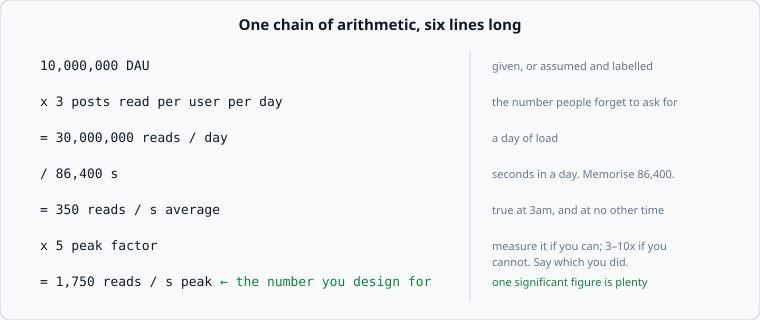

# Back of the envelope

*Week 1 · Day 3 · about 30 minutes*

> By the end of this you can take a user count and produce, in about four minutes,
> the requests per second, the bytes per day, the storage after a year, and the size
> of the thing you would like to keep in memory.

---

## There is no primary source for this, and that is fine

Back-of-the-envelope estimation is a craft, not a specification. Nobody publishes the
rules because there are none — only conventions that engineers pass around.

What *is* citable is the raw material:

| Source | Tier | What it gives you |
|---|---|---|
| [**Latency numbers every programmer should know**](https://gist.github.com/jboner/2841832) | 3 | The canonical table, widely circulated. Originally from **Jeff Dean** (Google) as conference-talk slides. This copy is a gist someone else transcribed — it is *not* a primary source, and treating it as one is the exact mistake this course exists to prevent |
| [**Interactive latency numbers, by year**](https://colin-scott.github.io/personal_website/research/interactive_latency.html) | 3 | The same numbers, with the years shown. Use it to see how much the table has moved since 2012 |
| [**Norvig — Teach Yourself Programming in Ten Years**](https://norvig.com/21-days.html) | 2 | The "Answers" table near the bottom is one of the earliest published versions |

So the honest position on the numbers you are about to learn: **they are approximately
right, they are a decade or two old, and their ratios matter more than their values.**
Say that out loud in an interview if you quote one, and you will look better rather than
worse.

---

## Why this pass decides everything

Because it is the only pass that can tell you the answer is easy.

A system doing 40 writes per second needs one database and no cleverness. The same
system at 400,000 writes per second needs partitioning, and a different data model, and
a conversation about what you are willing to lose. Those are not adjacent designs — they
share almost nothing — and the only thing that tells you which one you are in is
multiplication.

Skipping this pass means guessing which of two unrelated systems you are building. Most
people skip it because arithmetic feels like it is not real design work. It is the only
part of the hour that is not opinion.

---

## The chain



Six lines. Every sizing you do this course starts here.

### The numbers to memorise

There are four, and they are all you need.

| | |
|---|---|
| **86,400** | seconds in a day. Round to **100,000** and your arithmetic gets easier and stays within 16% |
| **2.5 million** | seconds in a month (30 days) |
| **~30 million** | seconds in a year |
| **1 KB** | a small record: a row of ids, a short message, a URL entry |

With those you can do most of this in your head. **10 million events a day at 1 KB each
is 10 GB a day, which is 3.6 TB a year, which fits on one disk.** That sentence takes
eight seconds and settles an argument that would otherwise take twenty minutes.

### Round aggressively

One significant figure. You are deciding between "one machine" and "a hundred machines",
and the gap between those is a factor of a hundred — so 350 versus 400 requests per
second is noise, and carrying it costs you time and accuracy in your head.

Rounding *up* is the convention, because being wrong in the direction of extra capacity
is cheaper than the alternative.

---

## Peak versus average

The one that separates a real estimate from a decorative one.

`350 requests/second` is what the average second looks like. There is no such second.
Real traffic has a daily shape — Slack's own engineers report peaks around 11am and 2pm
with a dip for lunch — and a system sized for the average is down every day at lunchtime.

| Situation | Peak multiplier |
|---|---|
| Global consumer traffic, spread across timezones | 2–3x |
| One country, business hours | 5–10x |
| Event-driven: a sale, a match, a broadcast | 50x or more, and unbounded |

If nobody gives you a measured peak, **assume 5x, say that you assumed it, and note what
changes at 10x.** That sentence is a senior engineer's sentence.

And watch for the top-of-the-hour effect: reminders, cron jobs, scheduled messages and
calendar alerts all cluster on the hour, which means a system with any scheduling in it
has spikes far sharper than its user behaviour suggests.

---

## Storage

```
records/day  x  bytes/record  x  retention days  x  replication factor
```

The two multipliers people forget are the last two.

**Retention.** 10 GB a day is 3.6 TB a year and 36 TB over ten. Whether you keep it for
90 days or seven years is a bigger lever on your storage bill than anything about the
data itself.

**Replication.** Three copies means three times the disk. Then indexes, which for
write-heavy workloads can approach the size of the data. Then compression, which may
claw back 2–10x for text. A useful rule: **compute the raw number, then multiply by
three, and note the assumption.**

### Sizing a record honestly

Add up the fields. Do not guess.

```
watch record:
  id            8 bytes
  product_id    8
  email        40
  created_at    8
  ------------------
              ~64 bytes, call it 100 with overhead
```

Database row overhead, index entries and padding are real, so a 2x fudge on a
field-by-field count is more honest than a round number pulled from the air.

---

## Bandwidth

```
requests/second  x  bytes/response  =  bytes/second
```

The number that matters is usually egress, and it matters because it is the line item
people forget until the bill arrives. 1,750 reads per second at 20 KB each is 35 MB/s,
about 3 TB a day — which is a real cost, and a reason to care whether that response
needs to be 20 KB.

Media makes this dominant. A video service's bandwidth cost dwarfs its compute cost, and
that single fact is why the CDN decision comes before the application design rather than
after it.

---

## Working set

The most useful number nobody computes: **how much of the data is actually being
touched?**

> 10 million products. In any hour, 20,000 of them account for most of the traffic.
> 20,000 x 2 KB = 40 MB.

Forty megabytes. That fits in memory on a laptop, let alone a server — which means the
cache decision is already made and the conversation about it can be short.

Access is almost never uniform. A small fraction of keys takes a large fraction of the
traffic, and **once you have the working-set number, the entire caching argument
collapses into arithmetic.** This is the highest-leverage line in the whole pass, and it
is the one most consistently missing from the designs you will read.

---

## Fan-out

```
one event  x  recipients  =  work
```

The number that turns a small system into a hard one, and it hides inside innocent
sentences.

- Restock a product with 50,000 watchers: **50,000 emails from one event**
- A user with 200 million followers posts: **200 million timeline writes, from one write**

The average is a trap here. Average fan-out is fine; the maximum is the design problem,
and the maximum is always some specific popular entity. **Ask for the maximum, every
time.** A design that handles the average fan-out and falls over on the largest account
has failed at exactly the moment anyone was watching.

---

## Doing it out loud

The performance an interviewer is grading:

> "Ten million daily users, three reads each — that is 30 million reads a day. Divided
> by roughly 100,000 seconds, call it 300 a second average. Peak at 5x, so 1,500 a
> second. Each response is about 20 KB, so 30 MB a second egress. Storage: 100 KB per
> user of profile and history, 10 million users, that is a terabyte, times three for
> replication, three terabytes. So: reads fit on a handful of machines, the whole
> dataset fits on one large one, and the interesting problem is somewhere else."

Sixty seconds. Notice the last sentence — the point of the arithmetic was to find out
where the difficulty is, and it turned out not to be where the brief implied.

---

## Today's lab

`week-01/day-3/sizing.py` — the chain, in code:

- `qps(daily_events)` and `peak_qps(qps, factor)`
- `daily_bytes(events_per_day, bytes_per_event)`
- `storage_bytes(events_per_day, bytes_per_event, retention_days, replicas)`
- `working_set_bytes(hot_keys, bytes_per_key)`
- `human_bytes(n)` — because "3,499,200,000,000" is not an answer anyone can use

Then `pytest week-01/day-3 -v`. Read [the latency numbers](latency-numbers-and-budgets.md)
next; you will need them for the milestone.

---

> **Sources for this article**
> The technique is craft, not specification — **Tier 3**, ours. The latency raw material
> is sourced above and is itself Tier 2/3, which the next article discusses. The Slack
> peak-hours observation is Tier 1:
> [Slack Engineering, 2023](https://slack.engineering/real-time-messaging/).
