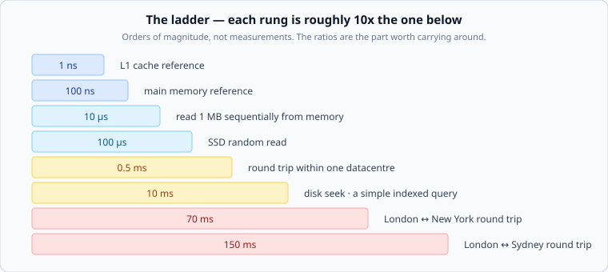

# Latency numbers, and spending them

*Week 1 · Day 3 · about 25 minutes*

> By the end of this you can add up the hops in a request path, say where the time
> went, and tell when a latency target is impossible before you try to design for it.

---

## Read the sources first — and notice what they are

| Source | Tier | Note |
|---|---|---|
| [**Latency numbers every programmer should know**](https://gist.github.com/jboner/2841832) | 3 | The famous table. Originally **Jeff Dean** (Google) in talk slides; this is a transcription by someone else. There is no canonical, dated, first-party publication of it |
| [**Interactive latency numbers by year**](https://colin-scott.github.io/personal_website/research/interactive_latency.html) | 3 | The same figures projected across years. Useful precisely because it shows how much has moved |
| [**Norvig — Approximate timing for various operations**](https://norvig.com/21-days.html) | 2 | One of the earliest published versions, by a named author on his own site |

This is a genuinely instructive case, so spend a moment on it.

The most-quoted table in system design **has no primary source**. It circulates as
gists, slides and screenshots. Its numbers were assembled well over a decade ago, and
some are now materially wrong — commodity SSD random reads have improved by roughly an
order of magnitude since, and "disk seek 10 ms" describes spinning rust that many
systems no longer contain.

The correct way to hold it: **the ratios are durable, the values are dated.** Memory is
about 100x faster than an SSD; an SSD is about 100x faster than a cross-country network
hop; the speed of light has not been renegotiated. Those relationships still hold and are
what you actually reason with.

If you quote a number from this table in an interview, say where it comes from and that
it is old. That is not hedging, it is the difference between someone who memorised a
table and someone who understands what it is.

---

## The ladder

Each rung roughly ten times the one below. Carry the ratios, not the digits.

The three that decide architectures:

| | |
|---|---|
| **Memory ~100 ns** | anything you can answer from RAM is effectively free |
| **Same-datacentre round trip ~0.5 ms** | a network hop inside a region is cheap, but it is not free, and you will make several |
| **Cross-continent round trip 70–150 ms** | **this one is physics**, and no amount of engineering will fix it |

That last row is the most important line in this article.

---

## The speed of light is a requirement

Light in fibre travels about 200,000 km/s. London to New York is roughly 5,600 km, so
one way is 28 ms at the theoretical best and a real round trip is 70–80 ms once routing
and equipment are counted.

**Consequences you cannot design around:**

- A user in Sydney talking to a server in Virginia will not see a sub-100 ms response.
  Not with a faster database, not with a better cache, not ever.
- "p99 under 50 ms globally" and "one region" are contradictory requirements. Notice
  this in pass 1 and you have saved everyone an hour.
- Any design that crosses an ocean *twice* in one request has spent 150 ms before doing
  any work.

Whenever a latency target and a geography appear in the same brief, check them against
each other before designing anything. Sometimes the answer is "this requires data close
to users", which is a large architectural commitment that was hiding inside a number.

---

## Budgets: latency is spent, not achieved

A target is a budget, and every hop is a withdrawal. Take a 200 ms p99 for a product
page:

| Hop | Spend | Left |
|---|---|---|
| Client to edge (mobile network) | 40 ms | 160 |
| Edge to origin region | 20 ms | 140 |
| Load balancer to app server | 1 ms | 139 |
| App to cache (hit) | 1 ms | 138 |
| App to database (miss path) | 10 ms | 128 |
| Rendering and serialisation | 15 ms | 113 |
| Response back to client | 60 ms | **53 ms spare** |

Write the table before designing, and two things become obvious immediately.

**Where the budget actually goes.** 100 of the 200 ms went to the client's network,
before your code ran. Optimising a 10 ms query to 5 ms buys 2.5% of the budget. Moving
the response closer to the user buys ten times that. This is why CDNs exist and why
database micro-optimisation is usually the wrong first move.

**How many sequential hops you can afford.** Every one costs a round trip. A design with
six services calling each other in a chain has spent 3 ms in pure network overhead on a
good day — and on a bad day, at p99 each, far more than the sum suggests.

---

## The p99 of a chain is not the p99 of its parts

The trap that catches everyone, and it works in two directions.

**Sequential calls.** If a request makes 5 calls each with a 1% chance of being slow,
the request has roughly a 5% chance of being slow. Your service's p95 is built from your
dependencies' p99s.

**Parallel fan-out.** A request that waits on 100 parallel calls is as slow as the
*slowest* of them. With 100 calls, you are sampling the 99th percentile essentially
every time — so your typical response inherits your dependency's worst case.

This is the reason large fan-out systems chase p99.9 and p99.99 targets that look
paranoid from the outside. They are not being fastidious; they are doing the
multiplication.

**Design consequence:** reduce the number of things a request waits on. A design that
fans out to 100 services and one that fans out to 5 are not the same design with a
different number, and no amount of tuning closes that gap.

---

## Timeouts belong in the budget

A hop with no timeout has an unbounded budget, which means your p99 is whatever your
slowest dependency feels like today.

The AWS Builders' Library article on
[timeouts, retries and backoff with jitter](https://aws.amazon.com/builders-library/timeouts-retries-and-backoff-with-jitter/)
is the primary source here and worth reading in full during week 9. Two ideas to take
now:

- **Every remote call gets a timeout**, and it should be derived from the budget rather
  than picked from the air. If the hop has 20 ms of budget, a 30-second default timeout
  is not a safety net — it is a decision to break the SLO rather than fail fast.
- **A retry doubles the work when the system is already failing.** Retries are a
  capacity decision as much as a reliability one, which is why week 9 spends a day on
  them.

---

## What to actually memorise

Six facts, and they will carry you a long way:

| | |
|---|---|
| Memory read | ~100 ns |
| SSD random read | ~100 µs — 1,000x slower than memory |
| Same-datacentre round trip | ~0.5 ms |
| Cross-country round trip | ~70 ms |
| Cross-planet round trip | ~150 ms |
| Seconds in a day | 86,400 — call it 100,000 |

Everything else you can derive or look up. What you cannot look up mid-sentence is the
*sense* of which operations are in which league, and that is what these six give you.

---

## Today's lab

`week-01/day-3/sizing.py` includes the budget side:

- `budget_remaining(target_ms, hops)` — spend a budget across a hop list, and say where
  it went negative
- `is_geographically_possible(target_ms, km)` — check a target against the speed of light
  before designing for it

`pytest week-01/day-3 -v`.

---

> **Sources for this article**
> The latency table is **Tier 3** with a Tier 2 ancestor ([Norvig](https://norvig.com/21-days.html)),
> and this article says so at length because it is the clearest example in the course of
> a load-bearing number with no primary source.
> [AWS Builders' Library](https://aws.amazon.com/builders-library/timeouts-retries-and-backoff-with-jitter/)
> is Tier 1 for timeouts and retries. The speed-of-light figures are physics and
> arithmetic.
