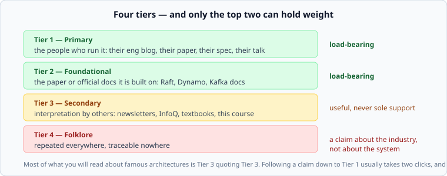
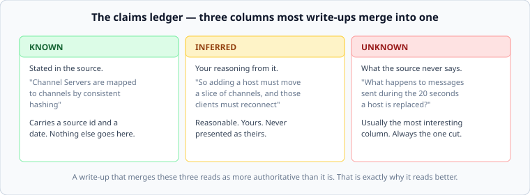

# Source tiers, and the claims ledger

*Week 1 · Day 4 · about 25 minutes*

> By the end of this you can tell how much weight a source can carry, and split what
> you have read into what is known, what you inferred, and what nobody has published.

---

## The problem this solves

Ask a search engine, or a model, how any famous system works. You will get a confident,
fluent, well-organised answer in seconds. It will contain numbers. It will contain no
dates and no sources, and a portion of it — you will not be able to tell which portion —
will be wrong or a decade out of date.

That is a bad foundation for a design, and a worse one for an interview, because the one
question that destroys a memorised answer is *"where did you get that?"*

The fix is not to read more. It is to **track provenance while you read**, which costs
almost nothing at the time and is impossible to reconstruct afterwards.

---

## The four tiers



| Tier | Meaning | Recognise it by |
|---|---|---|
| **1 — Primary** | The people who build or run the system | on their own domain, a named author, usually a date, and specific numbers they had no reason to invent |
| **2 — Foundational** | The paper or official docs the system is built on | a venue and a year; official documentation for the actual software |
| **3 — Secondary** | Interpretation by people who did not build it | explains rather than reports; cites others, or nobody |
| **4 — Folklore** | Repeated everywhere, traceable nowhere | "it is well known that…", numbers with no date |

**Tier 3 is not the enemy.** A good secondary source is often the clearest explanation
available and a much better place to start than a dense paper. This course is Tier 3.
The rule is only that Tier 3 is never *the last word* — a claim resting on it alone is
marked as unverified, not stated as fact.

### The two-click test

Take any interesting claim from a secondary source and follow its citation. Then follow
that one's.

Usually one of three things happens:

1. You land on a Tier 1 post or paper. Excellent — cite *that*, not the thing that led
   you there.
2. You land in a circle: three sites citing each other. The claim has no origin.
3. You land nowhere. The claim was asserted.

Doing this ten times permanently changes how you read. Most of what "everyone knows"
about famous architectures is case 2 or 3.

---

## Dates are half of a source

An architecture post describes the day it was written. Companies rewrite their systems;
posts are rarely updated to say so.

| Claim | Without a date | With one |
|---|---|---|
| "Twitter uses Ruby on Rails" | wrong | true in 2009, and interesting |
| "Slack delivers messages in 500 ms" | unverifiable | Slack Engineering, 2023 — recent enough to trust |
| "Disk seek is 10 ms" | misleading in 2026 | fine for a spinning disk, and most systems now use flash |

So every source you record gets two dates: when it was **published**, and when you
**retrieved** it. And every case study gets a *Where this is now* section, even if that
section says "no public update since 2019" — because that is itself information, and it
tells the reader how much of what follows is history.

---

## The claims ledger



When you finish reading a source, split what you have into three columns. This is the
habit that makes the difference.

**Known** — stated in the source, in their words, with the source id attached.

**Inferred** — your reasoning from what is stated. Often the most valuable part of your
work, and it is *yours*. Presenting an inference as a fact about someone else's system is
the specific dishonesty this course is built to prevent, and it is the thing most
architecture write-ups do constantly.

**Unknown** — the questions the source does not answer. Almost always the most
interesting column, and almost always the one cut before publication, because it makes
an article look less authoritative. It makes it *more useful*: knowing precisely where
the public record stops is what lets you say "here is where I would have to find out"
instead of bluffing.

### It also fixes interviews

An interviewer asks how Slack handles a Channel Server dying. Two answers:

> "They use consistent hashing so channels get remapped."

versus

> "Their 2023 post says Channel Servers map to channels by consistent hashing, and that
> a replacement is ready in under twenty seconds. It does not say what happens to
> messages sent during that window — my guess is clients reconnect and refetch recent
> history, but that is me inferring, not them saying."

The second answer is longer, more honest, and enormously more impressive. It shows you
read the source, you know its limits, and you can reason past them while labelling the
reasoning. That is what senior sounds like.

---

## Recording it

Every case study in this course carries a source file. The format is small on purpose:

```yaml
system: Slack real-time messaging
sources:
  - id: slack-rtm-2023
    title: Real-time Messaging
    url: https://slack.engineering/real-time-messaging/
    publisher: Slack Engineering
    author: Sameera Thanugdu
    tier: 1
    published: 2023-04-11
    retrieved: 2026-09-02

claims:
  - id: cs-consistent-hashing
    text: Channel Servers map to a subset of channels by consistent hashing
    kind: known
    sources: [slack-rtm-2023]

  - id: cs-reconnect-cost
    text: Replacing a host must therefore move a slice of channels, forcing reconnects
    kind: inferred
    sources: [slack-rtm-2023]

  - id: cs-inflight-messages
    text: What happens to messages sent during the replacement window
    kind: unknown
```

`python3 tools/check_sources.py` enforces the rules: every source has a tier and two
dates, every claim cites something, and no `known` claim rests on Tier 3 alone. It runs
in about a second and it will fail your milestone if you get lazy on a Friday afternoon.

That is deliberate. The discipline is only worth anything if it holds when you are tired.

---

## Today

Read [reading an engineering blog post](reading-an-engineering-blog.md), then take the
Slack post apart yourself and build its ledger. Today's lab (`week-01/day-4/triage.py`)
has you implement the tier rules and the "no known claim on Tier 3 alone" check in code
— which is the fastest way to stop treating them as vibes.

---

> **Sources for this article**
> The tier scheme is this course's own — **Tier 3**, ours, and applied to itself
> throughout. The known/inferred/unknown split is ordinary scholarly practice rather than
> anyone's invention. The Slack examples come from
> [Slack Engineering, 2023](https://slack.engineering/real-time-messaging/) — Tier 1.
