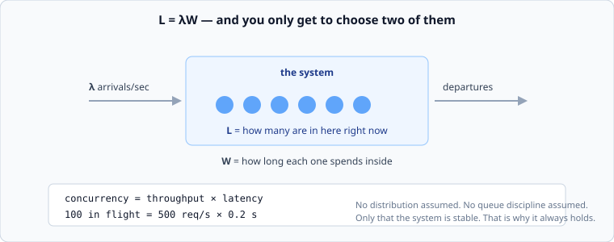

# Little's Law

*Week 2 · Day 1 · about 25 minutes*

> By the end of this you can compute how many requests are inside your system right
> now, size a thread pool from a latency target, and explain why you cannot improve
> throughput and latency and concurrency independently.

---

## Read the primary sources first

| Source | Tier | What it gives you |
|---|---|---|
| [**Google SRE Book — Addressing Cascading Failures**](https://sre.google/sre-book/addressing-cascading-failures/) | 1 | Queues, latency and how a system tips over, written by the people who watched it happen |
| [**AWS Builders' Library — Using load shedding to avoid overload**](https://aws.amazon.com/builders-library/using-load-shedding-to-avoid-overload/) | 1 | The operational consequence: what you do when arrivals exceed what you can serve |
| **Little, J. D. C. (1961), "A Proof for the Queuing Formula: L = λW"** ([DOI](https://doi.org/10.1287/opre.9.3.383)) | 2 | The theorem itself. Paywalled, so cited rather than linked usefully — the result is what matters and it is one line |

Read the SRE chapter's opening sections today. You will come back to it in week 9.

---

## One equation

```
L  =  λ  ×  W
```

In a stable system, the average number of things **inside** it equals the rate they
**arrive** multiplied by the average time each one **stays**.



That is the whole thing. What makes it remarkable is what it does *not* require: no
assumption about the arrival distribution, the service distribution, the queue
discipline, or the number of servers. It holds for a web service, a hospital, a
warehouse and a queue at passport control, and it holds exactly rather than
approximately.

The only requirement is **stability** — over the window you measure, what goes in comes
out. If arrivals permanently exceed departures, nothing here applies and you have a
different, worse problem.

---

## The engineering translation

```
concurrency  =  throughput  ×  latency
```

Read it three ways, because each is a different tool:

| Solve for | Question it answers |
|---|---|
| `L = λW` | how many requests are in flight right now? |
| `W = L / λ` | how long is something waiting in a queue of this depth? |
| `λ = L / W` | what throughput can this concurrency limit support? |

### In flight

A service handling **500 requests a second** with an average latency of **200 ms** has

```
L = 500 × 0.2 = 100 requests inside it at any moment
```

One hundred. Not five hundred. This number decides your thread pool, your connection
pool, your memory per request, and your file descriptor limit — and almost nobody
computes it, which is why those limits are usually set by copying a config file.

### How long is that queue

A backlog of **10,000 messages** draining at **200 per second**:

```
W = 10,000 / 200 = 50 seconds behind
```

This is the arithmetic behind the metric that matters most for any queue: not its
depth, but the **age of its oldest item**. Depth alone means nothing without the drain
rate, and the drain rate is the thing that changes during an incident.

### What can this support

A connection pool of **50** against a database with **10 ms** queries:

```
λ = 50 / 0.01 = 5,000 queries a second
```

And if the query time triples to 30 ms under load, the same pool supports 1,667/s —
**a third of the throughput, with no change to the pool, the code, or the hardware.**
That is the mechanism by which one slow dependency silently caps a whole service, and
it is the single most useful thing this law tells you.

---

## You get to choose two

Rearranged: **throughput and latency are not independent once concurrency is capped.**

Every real system caps concurrency somewhere — threads, connections, memory, a
semaphore, or the operating system deciding for you. Once it is capped:

> **If latency goes up and concurrency cannot, throughput must come down.**

Nothing you do changes that. It is arithmetic, not engineering. So when a dependency
slows down, your throughput falls whether or not anything is "wrong" with your service,
and the graph that shows it will look like your service failing.

This is also why "just add threads" is usually wrong. Raising `L` raises throughput only
until something else — CPU, the database, a lock — becomes the constraint, and past that
point the extra threads add queueing rather than work. You have moved the queue inside
your process, where it is harder to see and impossible to shed.

---

## Where people get it wrong

**Using peak arrivals with average latency.** Both numbers must describe the same
window. Peak λ with average W understates concurrency exactly when you most need it
right.

**Forgetting queue time is part of W.** `W` is time *in the system*, not time being
served. A request that waits 400 ms and executes in 20 ms has `W = 420 ms`. This is why
measured concurrency is usually far higher than people expect — most of what is "in the
system" is waiting, not working.

**Applying it to an unstable system.** During an overload, arrivals exceed departures,
`L` grows without bound, and the law tells you nothing except that you are in trouble.
Which, to be fair, is worth knowing.

---

## Today's lab

`week-02/day-1/littles.py`:

- `concurrency(throughput, latency_s)` — the base case
- `wait_seconds(queue_depth, drain_rate)` — how far behind a backlog is
- `max_throughput(concurrency_limit, latency_s)` — what a pool can support
- `pool_size(throughput, latency_s, headroom=1.5)` — sizing, with headroom, rounded up
- `throughput_after_slowdown(pool, old_latency_s, new_latency_s)` — the number that
  explains most incidents

Then read [concurrency and pools](concurrency-and-pools.md).

---

> **Sources for this article**
> Little's Law is a theorem (Little, 1961 — **Tier 2**, paywalled).
> [Google SRE Book](https://sre.google/sre-book/addressing-cascading-failures/) and the
> [AWS Builders' Library](https://aws.amazon.com/builders-library/using-load-shedding-to-avoid-overload/)
> are **Tier 1** for the operational consequences. The worked numbers are arithmetic.
