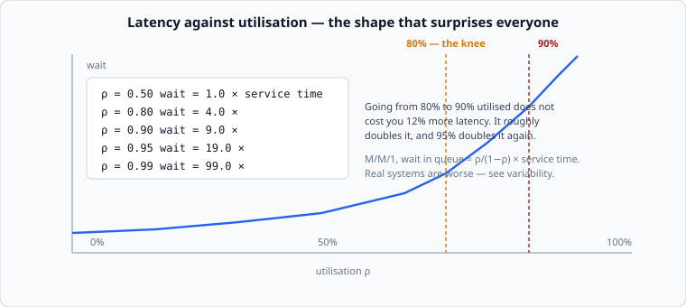

# Utilisation, and the knee

*Week 2 · Day 2 · about 30 minutes*

> By the end of this you can say what happens to latency when a service goes from 80%
> to 90% utilised, and why "we have 10% headroom left" is not a reassuring sentence.

---

## Read the primary sources first

| Source | Tier | What it gives you |
|---|---|---|
| [**Google SRE Book — Handling Overload**](https://sre.google/sre-book/handling-overload/) | 1 | What a service does when demand approaches capacity, from people running some of the largest |
| [**Google SRE Book — Addressing Cascading Failures**](https://sre.google/sre-book/addressing-cascading-failures/) | 1 | How the knee turns into an outage, with the feedback loops named |
| [**AWS Builders' Library — Using load shedding to avoid overload**](https://aws.amazon.com/builders-library/using-load-shedding-to-avoid-overload/) | 1 | The other side: deciding, deliberately, not to serve some requests |

---

## The number that decides everything

**Utilisation**, written ρ, is the fraction of capacity in use:

```
ρ  =  arrival rate  /  service rate
```

A server that can handle 100 requests a second, receiving 80, is at ρ = 0.8.

Everyone's intuition is that latency rises smoothly with utilisation — that 90% busy
means a bit slower than 80% busy. It does not.



For the simplest queue — one server, random arrivals, random service times — the time
spent waiting is

```
wait  =  ρ / (1 − ρ)  ×  service time
```

| ρ | Wait, in service times | Going from the row above |
|---|---|---|
| 0.50 | 1.0 | — |
| 0.70 | 2.3 | +130% |
| 0.80 | 4.0 | +74% |
| 0.90 | 9.0 | +125% |
| 0.95 | 19.0 | +111% |
| 0.99 | 99.0 | +421% |

Read the last column. **Each 5–10 point step in utilisation roughly doubles the wait.**
There is no region where adding load is cheap; there is only a region where it is
survivable.

---

## Why the shape is like that

The intuition is worth more than the formula.

At ρ = 0.5, half the time the server is idle. A burst of three requests arrives; the
idle time absorbs it, and by the time the next burst comes the queue is empty again.
**Idle time is not waste, it is the shock absorber.**

At ρ = 0.95 there is almost no idle time left. A burst arrives, and there is nowhere to
put it — the queue that forms has to be worked off during slack that barely exists.
Queues built during a burst take far longer to drain than they took to form.

At ρ = 1.0, the queue never drains. Latency is not "high", it is **unbounded and
growing**, and the only thing that stops it is memory running out or someone giving up.

This is also why the average is such a poor guide. A service at 60% average utilisation
that spends ten minutes a day at 95% does most of its damage in those ten minutes, and
the daily average will never show it.

---

## Design consequences

**Headroom is a feature, not slack to be reclaimed.** The instinct to "improve
efficiency" by running at 90% is buying a small amount of hardware cost with a large
amount of latency and a much thinner margin before collapse. Most well-run services
target 60–75% at peak — the SRE book's chapters on overload are, in large part, an
argument for exactly that.

**Autoscaling does not save you at the knee.** From the decision to scale, to an
instance booting, warming its caches and opening connections, is minutes. The knee
arrives in seconds. Autoscaling handles the daily shape; it does not handle a spike, and
a design that relies on it for spikes has an unexamined assumption in it.

**Retries push ρ past 1, instantly.** When latency rises, clients time out and retry.
Retries are new arrivals. λ goes up exactly when the service is least able to absorb it,
and the system crosses from "slow" to "collapsing" without anything else changing. This
is the central feedback loop in the cascading-failures chapter and it is worth reading
twice.

**A retry budget is a capacity decision.** Everything in week 9 about retries follows
from this graph rather than from reliability theory.

---

## Pools do better than servers

One more result, and it changes how you think about splitting things up.

Ten separate servers, each at 80% utilisation, behave **worse** than one pool of ten
servers at 80%. Same hardware, same total load. In the separated case, a burst at server
three cannot use the idle capacity at server seven; in the pooled case it can.

Larger pools tolerate higher utilisation for the same latency. This is why one shared
cluster usually beats many small dedicated ones, and it is a real cost of partitioning
that week 4 will make you weigh: **every time you split traffic into smaller independent
pools, you lose some of this statistical sharing.**

The counter-argument is isolation — a shared pool shares its failures too. That tension
does not resolve; you choose a point on it, and saying which point and why is a good
design decision.

---

## What to do with this in a design

In pass 2, after you compute peak QPS, do one more line:

```
peak QPS / capacity per instance = ρ at peak
```

If that is above about 0.8, your design has a latency problem it has not admitted to,
and adding instances is now a stated decision rather than an afterthought.

In pass 6, ask what ρ becomes when one instance dies. Three instances at 65% become two
at **97%**, which is not "a bit more loaded", it is the far end of that table. Losing
one of three is the most common outage shape there is, and the arithmetic takes ten
seconds.

---

## Today's lab

`week-02/day-2/queueing.py`:

- `utilisation(arrival_rate, service_rate)`
- `wait_time(service_time_s, rho)` — the M/M/1 queue wait
- `response_time(service_time_s, rho)` — wait plus service
- `max_arrival_rate(service_rate, target_rho)` — how much load fits under a target
- `utilisation_after_losing_one(instances, rho)` — the outage arithmetic above
- `servers_needed(arrival_rate, service_rate, target_rho)`

Then read [variability](variability.md) — because everything above is the *optimistic*
case.

---

> **Sources for this article**
> [Google SRE Book](https://sre.google/sre-book/handling-overload/) and
> [Addressing Cascading Failures](https://sre.google/sre-book/addressing-cascading-failures/),
> **Tier 1** · [AWS Builders' Library](https://aws.amazon.com/builders-library/using-load-shedding-to-avoid-overload/),
> **Tier 1**. The M/M/1 wait formula is standard queueing theory. The "60–75% at peak"
> figure is our summary of common practice — **Tier 3**, and you should ask anyone who
> states it more precisely where they got it.
