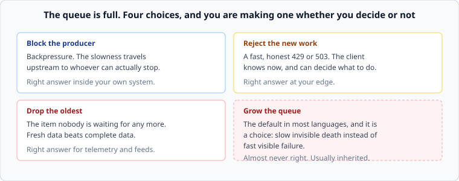

# Queues, and what to do when they fill

*Week 2 · Day 3 · about 30 minutes*

> By the end of this you can say what a queue is actually for, choose what happens when
> one is full, and name the metric that tells you a queue is losing.

---

## Read the primary sources first

| Source | Tier | What it gives you |
|---|---|---|
| [**AWS Builders' Library — Using load shedding to avoid overload**](https://aws.amazon.com/builders-library/using-load-shedding-to-avoid-overload/) | 1 | Why rejecting work is a service you provide, not a failure |
| [**Google SRE Book — Handling Overload**](https://sre.google/sre-book/handling-overload/) | 1 | Queue management at the scale where the decision cannot be manual |
| [**Google SRE Book — Addressing Cascading Failures**](https://sre.google/sre-book/addressing-cascading-failures/) | 1 | The section on queue management is short and is the best two pages on this anywhere |

---

## A queue is a shock absorber, not storage

The one sentence to carry out of this week.

A queue absorbs a **temporary** mismatch between how fast work arrives and how fast it
is done. Arrivals are bursty; service is steady; the queue smooths the difference. That
is its entire job.

What a queue cannot do is fix a **sustained** mismatch. If the arrival rate exceeds the
service rate on average, the queue grows without bound and every item in it gets slower
until something breaks. No queue depth is large enough, because the problem is not
capacity, it is arithmetic.

So there are exactly two states a queue can be in, and you should always know which one
you are looking at:

| | Depth | What it means |
|---|---|---|
| **Absorbing** | rises and returns to near zero | working as designed |
| **Losing** | rises and does not come back | ρ > 1. The queue is now just a slower way to fail |

A dashboard showing queue depth without showing whether it returns to zero tells you
almost nothing.

---

## The metric is not depth

From Little's Law: a depth of 10,000 draining at 200/s means the item at the back waits
50 seconds. Depth alone is meaningless — the same depth on a faster consumer is fine.

**Measure the age of the oldest unprocessed item.** It is in the unit that matters
(seconds behind), it needs no mental arithmetic during an incident, and it is directly
comparable to your freshness requirement from pass 1.

If your envelope says "95% of notifications within 5 minutes", then "oldest item age
> 5 minutes" *is* the alert. Depth would have required you to know the drain rate, which
during an incident is the thing that is changing.

---

## When it is full

Four choices. You are making one of them whether or not you decided.

### Block the producer — backpressure

The producer waits until there is room. The slowness travels **upstream**, toward
whoever is actually able to slow down — and eventually to a component that can make a
real decision, or to a human.

This is the right default inside your own system, and it is what a bounded channel or a
blocking pool gives you. The important property is that it makes the constraint visible
where it can be acted on, instead of hiding it in a growing buffer.

The danger: backpressure that propagates all the way to a user-facing request turns into
a timeout, and a timeout turns into a retry, and a retry is a new arrival. Backpressure
must terminate in something that **rejects**, not in something that waits forever.

### Reject the new work

A fast 429 or 503. The client finds out immediately and can decide: retry later, degrade,
or tell the user.

This is the right answer at your edge, and the AWS article is a sustained argument for
it: a service that stays up and serves 80% of requests has done its job far better than
one that accepts everything and serves nothing before the timeout. **Rejecting work is
something you do on purpose to protect the work you accepted.**

### Drop the oldest

Counter-intuitive and often correct. If the queue holds telemetry, position updates, or
anything where fresh matters more than complete, the oldest item is the least valuable
thing in the queue — quite possibly nobody is waiting for it any more.

For a request queue there is a stronger version of this argument, and it is one of the
genuinely surprising results in the field.

### Grow the queue

The default in most languages, and it is a choice. It converts a fast visible failure
into a slow invisible one: everything gets late, dashboards keep showing traffic being
accepted, and eventually the process dies of memory exhaustion — usually taking its
in-flight work with it.

---

## The LIFO surprise

Under overload, serving the **newest** request first can be better than serving the
oldest.

The reasoning: if requests have been queued for longer than the client's timeout, the
client has already given up. Serving them is pure waste — you burn capacity producing
answers nobody will read, which makes the next request wait longer, which pushes more
requests past their timeout. FIFO under sustained overload can serve nothing useful at
all while looking fully busy.

LIFO serves the requests most likely to still have somebody waiting. It is unfair, and
that is the point: under overload you are choosing who to disappoint, and disappointing
the people who have already left is the cheapest option available.

You will not build this. You should know it exists, because it is the clearest
demonstration that **queue discipline is a design decision** rather than a detail of the
library you used.

---

## Where the queue goes in a design

Two questions to answer for every queue in your pass 4:

1. **What is its bound?** A number. "Unbounded" is an answer, but you have to write it
   and say what makes that safe.
2. **What happens when it is full?** One of the four above, named.

And one question in pass 6: **what happens when the consumer has been down for an hour
and then comes back?** The queue is now at maximum depth, the consumer starts at full
speed, and everything downstream of it receives an hour of traffic compressed into
minutes. A design that survives a consumer being down but not a consumer coming back is
a common and expensive shape.

---

## Today's lab

`week-02/day-3/backpressure.py`, and this is the first lab that runs on `simlib`.

You implement a `BoundedQueue` with a policy — `block`, `reject`, `drop_oldest` — and a
consumer that drains it at a fixed rate. The tests run producers against it under
different arrival patterns and check what actually happens: what is served, what is
dropped, how far behind the oldest item gets, and whether the queue recovers after a
burst.

The interesting test is the last one. A burst that a bounded queue absorbs cleanly, an
unbounded queue turns into a latency problem lasting minutes — in the same simulation,
with the same arithmetic, and you can see the difference in the trace.

---

> **Sources for this article**
> [AWS Builders' Library — load shedding](https://aws.amazon.com/builders-library/using-load-shedding-to-avoid-overload/)
> and [Google SRE Book — Handling Overload](https://sre.google/sre-book/handling-overload/)
> / [Addressing Cascading Failures](https://sre.google/sre-book/addressing-cascading-failures/),
> all **Tier 1**, and all three make the LIFO-under-overload and reject-early arguments
> in their own words. The four-choice framing is ours — **Tier 3**.
