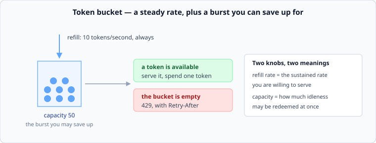

# Rate limiting

*Week 2 · Day 4 · about 30 minutes*

> By the end of this you can pick a rate-limiting algorithm and say what it does at the
> window boundary, what it costs to store, and what it does across ten servers.

---

## Read the primary sources first

| Source | Tier | What it gives you |
|---|---|---|
| [**AWS Builders' Library — Using load shedding to avoid overload**](https://aws.amazon.com/builders-library/using-load-shedding-to-avoid-overload/) | 1 | The reason limiting exists: protecting the work you already accepted |
| [**Google SRE Book — Handling Overload**](https://sre.google/sre-book/handling-overload/) | 1 | Per-client quotas, and what happens when clients ignore them |
| [**RFC 6585 — Additional HTTP Status Codes**](https://www.rfc-editor.org/rfc/rfc6585) | 2 | Where 429 is actually defined, including `Retry-After` |

---

## Three different jobs

"Rate limiting" is used for three things that want different answers. Say which one you
mean before choosing a mechanism.

| Job | Question | Typical answer |
|---|---|---|
| **Protection** | is the system about to fall over? | shed load based on health, not on quotas |
| **Fairness** | is one tenant eating everyone's capacity? | per-tenant limits |
| **Business** | what did they pay for? | quotas, billing, and no relation to capacity |

They conflict. A tenant within their paid quota may still be the reason the service is
failing, and a limiter that only enforces the business rule will let it. Most real
systems need protection *and* fairness, and treating either as a substitute for the
other is a common design error.

---

## Four algorithms

### Fixed window

Count requests per key per clock minute; reject over the limit. One counter, trivially
cheap.

**The boundary problem:** a limit of 100/minute allows 100 requests at 10:00:59 and 100
more at 10:01:00 — **200 in one second**, twice the intended rate at exactly the wrong
moment. Every fixed-window limiter has this and it is not a rounding error, it is a
factor of two.

Fine for coarse business quotas. Not fine for protection, because the burst it permits
is the one that hurts.

### Sliding window log

Keep the timestamp of every request in the window; count what is still inside it. Exact,
with no boundary artefact.

**The cost:** memory proportional to the number of requests, per key. A limit of
10,000/hour means up to 10,000 timestamps per key, and with a million keys that is not a
thing you are going to store.

### Sliding window counter

Two counters — this window and the previous one — with the previous one weighted by how
much of it is still in view.

```
count ≈ current + previous × (fraction of the previous window still inside)
```

An approximation, and a good one: two integers per key, no boundary doubling, and the
error is small unless traffic is extremely bursty. This is what most production limiters
actually do.

### Token bucket



Tokens refill at a fixed rate up to a capacity. Each request spends one. No token, no
service.

Two knobs, and they mean genuinely different things:

- **refill rate** — the sustained rate you are willing to serve
- **capacity** — how much unused allowance may be redeemed at once

That second knob is the one that makes token bucket the usual choice: it permits a
*bounded* burst, which matches how real clients behave. A client that has been idle for
a minute and then makes twenty requests is normal, not abusive, and a limiter that
cannot express "steady 10/s, occasional burst of 50" will either block legitimate
traffic or permit too much of it.

Storage is two numbers per key — token count and last refill time — and refill is
computed lazily when a request arrives rather than by a background job.

### Leaky bucket

Requests enter a queue and leave at a constant rate. Output is perfectly smooth, which
is what you want when the thing being protected hates bursts — a downstream API with its
own limits, a device, a payment gateway.

The difference in one line: **token bucket limits the average and allows a burst; leaky
bucket eliminates the burst.**

---

## What to return

A 429, with a `Retry-After` header. Both parts matter.

Without `Retry-After`, every rejected client retries on its own schedule, which is
usually "immediately" — and a rejection that triggers an instant retry has increased
your load rather than reduced it.

And whatever the client is told, they will all retry at once unless you scatter them.
Jitter belongs on every retry schedule, and week 9 spends a day on why. For now:
**a limiter without jitter downstream is a synchroniser.**

Distinguish this from a 503, which says "the service is unwell". A 429 says "you, in
particular, are asking too often" — different diagnosis, different client behaviour,
different alerting. Getting this wrong sends every rate-limited client into your
incident channel.

---

## Doing it across ten servers

The problem nobody mentions until it is load-bearing.

A limiter on each of ten servers, each allowing 100/s, permits 1,000/s in total. Fine if
traffic is evenly balanced. Not fine if it is not — and it never is.

| Approach | Cost | Accuracy |
|---|---|---|
| **Local only** | free | limit × server count, in the worst case |
| **Local, divided** | free | over-restrictive under imbalance; a client hitting one server is limited at a tenth of their quota |
| **Shared counter** | a network hop on every request | accurate, and now the limiter is in your latency budget and can fail |
| **Local with periodic sync** | cheap | approximately right, briefly wrong after a burst |

The last one is what large systems generally do, and the reason is week 5's material
arriving early: **exact global agreement costs a round trip, and a limiter is on the
hot path of every single request.** Paying 1 ms of coordination to enforce a limit that
protects you from a problem measured in seconds is a bad trade, and being able to say
that sentence is a good answer to an interview question.

---

## Where it goes

At the **edge**, because a request rejected at the edge has not consumed any of the
capacity you are protecting. A limiter inside your service, after authentication, three
network hops in, has already spent most of the cost of serving the request.

But the edge does not know which tenant is expensive, and it usually does not know the
health of the thing downstream. Real systems end up with both: coarse protection at the
edge, per-tenant fairness closer in. That is a decision with a price, which makes it a
good pass-5 entry.

---

## Today's lab

`week-02/day-4/token_bucket.py` — a token bucket driven by `simlib`'s virtual clock, so
the tests can advance an hour instantly and deterministically.

- lazy refill, capped at capacity
- `allow(n=1)` and the burst behaviour that follows from capacity
- `retry_after()` — how long until the next token, which is what goes in the header
- a `FixedWindow` for comparison, and **a test that demonstrates its boundary
  doubling** — 200 requests in one second under a 100-per-minute limit

Write the fixed-window one first and watch the test prove the flaw. It is a much more
convincing argument than this article.

---

> **Sources for this article**
> [AWS Builders' Library](https://aws.amazon.com/builders-library/using-load-shedding-to-avoid-overload/)
> and [Google SRE Book — Handling Overload](https://sre.google/sre-book/handling-overload/),
> **Tier 1** · [RFC 6585](https://www.rfc-editor.org/rfc/rfc6585), **Tier 2**, for 429
> and `Retry-After`. The algorithms are standard; the distributed-limiter table is our
> summary — **Tier 3**.
