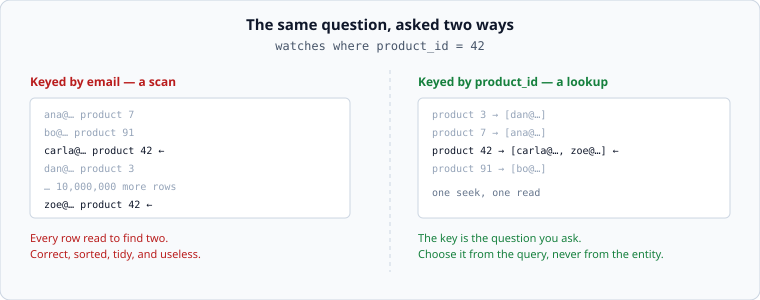

# Access patterns first

*Week 3 · Day 1 · about 25 minutes*

> By the end of this you can write a data model backwards from the queries, and spot the
> model that is beautifully organised around the wrong question.

---

## Read the primary sources first

| Source | Tier | What it gives you |
|---|---|---|
| [**Dynamo: Amazon's Highly Available Key-value Store**](https://www.allthingsdistributed.com/files/amazon-dynamo-sosp2007.pdf) | 1 | Amazon's own paper. Read §2 — the argument that their query patterns, not their data, determined the store |
| [**Bigtable: A Distributed Storage System for Structured Data**](https://research.google/pubs/bigtable-a-distributed-storage-system-for-structured-data/) | 1 | Google's. §2 on the data model is the clearest published statement of "the row key is the design" |
| [**Cassandra documentation — data modelling**](https://cassandra.apache.org/doc/latest/) | 2 | Official docs for a system that refuses to let you query by anything but the key, and is therefore honest about it |

Read Dynamo §1–2 today. It is four pages and it is the origin of most of what this week
covers.

---

## The mistake

Almost everyone models entities first. A `User`, a `Product`, a `Watch`; fields on each;
foreign keys between them. It feels like the responsible thing to do, and for a system
small enough that everything fits on one machine, it is fine.

It stops being fine the moment the data will not fit on one machine, because then **the
way you organised it decides which questions are cheap and which are impossible.**



Both sides hold identical data. On the left, finding everyone watching product 42 means
reading every row. On the right it is one lookup. Nothing about the *data* changed —
only what it was organised by, which was decided by which question you expected.

---

## Model backwards

The procedure, and it is the whole of pass 3:

**1. List the queries.** Not the entities — the actual questions, in the words of the
feature.

```
Q1  who is watching product X?              on every restock       high volume
Q2  what is this shopper watching?          on the settings page   low volume
Q3  how many watches exist for product X?   on the admin page      rare
```

**2. Attach a volume and a latency budget to each.** Q1 runs on every restock and is on
the critical path; Q3 runs when someone opens an admin page and can take a second. That
difference is worth more than any amount of normalisation theory.

**3. Design so the highest-volume query is a lookup**, and let the rare ones be
expensive. A scan that happens twice a day is not a problem. A scan on the critical path
is the whole problem.

**4. Write the queries the model cannot serve.** Every model makes something expensive.
Say which, on purpose, in your document — that sentence is worth more than a diagram.

---

## Two queries, one dataset, two models

Q1 wants data keyed by product. Q2 wants it keyed by shopper. One physical ordering
cannot be both.

Your options, and each is a real design with a price:

| Option | Cost |
|---|---|
| Key by product, scan for Q2 | Q2 is slow — but it is a settings page, so who cares |
| Key by product, keep a second index by shopper | every write now updates two structures |
| Store it twice, keyed both ways | double the storage, and two writes that can disagree |

That last one horrifies people trained on normalisation, and it is what large systems do
constantly. Once data does not fit on one machine, **storage is cheap and coordination
is expensive**, so duplicating data to serve a second access pattern is often the
correct answer. Dynamo and Bigtable both assume it.

The thing you must not do is pick one without noticing you picked. A model with a
secondary index has chosen to make writes more expensive; a model with duplication has
chosen to allow two copies to disagree briefly. Both are fine. Neither is free.

---

## What "can serve this query" means

An index is an ordering. You can efficiently answer a question if the ordering puts the
answer together, and not otherwise. Three rules follow, and they are today's lab:

**Equality first, then range.** An index on `(tenant, created_at)` answers "tenant = X
ordered by created_at" and "tenant = X and created_at > T". It does not answer
"created_at > T" across all tenants — the rows are scattered through every tenant's
section.

**Leftmost prefix.** An index on `(a, b, c)` serves queries on `a`, on `(a, b)`, and on
`(a, b, c)`. It does not serve a query on `b` alone. You cannot start reading in the
middle of an ordering.

**One range column, and it must come last.** After you have used a range, everything
beyond it in the index is no longer in a useful order.

These are not quirks of one database. They follow from what an ordering *is*, which is
why they hold for a B-tree index, a Cassandra clustering key, and a sorted file you wrote
yourself.

---

## The cost of an index

Every index is a second copy of part of your data, and every write updates all of them.

```
one insert, four indexes  =  five structures written
```

This is why "just add an index" is not free advice, and why write-heavy systems have
few indexes and read-heavy ones have many. It is also why the read/write ratio you
computed in week 1 belongs in this conversation: at 150 reads per write, an index that
turns a scan into a lookup is obviously worth it. At 1 read per 10 writes, it may not be.

**Bring the ratio to the data-model discussion.** Most people argue about indexes without
it, which makes the argument unresolvable.

---

## Today's lab

`week-03/day-1/access.py` — the rules above, as code:

- `can_serve(index, equalities, range_column, order_by)` — the leftmost-prefix rule
- `is_covering(index, selected)` — whether the index alone answers it, with no trip back
  to the row
- `selectivity(distinct_values, rows)` — how much an index actually narrows things
- `write_amplification(index_count)` — structures touched per insert

Then read [indexes](indexes.md).

---

> **Sources for this article**
> [Dynamo](https://www.allthingsdistributed.com/files/amazon-dynamo-sosp2007.pdf) (Amazon,
> 2007) and [Bigtable](https://research.google/pubs/bigtable-a-distributed-storage-system-for-structured-data/)
> (Google, 2006), both **Tier 1** ·
> [Cassandra docs](https://cassandra.apache.org/doc/latest/), **Tier 2**.
> The four-step procedure and the options table are ours — **Tier 3**.
