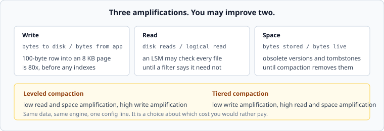

# Amplification, and the three-way trade

*Week 3 · Day 2 · about 25 minutes*

> By the end of this you can put numbers on what a storage engine costs, and explain why
> no configuration improves all three at once.

---

## Read the primary sources first

| Source | Tier | What it gives you |
|---|---|---|
| [**RocksDB wiki — Leveled Compaction**](https://github.com/facebook/rocksdb/wiki/Leveled-Compaction) | 1 | The mechanism, and where the write amplification comes from |
| [**RocksDB wiki — Universal Compaction**](https://github.com/facebook/rocksdb/wiki/Universal-Compaction) | 1 | The tiered alternative, and what it trades away |
| [**Designing Access Methods: The RUM Conjecture**](https://openproceedings.org/2016/conf/edbt/paper-12.pdf) | 2 | Athanassoulis et al., EDBT 2016 — the argument that read, update and memory overheads cannot all be minimised |

---

## Three numbers

| | Definition | Question it answers |
|---|---|---|
| **Write amplification** | bytes written to storage ÷ bytes written by the application | how much extra work does a write cause? |
| **Read amplification** | storage reads ÷ logical read | how many places must we look? |
| **Space amplification** | bytes stored ÷ bytes of live data | how much are we paying to store what we have? |



---

## Why you cannot have all three

The RUM conjecture states it formally; the intuition is simple. Any way of organising
data on disk is choosing where to put the work:

- Keep everything sorted and compact, and **writes** must do the sorting — high write
  amplification.
- Write wherever is cheapest, and **reads** must search — high read amplification.
- Keep several copies or several versions so both are fast, and **space** grows.

Compaction strategy is exactly this dial, exposed as a config option:

| | Write | Read | Space |
|---|---|---|---|
| **Leveled** — keep each level non-overlapping | high | low | low |
| **Tiered** — let files pile up, merge in batches | low | high | high |

Same engine, same data, one line of configuration, and a materially different system.
Being able to say *which of the three you would rather pay* is a good answer to a design
question, and it is a much better answer than naming a database.

---

## Rough models

The lab implements these. They are **models with stated assumptions**, not measurements,
and you should present them that way — an interviewer who has run these systems will
respect "roughly, by this model" and will not respect a confident wrong number.

**B-tree write amplification.** A row update rewrites its page:

```
WA ≈ page_bytes / row_bytes          8 KB page, 100 B row  ->  ~80x
```

Batching helps — several updates landing on the same page before it is flushed share the
cost — so the real number is lower under load and higher under sparse random updates.

**LSM write amplification, leveled.** Data is rewritten as it moves down each level, and
merging a level with the one below it rewrites roughly the size ratio's worth of data:

```
WA ≈ levels × size_ratio             7 levels, ratio 10  ->  order of tens
```

**LSM read amplification.** Without filters, a point lookup may check the memtable plus
every file. With a per-file membership filter, most files answer "not here" from memory:

```
RA ≈ 1 + files × false_positive_rate
```

That is why those filters matter so much: they take read amplification from "the number
of files" to "about one".

**Space amplification.** Obsolete versions and tombstones live until compaction:

```
SA ≈ (live + obsolete) / live
```

---

## The number that decides it

Take the write amplification and multiply by your write rate:

```
40,000 writes/s × 200 bytes  =  8 MB/s of application writes
× 30x amplification          =  240 MB/s to the device
```

Now compare that with what your storage can sustain. A great many capacity plans have
been undone by exactly this multiplication, because the application-level number looked
comfortable and the device-level one was not.

**Do this multiplication in pass 2 whenever the design is write-heavy.** It takes ten
seconds and it occasionally changes the entire architecture.

---

## And it is a latency problem too

Amplification is usually presented as a throughput and cost issue. The more interesting
consequence is the week-2 one.

Compaction is bursty. During a burst, the device is busy with background work, so
foreground reads and writes are slower — a **service-time spike**, at a moment nobody
chose. From Kingman, higher service-time variance means more queueing at the same
utilisation, so the p99 rises by more than the extra work alone would suggest.

This is why storage engines have knobs for rate-limiting compaction, and why turning
those knobs is a trade between "p99 is bad now" and "space amplification is bad later".

---

## Today's lab

`week-03/day-2/amplification.py`:

- `btree_write_amplification(page_bytes, row_bytes)`
- `lsm_write_amplification(levels, size_ratio)`
- `lsm_read_amplification(file_count, false_positive_rate)`
- `space_amplification(live_bytes, obsolete_bytes)`
- `device_write_rate(app_writes_per_second, bytes_per_write, amplification)`
- `compare_compaction(strategy)` — returns the three numbers for `"leveled"` and
  `"tiered"`, so you can look at the trade rather than recite it

---

> **Sources for this article**
> [RocksDB wiki](https://github.com/facebook/rocksdb/wiki/Leveled-Compaction) — **Tier 1**
> for the mechanisms · [The RUM Conjecture](https://openproceedings.org/2016/conf/edbt/paper-12.pdf),
> Athanassoulis et al., EDBT 2016 — **Tier 2** for the three-way trade.
> **The formulas in the lab are our simplified models — Tier 3.** Real amplification
> depends on the workload, the key distribution and a dozen configuration options, and
> anyone quoting a single number for it without a workload attached is guessing.
