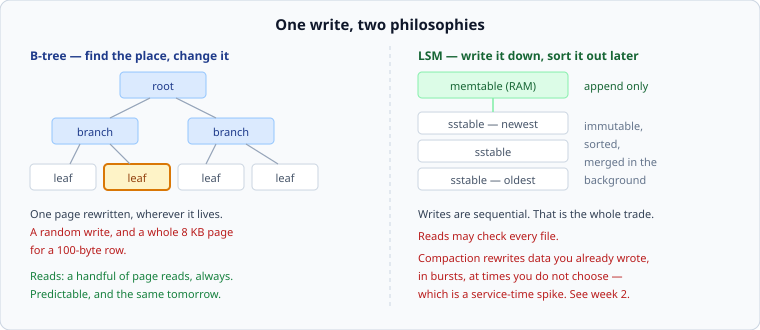

# B-trees and LSM trees

*Week 3 · Day 2 · about 30 minutes*

> By the end of this you can say which of the two a workload wants, and why the answer
> is a sentence about random writes rather than a preference.

---

## Read the primary sources first

| Source | Tier | What it gives you |
|---|---|---|
| [**RocksDB wiki — Overview**](https://github.com/facebook/rocksdb/wiki/RocksDB-Overview) | 1 | Meta's own documentation for the LSM engine underneath a great deal of production software |
| [**RocksDB wiki — Leveled Compaction**](https://github.com/facebook/rocksdb/wiki/Leveled-Compaction) | 1 | What compaction actually does, from the people who wrote it |
| [**LevelDB — implementation notes**](https://github.com/google/leveldb/blob/main/doc/impl.md) | 1 | Short, readable, and the ancestor of RocksDB |
| [**Bigtable §5.3–5.4**](https://research.google/pubs/bigtable-a-distributed-storage-system-for-structured-data/) | 1 | Memtable, SSTable and compaction described by the people who named them |
| [**The Log-Structured Merge-Tree**](https://www.cs.umb.edu/~poneil/lsmtree.pdf) | 2 | O'Neil et al., 1996 — the original paper |

Read the LevelDB implementation notes today. Four pages, and it is the clearest
description of an LSM tree in existence.

---

## The problem both are solving

You have more data than memory, on a device where **sequential access is far cheaper
than random access**. Everything below follows from that one fact.

---

## B-tree: find the place, change it

A balanced tree of fixed-size pages, usually 4–16 KB. Keys are sorted; a lookup is a
handful of page reads from root to leaf; an update rewrites the page the row lives on.

**What is good:** reads are predictable — the same small number of page reads today and
next year. Range scans are sequential within the leaf ordering. Space amplification is
low: one copy of each row, plus some slack in each page. Updates and deletes really
remove the old value.

**What is not:** every write is a random write, to whichever page holds that key. And
because pages are the unit of I/O, a 100-byte row update writes an 8 KB page — **80x
write amplification before you have added a single index.**

Under a heavy write load this is the binding constraint, and it is why every B-tree
database also has a write-ahead log: the log makes the write durable sequentially and
cheaply, so the expensive random page write can be deferred and batched. That is
Thursday.

---

## LSM tree: write it down, sort it out later

Writes go to an in-memory sorted structure — the **memtable** — plus a sequential log
for durability. When the memtable is full it is written out as an immutable sorted file,
an **SSTable**. Files accumulate; a background process **compacts** them by merging
sorted files and discarding superseded values.

Reads check the memtable, then the files, newest first, until they find the key.

**What is good:** every write to storage is sequential. Ingest rates are far higher than
a B-tree can manage for the same hardware, which is why LSM engines are underneath most
things that swallow a firehose — time series, event stores, message logs, wide-column
databases.

**What is not, and there are three:**

**Reads may touch many files.** A key that is not in the memtable might be in any file.
Real engines keep a small in-memory filter per file that can say "definitely not here",
which removes most of the cost — that structure is week 6's material, and for now it is
enough to know reads are the side that pays.

**Deletes are not deletes.** You cannot modify an immutable file, so a delete writes a
**tombstone** — a marker meaning "gone". The old value stays on disk until compaction
removes both. This has consequences people meet the hard way: space is not reclaimed
when you delete, and a range scan over a heavily deleted range reads a great many
tombstones to return nothing.

**Compaction is work you did not schedule.** The same data is rewritten several times as
it moves down the levels. It happens in bursts, in the background, at moments you do not
choose — and *that is a service-time spike*. Which, from week 2, is a variability
increase, which through Kingman is a queueing increase at the same utilisation.

That last connection is the one to carry. **Compaction pauses are a p99 problem, not a
throughput problem**, and a design that sizes an LSM store on average throughput has
missed the way it actually hurts.

---

## Choosing

| Workload | Wants | Because |
|---|---|---|
| Heavy ingest, append-mostly | **LSM** | sequential writes are the whole game |
| Read-heavy point lookups on stable data | **B-tree** | predictable reads, no file-count tax |
| Read-modify-write on hot rows | **B-tree** | in-place updates, no version pile-up |
| Time series, events, logs | **LSM** | write-once, ordered by time, rarely updated |
| Small dataset that fits in memory | either | this is not your bottleneck; stop optimising it |
| Range scans over recent data | **LSM**, usually | recent data is in few, young files |

The honest summary, and it is worth saying in these words:

> **A B-tree pays on every write to keep reads simple. An LSM tree keeps writes cheap
> and pays later, in background work and read complexity.**

Neither is modern or old-fashioned. Both are in active development at large companies,
and the same organisation will run both for different workloads.

---

## What goes in a design document

Not "we will use an LSM store". This:

> Writes are 40,000/s of small append-only records, never updated, read back in time
> ranges within the last hour. **That is an append-heavy, range-read workload, so a
> log-structured store fits and an update-in-place one does not.** The cost is background
> compaction, which shows up as p99 spikes on the read path — so the read budget needs
> headroom for it, and compaction rate is on the dashboard.

Workload, shape, cost, consequence. Notice that no product is named — the fence still
holds — and the paragraph is more useful than a product name would have been.

---

## Today's lab

`week-03/day-2/amplification.py` — the three amplifications as explicit models, with
their assumptions written down. Read [amplification](amplification.md) first; the models
are only meaningful once you know what they are approximating.

---

> **Sources for this article**
> [RocksDB wiki](https://github.com/facebook/rocksdb/wiki/RocksDB-Overview),
> [LevelDB notes](https://github.com/google/leveldb/blob/main/doc/impl.md),
> [Bigtable](https://research.google/pubs/bigtable-a-distributed-storage-system-for-structured-data/)
> — all **Tier 1** · [O'Neil et al., 1996](https://www.cs.umb.edu/~poneil/lsmtree.pdf)
> — **Tier 2**. The choosing table and the compaction-is-a-variability-problem argument
> are ours — **Tier 3**.
