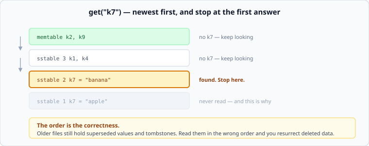

# Inside an LSM store

*Week 3 · Day 3 · about 25 minutes, then you build one*

> By the end of today you have written a working log-structured store — memtable,
> flush, tombstones, compaction — and you know which of its rules exist for correctness
> and which for speed.

---

## Read the primary sources first

| Source | Tier | What it gives you |
|---|---|---|
| [**LevelDB — implementation notes**](https://github.com/google/leveldb/blob/main/doc/impl.md) | 1 | Four pages, and today's lab is a small version of what it describes |
| [**RocksDB wiki — Overview**](https://github.com/facebook/rocksdb/wiki/RocksDB-Overview) | 1 | The production version, with the parts we are leaving out |
| [**Bigtable §5.3–5.4**](https://research.google/pubs/bigtable-a-distributed-storage-system-for-structured-data/) | 1 | Where the words memtable and SSTable come from |

---

## Four pieces

**The memtable.** An in-memory sorted map. Every write goes here first. It is sorted so
that flushing it is one sequential pass, and so that a range scan over recent data does
not need a sort.

**The SSTable.** When the memtable reaches a size limit it becomes an immutable sorted
file, and a new empty memtable takes over. Immutable is the important word: nothing ever
modifies one of these files, which is why writes can be sequential and why readers need
no locks.

**The tombstone.** A delete cannot remove anything from an immutable file, so it writes a
marker meaning "gone as of now". The marker is a value like any other; it just means
absence.

**Compaction.** A background merge of several sorted files into one, keeping the newest
value for each key and — under the right conditions — dropping tombstones entirely.

---

## The read path is the correctness



```
get(key):
    look in the memtable
    then each sstable, newest to oldest
    the first hit wins
    if that hit is a tombstone, the key does not exist
```

Three rules in there, and each one is load-bearing:

**Newest first.** Older files still contain the values that newer writes replaced. Search
them in the wrong order and you return stale data — or resurrect a deleted key, which is
worse because it looks like a ghost rather than a bug.

**Stop at the first hit.** Not "collect all the values and pick one". The first hit is by
construction the newest, and continuing costs reads for no information.

**A tombstone is a hit.** It stops the search and means "not found". A store that treats
a tombstone as "keep looking" will find the old value underneath it and hand it back.
This is the single most common bug when people implement this, and today's tests are
built to catch it.

---

## When can a tombstone be dropped?

Only when compaction is merging **every** file that could contain an older value for that
key. If a tombstone is dropped while an older file still holds the key, the delete is
undone.

In a real engine this means tombstones survive until a compaction reaches the bottom
level, which can be a long time. Two consequences worth carrying:

- **Deleting data does not free space**, not straight away and sometimes not for hours.
- **A range scan across many deleted keys is slow**, because it reads every tombstone to
  return nothing. Queues and job tables built on LSM stores hit this constantly: a table
  that is written, read once and deleted looks empty and scans like it is full.

In today's lab, `compact()` merges *all* files, so it may drop tombstones. Say why in a
comment as you write it — that condition is the reasoning, not the code.

---

## What we are leaving out, and why

A real engine has several things today's lab does not, and knowing which is which is
part of reading the source honestly:

| Left out | Why it exists |
|---|---|
| **Levels** | compacting everything at once is fine at ten files, impossible at ten thousand |
| **Membership filters per file** | takes read amplification from "number of files" to about one. Week 6 |
| **Block index and sparse index** | finding a key inside a large file without scanning it |
| **A write-ahead log** | the memtable is in memory, so a crash loses it. Tomorrow |
| **Compression per block** | most of the space saving in a real store |

None of these change the shape you are building. All of them are why a production engine
is a hundred thousand lines and this is eighty.

---

## Today's lab

`week-03/day-3/memtable.py` — `LSMStore`:

```python
store = LSMStore(memtable_limit=4)
store.put("k", "v")          # into the memtable; flushes automatically when full
store.delete("k")            # writes a tombstone — it is a write, not a removal
store.get("k")               # None when absent or tombstoned
store.flush()                # memtable -> a new sstable, newest first
store.compact()              # merge every sstable into one, dropping tombstones
store.sstables               # newest first
store.stats                  # flushes, compactions, sstables_read
```

`sstables_read` is read amplification, counted. The tests use it to show that compaction
does not just save space — it makes reads cheaper, which is the part people forget.

The test to read carefully is the tombstone one. It puts a value, flushes, deletes,
flushes again, and asserts the key is absent — with the old value sitting in an older
file the whole time.

```bash
pytest week-03/day-3 -v
```

---

## The written exercise

Half a page in `week-03/day-3/lsm-costs.md`:

Your week-2 rate limiter kept per-tenant state. Suppose it were persisted in a
log-structured store, with 50,000 tenants updated constantly.

- What is the read path for one limiter decision, and how many files might it touch?
- What happens to a tenant's old counter values? How many versions of one tenant's row
  exist before compaction?
- **Would you use this store for that?** One sentence, with the reason.

The answer is no, and being able to say precisely why — updates to hot keys are the
workload LSM is worst at — is the point of the exercise.

---

> **Sources for this article**
> [LevelDB implementation notes](https://github.com/google/leveldb/blob/main/doc/impl.md),
> [RocksDB wiki](https://github.com/facebook/rocksdb/wiki/RocksDB-Overview) and
> [Bigtable](https://research.google/pubs/bigtable-a-distributed-storage-system-for-structured-data/)
> — all **Tier 1**. The "what we left out" table is ours — **Tier 3**.
