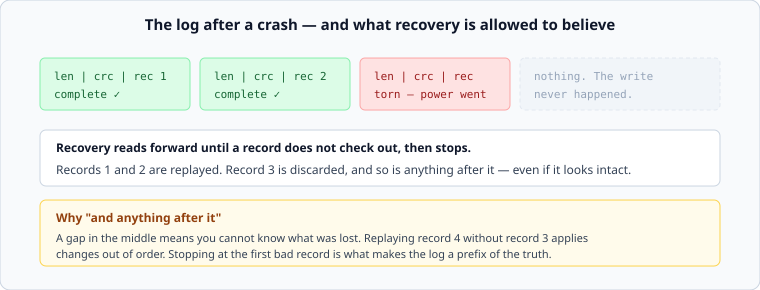

# Write-ahead logs, and what durability costs

*Week 3 · Day 4 · about 30 minutes*

> By the end of this you can say what "the write succeeded" means, why every database
> writes everything twice, and what a crash in the middle of a write leaves behind.

---

## Read the primary sources first

| Source | Tier | What it gives you |
|---|---|---|
| [**PostgreSQL — Write-Ahead Logging**](https://www.postgresql.org/docs/current/wal-intro.html) | 2 | The canonical short explanation, in official documentation |
| [**SQLite — Write-Ahead Logging**](https://www.sqlite.org/wal.html) | 2 | The same idea from a very different engine, with the trade-offs listed plainly |
| [**SQLite — Atomic Commit**](https://www.sqlite.org/atomiccommit.html) | 2 | What actually has to happen, step by step, for a commit to survive a power cut |

Read the SQLite atomic-commit page. It is the most concrete account of crash safety
available for free, and it will make you permanently suspicious of the word "saved".

---

## The problem

You want two things that fight:

- **Durable** — once you tell a client "done", it survives a power cut
- **Fast** — you cannot pay for a random page write on every request

A B-tree update writes a page in the middle of a file. A crash halfway through leaves the
page half-old and half-new — not a lost write but a **corrupt structure**, which is much
worse than losing the write.

The solution is the same everywhere, and it is one of the genuinely universal ideas in
this course: **write what you are about to do to a sequential log first, make that
durable, and only then do the slow thing.**

```
1. append the change to the log
2. make the log durable          <- this is the moment the write "happened"
3. return success to the client
4. update the real structure, whenever is convenient
```

If the crash happens after 2, recovery replays the log. If it happens before 2, the
client was never told success. There is no in-between, and constructing that "no
in-between" is the whole art.

---

## Fsync is the actual boundary

Writing to a file does not put bytes on a device. It puts them in the operating system's
page cache, where they sit until the OS feels like flushing them. A power cut in that
window loses data your program believes it wrote.

`fsync` is the call that says "do not return until it is really on the device". It is
also the expensive one — historically milliseconds, and even on flash it is far more
expensive than the write itself, because it must wait for the device to acknowledge
durability rather than acceptance.

**Where the fsync goes is the durability decision**, and it is a design decision with a
number attached:

| Policy | Loses | Costs |
|---|---|---|
| fsync every commit | nothing acknowledged | an fsync per write; the ceiling is fsyncs per second |
| fsync every N ms | up to N ms of acknowledged writes | almost nothing |
| never fsync | anything the OS had not flushed | nothing |

The middle row is what most systems actually run, and it is a perfectly respectable
choice **as long as it is written down**. "We may lose up to 200 ms of acknowledged
writes on a host failure" is an envelope line from week 1, and a design that has never
said it has not made the decision — it has inherited a default.

### Group commit

The trick that makes the top row affordable: while one fsync is in flight, other commits
queue up behind it; when it returns, they all fsync together. Ten concurrent writers cost
one fsync rather than ten.

Note what this means for the shape of your latency: throughput improves enormously with
concurrency, and single-writer latency does not improve at all. A benchmark with one
client and a benchmark with a hundred measure different things, and the gap between them
is group commit.

---

## Everything is written twice

The WAL is not free. Every byte goes to the log and again to the real structure, so **the
floor on write amplification is 2x** before any page or compaction overhead. That is the
price of never having a half-updated structure, and everyone pays it.

---

## A crash in the middle of a log write



The log is append-only, which removes the corrupt-structure problem, but not this one: a
crash can happen part-way through appending a record, leaving a **torn write** — a
partial record at the end of the file.

Two mechanisms make this survivable, and today's lab implements both:

**Length prefix and checksum.** Each record is written as `length | checksum | payload`.
Recovery reads a length, reads that many bytes, and checks the checksum. A torn record
fails one of those and is discarded — the write never happened, and the client was never
told it had.

**Stop at the first bad record.** Not "skip it and carry on". If record 3 is damaged,
records 4 and 5 are discarded too, even if they look intact.

That second rule is the one worth understanding, because it looks wasteful. The log is
only useful if replaying it produces a state the system could actually have been in.
Applying record 4 without record 3 applies changes out of order and produces a state that
never existed. **Stopping at the first bad record is what makes the log a prefix of the
truth**, and a prefix is a state; a subset with a hole in it is not.

---

## Checkpoints, or the log grows for ever

Replaying from the beginning of time gets slower every day, and the log gets larger.

A **checkpoint** flushes the real structure to disk and records that everything before
some point in the log is now redundant. Recovery starts from the last checkpoint;
everything older can be deleted.

The trade is the familiar one. Frequent checkpoints mean fast recovery and more
foreground I/O; infrequent ones mean the opposite. And this is a place to bring your
envelope: **"how long may recovery take?" is a requirement**, it is usually unstated, and
it is what actually determines checkpoint frequency.

---

## Where else this shape appears

Once you see it, it is everywhere, and recognising it is worth more than the details:

- An LSM tree's memtable is backed by a WAL — that is what makes the in-memory part safe
- A replicated log is the same idea across machines instead of within one, which is
  weeks 5 and 7
- A message broker's durability guarantee is an fsync policy with a different name
- "At least once" delivery is a log you replay and a receiver that tolerates duplicates

**Write it down first, do the expensive thing later, replay on failure.** It may be the
single most reused idea in systems design.

---

## Today's lab

`week-03/day-4/wal.py` — a real log, in a real file, that survives a real truncation.

```python
encode(payload)      -> bytes           # length | crc32 | payload
decode(data)         -> (records, ok)   # stops at the first bad record

WriteAheadLog(path)
    .append(payload)
    .recover()       -> list[bytes]     # replays what is trustworthy
    .checkpoint()                       # truncate what is no longer needed
```

The tests write records, then damage the file — truncate it mid-record, flip a byte in
the middle — and assert exactly what recovery returns. One of them checks that a record
*after* a corrupt one is discarded even though it is intact, which is the rule above and
the test people argue with before they think about it.

```bash
pytest week-03/day-4 -v
```

---

> **Sources for this article**
> [PostgreSQL WAL](https://www.postgresql.org/docs/current/wal-intro.html),
> [SQLite WAL](https://www.sqlite.org/wal.html) and
> [SQLite atomic commit](https://www.sqlite.org/atomiccommit.html) — **Tier 2**, official
> documentation for two engines that made different choices. The fsync-policy table and
> the "prefix of the truth" framing are ours — **Tier 3**.
