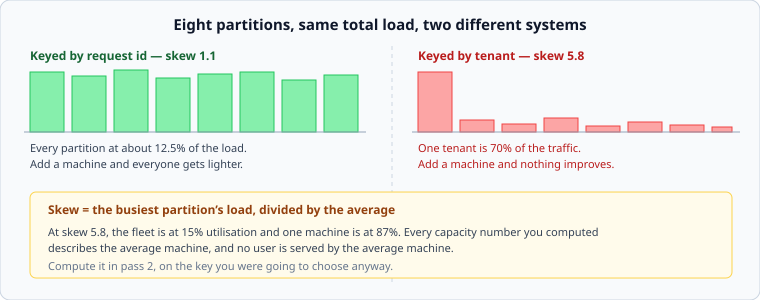

# Choosing a partition key

*Week 4 · Day 1 · about 25 minutes*

> By the end of this you can pick a key, measure its skew before committing, and say
> which query you have just made expensive.

---

## Read the primary sources first

| Source | Tier | What it gives you |
|---|---|---|
| [**Cassandra — the Dynamo-derived architecture**](https://cassandra.apache.org/doc/latest/cassandra/architecture/dynamo.html) | 2 | Partition key against clustering key, stated precisely by a system that refuses to hide the distinction |
| [**Vitess — Sharding**](https://vitess.io/docs/reference/features/sharding/) | 2 | What choosing a sharding key means operationally, including changing one |
| [**Slicer**](https://research.google/pubs/slicer-auto-sharding-for-datacenter-applications/) §2 | 1 | Google measuring real key distributions. The load imbalance they report is worse than most people assume |

---

## The key is the design

An index can be dropped and rebuilt in an afternoon. **A partition key is a migration** —
every row has to move, while the system is serving traffic, and until it finishes you
have two sources of truth.

So it is worth ten minutes of arithmetic before you commit, and today's lab is those ten
minutes.

---

## Three requirements, and everyone remembers two

**1. High cardinality.** Enough distinct values to spread across your partitions, now and
after ten times the growth. Partitioning by `country` gives you about 200 values and a
distribution shaped like the world's population.

**2. Even distribution.** Not just many values — many values *of similar weight*. This is
the one that is measured rather than reasoned about, and it is the one people skip.

**3. It appears in the high-volume query.** The one everyone forgets. A key with perfect
cardinality and perfect balance is still wrong if your busiest query does not carry it,
because then every one of those queries is scatter-gather and you have made your most
common operation into your most expensive one.

Three requirements. Any candidate key that fails one is wrong, and it is usually the
third.

---

## Skew, and how to measure it



```
skew  =  load on the busiest partition  /  average load per partition
```

A skew of 1.0 is perfect. Under about 1.5 is comfortable. Above 3 you are running one
hot machine and a lot of idle ones, and — this is the part that matters — **every
capacity number you computed describes the average machine, and no user is served by the
average machine.**

Bring week 2 to this. At a skew of 5.8 with a fleet at 15% utilisation, the busiest
partition is at 87%, which is past the knee. The dashboard says the cluster is nearly
idle. Users on that partition are getting five times the latency of everyone else, and no
graph in the system is showing it.

**Compute the skew in pass 2, on the key you were going to choose anyway.** It takes ten
minutes with a sample of real keys, and it occasionally changes the entire design.

---

## The three ways a key goes wrong

**Too few values.** `status`, `region`, `country`, `date`. You cannot have more
partitions than distinct values, and you very often cannot even have that many usefully.

**Skew.** `tenant_id` in any B2B system, `user_id` in any social system, `product_id` in
any retail system. Real populations are not uniform: a small number of tenants, users or
products account for most of the traffic, always, in every system, and a design that
assumes otherwise is assuming away its hardest problem. That is Wednesday.

**Absent from the query.** Partitioning orders by `order_id` when the busiest query is
"orders for customer X" gives a perfect distribution and turns your most common query
into a scatter-gather across every partition.

---

## Compound keys

Most real systems use two parts, and the distinction is worth learning in the abstract
because every partitioned store has some version of it:

- **Partition key** — decides *which machine*. Hashed, usually.
- **Clustering key** — decides *the order within that machine*. Kept sorted.

```
partition key: series_id          -> which machine holds this series
clustering key: timestamp         -> sorted by time within it
```

This is why the metrics store's 95% query works: `series_id` sends you to one machine,
`timestamp` gives you a contiguous range once you are there. One lookup, one sequential
read, no scatter-gather.

And it shows the other half of the trade. Any query that does not name a `series_id` —
"all series matching a label" — has to ask every partition. If that query matters, it
needs its own structure, which is a decision with a price rather than a thing you get.

---

## When the natural key is too big

A single tenant that does not fit on one partition is not a key problem, it is a
**bounded partition** problem, and the answer is to make the key finer:

```
tenant_id                    ->  one whale does not fit
(tenant_id, day)             ->  bounded by day, and time queries stay local
(tenant_id, hash(user) % 16) ->  sixteen sub-partitions per tenant
```

Both work. Both make some query more expensive — the first makes "everything for this
tenant" span days, the second makes it span sixteen partitions. Pick the one whose cost
lands on a query you do not care about, and **write down which query you sacrificed**.

---

## Today's lab

`week-04/day-1/keys.py`:

- `partition_for(key, partitions)` — hash and modulo, done consistently
- `distribute(weighted_keys, partitions)` — where the load actually lands
- `skew(loads)` — busiest over average
- `utilisation_of_busiest(loads, fleet_utilisation)` — the week-2 translation, and the
  number that should end the argument
- `partitions_needed(total_load, per_partition_capacity, skew)` — sizing that accounts
  for the imbalance rather than pretending it away

The last one is the honest version of a calculation people usually do wrong.

---

> **Sources for this article**
> [Slicer](https://research.google/pubs/slicer-auto-sharding-for-datacenter-applications/)
> — **Tier 1**, and the source for how uneven real key distributions are ·
> [Cassandra](https://cassandra.apache.org/doc/latest/cassandra/architecture/dynamo.html)
> and [Vitess](https://vitess.io/docs/reference/features/sharding/) docs — **Tier 2**.
> The skew thresholds (1.5 comfortable, 3 a problem) are our rules of thumb — **Tier 3**,
> and you should treat any more precise figure with suspicion.
