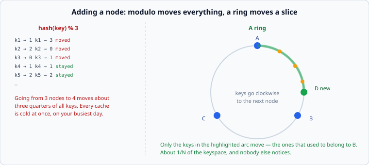

# Consistent hashing

*Week 4 · Day 2 · about 25 minutes*

> By the end of this you can explain why `hash(key) % n` is a trap, what virtual nodes
> fix, and what the ring costs you.

---

## Read the primary sources first

| Source | Tier | What it gives you |
|---|---|---|
| [**Dynamo**](https://www.allthingsdistributed.com/files/amazon-dynamo-sosp2007.pdf) §4.2 | 1 | Amazon's account, including why plain consistent hashing was not good enough and what virtual nodes fixed |
| [**Cassandra — Dynamo architecture**](https://cassandra.apache.org/doc/latest/cassandra/architecture/dynamo.html) | 2 | The same scheme in production documentation, with the token-assignment details |
| **Karger et al. (1997), "Consistent Hashing and Random Trees"** ([DOI](https://doi.org/10.1145/258533.258660)) | 2 | The original. Paywalled — cited by name, which is the honest thing to do |

---

## The problem with modulo

```python
partition = hash(key) % node_count
```

Simple, fast, evenly distributed, and it has one catastrophic property: **changing
`node_count` changes almost every answer.**



Going from 3 nodes to 4 moves roughly ¾ of all keys. From 10 to 11, roughly 10/11 of
them. Every key that moves is a cache entry that is now cold or a row that has to be
copied — and this happens precisely when you are adding capacity, which is precisely when
you are already under load.

There is a whole genre of outage where a node was added at peak, every cache went cold at
once, and the resulting load on the origin was worse than the problem the new node was
added to solve.

---

## The ring

Hash the keyspace onto a circle — say 0 to 2⁶⁴. Hash each **node** onto the same circle.
A key belongs to the first node clockwise from it.

Now add a node. It lands somewhere on the circle and takes over the keys between itself
and its predecessor. **Every other key stays where it was.** About 1/N of the keyspace
moves, and nothing else is disturbed.

That is the entire idea, and it is one of the small number of ideas in this course that
is genuinely clever rather than merely sensible.

---

## Why plain rings are not good enough

Two problems, both from hashing a handful of nodes onto a big circle:

**Uneven arcs.** With 10 randomly-placed nodes, the largest arc is commonly two or three
times the smallest. You wanted a 10-way split and got a 3x skew, from nothing but bad
luck.

**A departing node dumps everything on one neighbour.** When a node fails, its entire arc
goes to the *next* node clockwise — one machine, which now has double the load, at the
exact moment the system is already degraded. This is a cascading failure with a clear
mechanism, and it is the one Dynamo calls out.

---

## Virtual nodes

Give each physical node many positions on the ring — 100, or 256 — instead of one.

**Distribution evens out.** You are now averaging over hundreds of random arcs rather than
ten, and the law of large numbers does the rest. Skew drops towards 1.

**Failure spreads.** A departing node's 256 arcs each go to a different neighbour, so its
load is shared across the whole cluster rather than landing on one machine.

**Heterogeneous hardware works.** A machine with twice the capacity gets twice the virtual
nodes. This is not possible with one position per node, and it matters in real fleets,
which are never uniform.

The cost is bookkeeping: more ring entries to store, sort and search. It is small, and
every production implementation does this. Today's lab makes the improvement visible —
you measure the skew with 1 virtual node and with 100, and the difference is not subtle.

---

## What the ring costs you

**Ordered scans are gone.** Adjacent keys hash to unrelated positions, so "every key
between X and Y" means asking every node. If your access pattern needs ranges, hashing is
the wrong choice and [range partitioning](range-versus-hash.md) is the next article.

**Everyone needs the ring.** Whoever routes requests must know the current node set. That
is a distributed-agreement problem — small, but real, and it is what week 5 is about.

**Rebalancing still moves data.** 1/N instead of nearly everything, but 1/N of a large
dataset is still a lot of bytes moving while you serve traffic.

---

## What goes in a design document

> Partitions are assigned by consistent hashing over `series_id`, with 256 virtual nodes
> per host. **Rejected: modulo over the host count** — adding a host would move most keys
> and cold-start every cache at once, which is a worse failure than the capacity problem
> we were solving. **Price:** no ordered scans across series, so any query not naming a
> series is scatter-gather.

Mechanism, alternative, reason, price. And still no product named.

---

## Today's lab

`week-04/day-2/ring.py` — a hash ring with virtual nodes.

- `HashRing(nodes, virtual_nodes=100)` with `add`, `remove`, `node_for(key)`
- `distribution(ring, keys)` and the skew that follows
- `keys_moved(before, after, keys)` — the fraction that changed hands

Two tests are the point of the day: one shows modulo moving three quarters of the keys
where the ring moves about a quarter, and one shows virtual nodes taking the skew from
uncomfortable to fine. Both are measurements, not claims.

---

> **Sources for this article**
> [Dynamo §4.2](https://www.allthingsdistributed.com/files/amazon-dynamo-sosp2007.pdf) —
> **Tier 1**, and the source for the virtual-node argument ·
> [Cassandra docs](https://cassandra.apache.org/doc/latest/cassandra/architecture/dynamo.html)
> — **Tier 2** · Karger et al. 1997 — **Tier 2**, paywalled.
> The "genre of outage" claim is ours and is **Tier 3** — it describes a pattern we can
> reason about, not an incident anyone has published.
