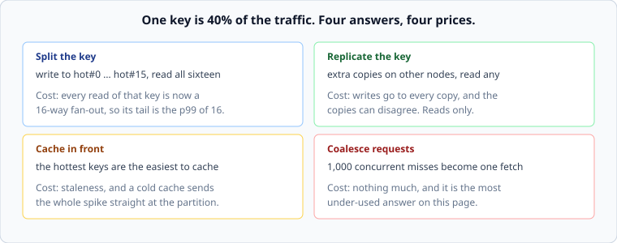

# Hot keys

*Week 4 · Day 3 · about 30 minutes*

> By the end of this you can detect a hot key, choose a remedy, and explain why adding
> machines does not help.

---

## Read the primary sources first

| Source | Tier | What it gives you |
|---|---|---|
| [**Slicer**](https://research.google/pubs/slicer-auto-sharding-for-datacenter-applications/) | 1 | Google measuring real key load and moving hot keys automatically. §2 has the distributions |
| [**Dean & Barroso, The Tail at Scale**](https://research.google/pubs/the-tail-at-scale/) | 1 | Selective replication and micro-partitioning, from week 2, now with a reason |
| [**How Discord stores billions of messages**](https://discord.com/blog/how-discord-stores-billions-of-messages) | 1 | A named engineer on choosing a partition key, and what happened when one bucket got large |

---

## Why this breaks the model

Partitioning divides load **only if load is divisible.**

If one key takes 40% of the traffic, no number of partitions helps. That key lives on one
machine, that machine gets 40% of everything, and the other machines are idle. Doubling
the fleet halves the load on the idle machines and does nothing at all to the hot one.

Take the week-2 translation seriously, because it is the sentence that gets a design
review's attention:

> Sixteen partitions, one key at 40% of traffic, cluster at 30% average utilisation.
> The hot partition is at **192%**. It is not slow, it is failing, and the fleet
> dashboard says everything is fine.

Averages hide this completely. Percentiles across partitions show it instantly, and
almost nobody measures that.

---

## Real load is always skewed

It is worth internalising that this is the normal case, not an edge case:

- One channel, group or stream that everybody is in
- One product on the front page
- One tenant who is ten times the next largest
- One user with a hundred million followers
- One row that every request reads — a feature flag, a config, a rate limit

Slicer's measurements are the useful primary source here: Google found load imbalances
across keys large enough that automatic hot-key movement was worth building a whole
system for. If you are assuming a uniform distribution, you are assuming away the problem
that made partitioning hard.

---

## Detecting one

You cannot fix what you cannot see, and the naive approach — count every key — costs
memory proportional to the number of keys, which is the thing you have too many of.

| Approach | Cost | Good for |
|---|---|---|
| **Count everything** | memory per distinct key | small key spaces only |
| **Top-K with decay** | memory for K entries | finding the current heavy hitters |
| **Sampling** | 1% of requests, ordinary counters | cheap, and finds anything genuinely hot |
| **Sketches** | fixed memory, approximate counts | very large key spaces. Week 6 |
| **Per-partition percentiles** | you already have it | the cheapest signal you are not using |

That last row is worth acting on today. **Alert on the spread between your busiest and
median partition**, not on the average. It requires no new machinery and it is the
difference between finding out from a graph and finding out from a customer.

---

## Four remedies

### Split the key

Write to `hot#0` … `hot#15`, chosen at random; read all sixteen and combine.

The general answer for **write** hotspots. It is what you do when one counter is being
incremented by a million clients a second.

The cost is real: every read of that key is now a 16-way fan-out, so its latency is the
p99 of sixteen requests rather than the median of one. You have moved the problem from
the write path to the read path, which is a good trade only if the ratio says so.

### Replicate the key

Extra copies on other nodes; reads go to any of them.

The general answer for **read** hotspots, and it is what *The Tail at Scale* calls
selective replication. Cheap when the hot item is small, which it usually is.

The cost is that writes must reach every copy, and copies can briefly disagree — which is
a consistency question, which is next week.

### Cache in front

The hottest keys are, by definition, the easiest to cache well: a tiny working set with a
huge hit rate.

The cost is staleness, plus the failure mode you already know. A cold cache sends the
entire spike straight at the partition that could not handle it, so the cache is now
load-bearing for availability rather than just for latency. Week 6.

### Coalesce requests

A thousand concurrent misses for the same key become **one** fetch, and the other 999
wait for its result.

This is the most under-used answer on the page. It is a few lines of code, it needs no
extra infrastructure, and it converts a thundering herd into a single request. Anywhere
many clients want the same thing at the same moment, it is close to free.

---

## The one that is not a remedy

**Adding machines.** It is the reflex, it costs money, and it does nothing — the hot key
is still one key on one machine. Being able to say that in a design review, with the
utilisation arithmetic behind it, is worth more than knowing all four remedies.

---

## What goes in a design document

> Load per tenant is heavily skewed; the largest is expected to be about 30% of traffic.
> **Tenants above 5% of measured load get their key split sixteen ways on write and
> read-combined.** Rejected: a dedicated partition per large tenant, which needs manual
> intervention as tenants grow and shrink. **Price:** reads for split tenants fan out
> sixteen ways, so their p99 is set by the slowest of sixteen — acceptable because their
> queries are already asynchronous.

Skew acknowledged, threshold stated, remedy named, alternative rejected, price paid.

---

## Today's lab

`week-04/day-3/hotkeys.py`:

- `TopK(k)` — a heavy-hitter tracker in fixed memory, with `observe` and `heavy_hitters`
- `is_hot(counts, key, threshold)` — a key's share against a threshold
- `split_key(key, ways)` and `split_targets(key, ways)` — write to one, read all
- `utilisation_of_hot_partition(...)` — the number from the top of this article, so you
  can produce it in a meeting rather than assert it

One test takes a realistic skewed workload and shows the fleet at comfortable average
utilisation with one partition past 100%. That is the picture worth carrying.

---

> **Sources for this article**
> [Slicer](https://research.google/pubs/slicer-auto-sharding-for-datacenter-applications/),
> [The Tail at Scale](https://research.google/pubs/the-tail-at-scale/) and
> [Discord Engineering](https://discord.com/blog/how-discord-stores-billions-of-messages)
> — all **Tier 1**. The four-remedy framing and the detection table are ours — **Tier 3**.
