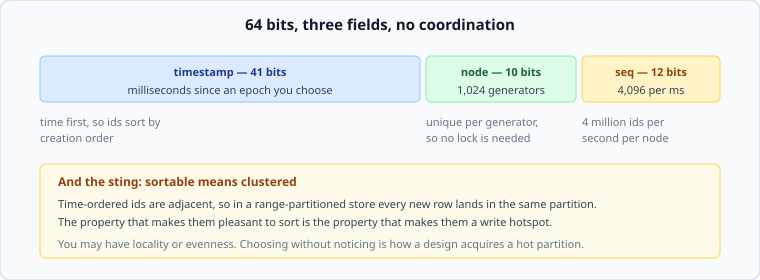

# Ids, and finding the right machine

*Week 4 · Day 4 · about 30 minutes*

> By the end of this you can choose an id scheme and say what it does to your partition
> distribution, and name who is responsible for knowing where a key lives.

---

## Read the primary sources first

| Source | Tier | What it gives you |
|---|---|---|
| [**Twitter Snowflake**](https://github.com/twitter-archive/snowflake) | 1 | Twitter's own generator, archived. The README states the requirements that produced the design |
| [**Vitess — Sharding**](https://vitess.io/docs/reference/features/sharding/) | 2 | A routing layer in production documentation: who holds the topology and what happens when it changes |
| [**Dynamo**](https://www.allthingsdistributed.com/files/amazon-dynamo-sosp2007.pdf) §4.2, §6 | 1 | The other model: any node can route, and clients may cache the ring |
| [**Slicer**](https://research.google/pubs/slicer-auto-sharding-for-datacenter-applications/) | 1 | Routing as a service, and the stale-assignment problem stated precisely |

---

## Part one: where do ids come from?

Every partitioned system needs unique identifiers, and the way you make them decides how
your data spreads.

| Scheme | Unique | Sortable | Coordination | Distribution |
|---|---|---|---|---|
| Auto-increment | yes | yes | **a round trip, every time** | a hotspot on the newest range |
| UUIDv4 (random) | yes | no | none | perfectly even |
| Snowflake-style | yes | yes | none, after node assignment | a hotspot on the newest range |
| UUIDv7 (time-ordered) | yes | yes | none | a hotspot on the newest range |

Read the last column. **Every sortable scheme has the same problem**, and it is not a
flaw in any of them — it is the definition of sortable.

### The trade in one sentence

> Ids that sort by time are adjacent, and adjacent keys go to the same partition.

You may have **locality** — recent rows together, cheap "latest N" queries, compact
indexes — or **evenness** — no write hotspot, no rebalancing pressure. Not both, from the
id alone.

What you do about it is a design decision with the usual shape:

- Take the locality and hash something into the *partition* key, leaving the id sortable
  for ordering **within** a partition. This is the hybrid from Tuesday and it is usually
  the answer.
- Take the evenness and accept that "the most recent hundred rows" is a scatter-gather.

### Snowflake, and why it looks like that



Twitter's scheme packs a 64-bit integer as timestamp, node id, and a per-millisecond
sequence. The design falls out of three requirements:

- **Roughly sortable**, because a timeline is ordered by time and sorting by id is free
- **No coordination**, because a round trip per id is a latency and availability cost on
  every write
- **Compact** — 64 bits, not 128, because these end up in every index and every message

Note what the node field is doing. It removes the need for a lock by **partitioning the
id space rather than sharing it** — which is the same move as everything else this week,
applied to a counter.

Two operational details worth knowing, because they are how these schemes actually fail:

**Clock skew.** The id embeds a timestamp, so a clock that jumps backwards can produce
duplicates. Real implementations refuse to issue ids while the clock is behind the last
one they used, which means a backwards jump makes the generator *stop* rather than lie.
That is the right choice and it is worth recognising as a choice.

**Node assignment.** Somebody has to guarantee that two generators never share a node id.
That is a small coordination problem you have pushed to deployment time instead of
request time — which is a fine trade, and is only fine if somebody actually does it.

---

## Part two: who knows where the key lives?

You have partitions and a key. Something has to turn one into the other, and there are
three places to put that responsibility.

| | Where routing lives | Extra hop | Client complexity | Topology changes |
|---|---|---|---|---|
| **Client-side** | in every client | none | high — every client needs the ring | every client must be told |
| **Proxy** | a routing tier | one | none | one place to update |
| **Any-node** | every server forwards | sometimes one | none | servers gossip among themselves |

**Client-side** is the fastest and the hardest to operate. Every client library holds the
topology, and a topology change means updating every client — including the one running
an old version in a corner that nobody has redeployed for a year.

**A proxy** is the common answer. One hop of latency, in exchange for clients that know
nothing and a single place to change the map. Vitess is this model, documented; if you
have ever used a database proxy you have used this.

**Any-node** is Dynamo's model: send the request anywhere and the receiving node forwards
it. Clients stay simple, and a client that *does* cache the ring gets the fast path
without needing to be correct about it.

---

## The stale topology problem

Whichever you choose, there is one hard question: **what happens to a request that
arrives at a node which no longer owns that key?**

It always happens. Topology changes are not instantaneous, and somebody is always working
from an old map.

| Response | Consequence |
|---|---|
| Serve it anyway | two nodes now believe they own the key. This is how data is lost |
| Forward it | correct, one extra hop, and a forwarding loop is possible if maps disagree |
| Reject with "not mine, here is the new map" | correct, and the client learns. One extra round trip for the client |

The third is the best behaviour and it is what good clients and servers negotiate. It
has a name in most systems — a redirect, a "moved" response, a topology-version error —
and the general shape is: **carry a version number with the map, and let the server tell
a client its version is old.**

That is a small consensus problem hiding in your routing tier, and next week is about
what it costs to solve properly.

---

## What goes in a design document

> Ids are 64-bit, time-ordered, generated locally with a per-host id assigned at
> deployment. **Rejected: a central sequence** — a round trip per write, and a
> single point of failure on the write path. **Rejected: random UUIDs** — even
> distribution, but "the most recent messages in this channel" would stop being a
> range read. **Price:** ids leak approximate creation time, and a host whose clock
> jumps backwards must stop issuing rather than risk duplicates.

Two rejected alternatives, both with reasons, and a price that includes an operational
behaviour rather than only a performance number.

---

## Today's lab

`week-04/day-4/ids.py`:

- `SnowflakeGenerator(node_id, epoch_ms)` on `simlib`'s clock, with `next_id()`
- `decode(id)` back into `(timestamp_ms, node, sequence)`
- sequence exhaustion inside one millisecond, and what to do about it
- refusing to issue when the clock moves backwards
- `partition_spread(ids, partitions)` — **the test that matters**: sortable ids through a
  range split against random ids through the same split, and the hotspot appears in the
  numbers

```bash
pytest week-04/day-4 -v
```

---

> **Sources for this article**
> [Twitter Snowflake](https://github.com/twitter-archive/snowflake),
> [Dynamo](https://www.allthingsdistributed.com/files/amazon-dynamo-sosp2007.pdf) and
> [Slicer](https://research.google/pubs/slicer-auto-sharding-for-datacenter-applications/)
> — **Tier 1** · [Vitess docs](https://vitess.io/docs/reference/features/sharding/) —
> **Tier 2**. The three-routing-models table is ours — **Tier 3**.
