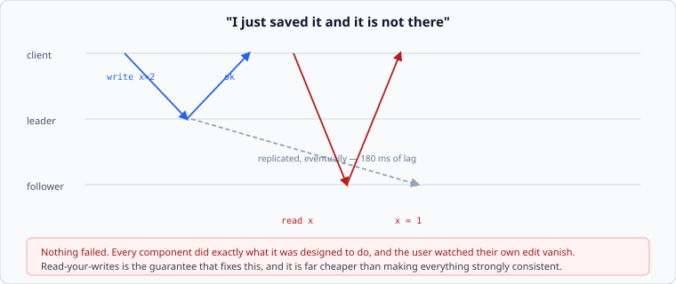

# Why copies, and what they cost

*Week 5 · Day 1 · about 25 minutes*

> By the end of this you can say which of the four reasons you are replicating for, and
> why three of them want different arrangements.

---

## Read the primary sources first

| Source | Tier | What it gives you |
|---|---|---|
| [**Dynamo**](https://www.allthingsdistributed.com/files/amazon-dynamo-sosp2007.pdf) §4 | 1 | Amazon replicating for availability, and being explicit that they chose it over consistency |
| [**Spanner**](https://research.google/pubs/spanner-googles-globally-distributed-database-2/) | 1 | Google replicating for consistency *and* geography, and what that costs in latency |
| [**Jepsen — Consistency models**](https://jepsen.io/consistency) | 1 | The map of what "consistent" can mean. Bookmark this; you will use it all week |

Read the Jepsen consistency page today, even though Thursday is the day for it. Having
seen the map once makes the rest of the week much less confusing.

---

## Last week every key had one home

That assumption made week 4 tractable. Remove it and almost everything hard in
distributed systems appears at once — because now a key lives in several places, and
**those places can disagree.**

---

## Four reasons, and they are not the same reason

| Reason | What you need | What you do not need |
|---|---|---|
| **Durability** | the write is on more than one disk before you say yes | the copies to be readable |
| **Availability** | a copy can serve when one machine is gone | the copies to be identical |
| **Read throughput** | many copies serving reads | the copies to be current |
| **Locality** | a copy near the user | the copies to be near each other |

They pull in different directions. Durability wants writes to wait for copies.
Availability wants writes to succeed even when copies are unreachable. Read throughput
wants many copies, which makes every write more expensive. Locality wants copies far
apart, which is the one thing physics charges most for.

**Say which one you are buying.** A design that says "we replicate three ways" without
saying why cannot answer the next question, which is always "what happens when one of
them is unreachable?" — and the answer differs completely depending on the reason.

---

## Synchronous, asynchronous, and the one in between

The single most consequential knob: **does the write wait for the copies?**

| | The leader waits for | On leader failure | Write latency |
|---|---|---|---|
| **Asynchronous** | nothing | **acknowledged writes can be lost** | one disk |
| **Semi-synchronous** | one follower | one follower has it | one network round trip |
| **Synchronous** | all followers | all have it | the slowest follower |

Fully synchronous is rarer than people expect, and the reason is week 2: if the write
waits for *every* follower, then **every follower's tail latency is your write latency**,
and one slow machine makes all writes slow. Worse, if a follower is down, writes stop
entirely — you have made your availability worse by adding a machine.

Semi-synchronous is the common answer: wait for one, replicate to the rest in the
background. You lose nothing acknowledged unless two machines fail together, and one slow
follower does not stop the world.

Asynchronous is fast and it means **acknowledged writes can be lost on failover**. That
is not a bug; it is a purchase. It only becomes a bug when nobody wrote it down.

---

## Lag, and the thing users actually notice

A user saves a change, the write goes to the leader, the response says "saved", they
reload, the read goes to a follower that has not got it yet, and their change is gone.

Nothing failed. Every component behaved exactly as designed. This is the most common
user-visible consequence of replication and it happens constantly in real systems.

The fix is *not* to make everything strongly consistent — that is expensive and mostly
unnecessary. The fix is a **session guarantee**: this user reads their own writes,
everyone else can be behind. Thursday is about how, and it is far cheaper than it sounds.

Bring your envelope from week 1 to this. "Others may see a 60-second-old version" and
"the author sees their own change immediately" are two different lines, and most products
need exactly those two and nothing stronger.

---

## What replication costs

| Cost | Detail |
|---|---|
| **Write amplification** | three copies means three times the write work, on top of week 3's amplification |
| **Latency** | at minimum a network round trip on the write path, and across regions that is physics |
| **Lag** | followers are behind, always, and the amount varies with load exactly when you care |
| **Failover complexity** | choosing a new leader is a consensus problem, which is Wednesday |
| **Split brain** | two nodes each believing they are the leader. This is how data is lost |

That last one is the week's real subject and it is the same shape as week 4's stale
routing map, one level deeper. Two nodes believing they own a key was bad; two nodes
believing they may *write* to it is worse.

---

## Today's lab

`week-05/day-1/replica.py` — a leader and two followers on `simlib`'s network, with real
latency and real lag.

You will make a write, read from a follower, and get the old value. Then you will kill
the leader mid-replication and count exactly how many acknowledged writes disappeared.
Both are assertions, not stories.

Read [leaders and followers](leaders-and-followers.md) next.

---

> **Sources for this article**
> [Dynamo](https://www.allthingsdistributed.com/files/amazon-dynamo-sosp2007.pdf) and
> [Spanner](https://research.google/pubs/spanner-googles-globally-distributed-database-2/)
> — **Tier 1**, and the two opposite choices are theirs ·
> [Jepsen](https://jepsen.io/consistency) — **Tier 1**, independent and rigorous.
> The four-reasons table is ours — **Tier 3**.
