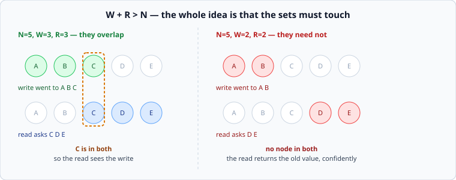

# Quorums

*Week 5 · Day 2 · about 25 minutes*

> By the end of this you can pick N, W and R, say what each combination guarantees, and
> explain why `W + R > N` is not quite the guarantee people think it is.

---

## Read the primary sources first

| Source | Tier | What it gives you |
|---|---|---|
| [**Dynamo**](https://www.allthingsdistributed.com/files/amazon-dynamo-sosp2007.pdf) §4.5, §4.6 | 1 | N, W and R by the people who popularised the notation, plus sloppy quorums and hinted handoff |
| [**Cassandra — Dynamo architecture**](https://cassandra.apache.org/doc/latest/cassandra/architecture/dynamo.html) | 2 | The same, as production documentation with the consistency levels named |
| [**Jepsen — Consistency models**](https://jepsen.io/consistency) | 1 | Where quorum systems actually sit on the map, which is lower than most people assume |

---

## Three numbers

| | Means |
|---|---|
| **N** | how many copies of each key exist |
| **W** | how many must acknowledge before a write is successful |
| **R** | how many are asked on a read |

Choosing them is choosing your position on every trade in the week at once.

**If `W + R > N`, every read set and every write set share at least one node**, so a read
is guaranteed to see at least one copy of the most recent completed write. That is the
whole mechanism — pigeonhole, not cleverness.

| N | W | R | What you get |
|---|---|---|---|
| 3 | 2 | 2 | the common default. Survives one node down, for reads and writes |
| 3 | 3 | 1 | fast reads, and **writes stop when any node is down** |
| 3 | 1 | 1 | fast everything, no overlap, stale reads are normal |
| 3 | 1 | 3 | fast writes, reads stop when any node is down |
| 5 | 3 | 3 | survives two nodes down. More copies, more write cost |

Read the second and fourth rows together. `W=N` and `R=N` both give strong guarantees on
one side by making the *other* side unavailable as soon as a single node is unreachable.
That is often a worse system, and it is a common accidental configuration.

---

## What `W + R > N` does not give you

This is the part that gets people, and being able to say it is the difference between
having read about quorums and understanding them.

**It is not linearizability.** The overlap guarantees a read sees a copy of the latest
*completed* write. It does not order concurrent operations, it does not stop a read
seeing a write that is still in progress and then a later read not seeing it, and it says
nothing at all about writes that failed partway.

The specific holes, all of which Dynamo is explicit about:

- **A partial write.** W=2, one node accepted, one failed: the write is reported failed,
  and one node has the value anyway. Later reads may or may not see it, depending on which
  nodes they ask.
- **Concurrent writes.** Two clients write different values at the same time. Both reach
  quorums. Now two copies disagree and the system must decide which wins — that is [the
  next article](conflicts.md).
- **A read during a write.** Read once and see the new value; read again a moment later
  from a different set and see the old one. Nothing is broken; nothing promised
  monotonic reads either.
- **Node failure and repair.** A node that was down comes back holding old data and
  counts towards R.

Jepsen's consistency map puts quorum systems well below linearizable, and it is worth
looking at where exactly. **"We use quorums" is not an answer to "is it consistent?"**

---

## Sloppy quorums and hinted handoff

Dynamo's answer to a different question: what if you cannot reach W of the *right* nodes?

A **sloppy quorum** accepts the write on any W reachable nodes, even ones that do not
normally hold that key. A **hint** is stored so the data is handed to the correct node
when it returns.

This buys availability: writes succeed during a partition that would otherwise stop them.
It costs the overlap guarantee — the nodes that took the write may not be in any read set
— so **`W + R > N` no longer holds during exactly the failures it was supposed to cover.**

That is a defensible trade for a shopping cart and an indefensible one for a ledger. The
important thing is that it is a choice, usually a configuration flag, and often nobody on
the team knows which way it is set.

---

## Latency, and the reason for hedging

A quorum read waits for R responses out of N. So its latency is the **R-th fastest**
response, not the average — which means:

- `R=1` of 3: you get roughly the fastest of three, which is *better* than a single node
- `R=3` of 3: you wait for the slowest of three, which is week 2's fan-out tail

This is where *The Tail at Scale* connects: asking N and waiting for R is a hedge that
you get for free from the quorum. Higher R buys consistency and costs tail latency, and
those are the same dial.

---

## What goes in a design document

> Each key has 3 copies. Writes require 2 acknowledgements, reads ask 2. **This survives
> one node being unreachable for both reads and writes, and guarantees a read sees the
> latest completed write.** Rejected: W=3 — a single unreachable node would stop all
> writes. **Price:** concurrent writes to one key can produce conflicting copies, which
> we resolve by [tomorrow's mechanism]; and this is not linearizable — a read during an
> in-flight write may see either value.

The last clause is what separates a document that understands quorums from one that has
heard of them.

---

## Today's lab

`week-05/day-2/quorum.py` — N replicas on `simlib`, with configurable W and R.

The two tests that matter run the same workload twice: with `W + R > N` a read always
sees the latest completed write, and with `W + R <= N` it demonstrably does not. Same
code, one number different.

There is also a test for the partial write above — W=2 reported as failed, one node
holding the value — because that is the case people are surprised by, and it is not a bug.

---

> **Sources for this article**
> [Dynamo §4.5–4.6](https://www.allthingsdistributed.com/files/amazon-dynamo-sosp2007.pdf)
> — **Tier 1**, and the source for quorums, sloppy quorums and hinted handoff ·
> [Jepsen](https://jepsen.io/consistency) — **Tier 1** for where this sits on the map ·
> [Cassandra docs](https://cassandra.apache.org/doc/latest/cassandra/architecture/dynamo.html)
> — **Tier 2**. The "what it does not give you" list is our synthesis — **Tier 3** — but
> every item in it is stated somewhere in Dynamo.
