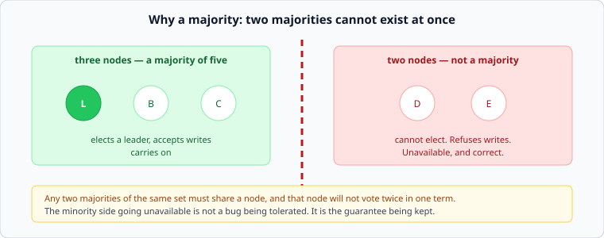

# Consensus, and enough Raft to argue about it

*Week 5 · Day 3 · about 35 minutes, then you build one*

> By the end of today you have implemented leader election, and you can say why a
> majority is the mechanism rather than a convention.

---

## Read the primary sources first

| Source | Tier | What it gives you |
|---|---|---|
| [**In Search of an Understandable Consensus Algorithm (Raft)**](https://raft.github.io/raft.pdf) | 2 | The paper. §5.1–5.2 are today; read them properly, they are six pages and were written to be read |
| [**raft.github.io**](https://raft.github.io/) | 1 | The authors' own site, with a visualisation that is worth ten minutes |
| [**etcd — API learning**](https://etcd.io/docs/v3.5/learning/api/) | 2 | What a consensus system looks like from outside: leases, revisions, watches |
| [**ZooKeeper overview**](https://zookeeper.apache.org/doc/current/zookeeperOver.html) | 2 | The older design, and the guarantees it does and does not offer |

Read Raft §5.1 and §5.2 before the lab. Today's lab is those two sections.

---

## The question

**How do several machines agree on one value when any of them may crash and the network
may delay or drop anything?**

Every hard thing this week reduces to it: which follower is the new leader, what the
current configuration is, who holds the lock, what the last committed write was.

And a result worth knowing by name: in an asynchronous network with even one faulty
process, no deterministic algorithm can guarantee agreement in bounded time — the FLP
impossibility. Practical systems live with it by using timeouts, which means they
guarantee *safety* always and *liveness* only when the network behaves. Raft is a
particularly readable example of that bargain.

---

## Terms, votes, majorities

Raft's core, in the amount you need to design with.

**Time is divided into terms.** A term is a number that only ever increases. Each term has
at most one leader.

**A node with no leader becomes a candidate**, increments the term, votes for itself, and
asks everyone else for a vote.

**A node votes at most once per term.** This one rule is what makes the whole thing work.

**A candidate with votes from a majority becomes leader.** Not a plurality, not a fixed
set — a majority of all nodes.

### Why a majority, specifically

Because **any two majorities of the same set must share at least one node**, and that node
will not vote twice in one term. So two leaders cannot be elected in the same term. It is
pigeonhole again, and it is the entire safety argument.

This is why cluster sizes are odd. Five nodes tolerate two failures; six nodes also
tolerate two, because a majority of six is four. The sixth machine costs money and buys
nothing.

### The minority goes unavailable, and that is correct

The two-node side cannot elect a leader, so it refuses writes. That is not a failure being
endured; **it is the guarantee being kept.** The alternative — letting the minority carry
on — is split brain, and now two halves have accepted conflicting writes and there is no
correct way to merge them.

This is CAP, arriving as a concrete mechanism rather than a slogan: under a partition,
this system chose to stop rather than diverge. Dynamo chose the other way on purpose, for
data where that made sense.

---

## Split votes, and why timeouts are random

Three candidates all time out at once, all vote for themselves, nobody gets a majority.
The term ends with no leader and it repeats — potentially for ever, if they keep timing
out together.

The fix is almost embarrassingly simple: **randomise the election timeout.** Each node
waits a different amount, so one usually goes first and wins before the others start.

It is worth noticing what kind of fix that is. There is no clever protocol here; the
system is made to work by breaking symmetry with randomness. Several hard distributed
problems have answers of exactly that shape, and jitter on retries — week 9 — is the same
move.

---

## Log replication, briefly

Once elected, the leader accepts writes, appends them to its log, and replicates. An entry
is **committed** once a majority have it, and only then may it be applied and acknowledged.

The two rules that matter for design:

- **A candidate whose log is behind cannot win.** Voters refuse a candidate less
  up-to-date than themselves, which is why a new leader always has every committed entry.
  Compare Monday's first failure mode: this is the fix for promoting a stale follower.
- **A committed entry is never lost or reordered.** Uncommitted entries on a deposed
  leader *are* discarded, which is why "acknowledged" must mean "committed" and not
  "written down".

---

## What this costs

| Cost | Detail |
|---|---|
| **A round trip per write** | to a majority, on the write path. Across regions this is physics |
| **Odd cluster sizes** | and every added node makes writes slower, not faster |
| **Unavailability on partition** | by design, on the minority side |
| **It does not scale writes** | every write goes through one leader. Consensus is for *agreement*, not throughput |

That last row is the most common misuse. Putting all your data in a consensus system
because consistency sounds good gives you a system whose write throughput is one machine's
and whose latency is a majority round trip. **Consensus is for the small, critical
decisions** — who is the leader, what is the configuration, who holds the lease — and the
bulk data lives elsewhere, arranged by those decisions.

---

## What goes in a design document

> Leadership and configuration are decided by a 5-node consensus group; the data itself is
> not stored there. **Rejected: consensus on the data path** — every write would cost a
> majority round trip and be capped at one leader's throughput. **Price:** a partition
> that isolates 3 of the 5 makes leadership changes impossible until it heals, and the
> group is a dependency for failover.

---

## Today's lab

`week-05/day-3/election.py` — Raft leader election on `simlib`'s network, with partitions.

- terms, candidates, votes, and the one-vote-per-term rule
- randomised election timeouts
- **`test_no_two_leaders_in_one_term`** — the safety property, checked over a long random
  run with nodes crashing and the network dropping messages
- a 3–2 partition where only the majority elects, and the minority's old leader steps down
- healing the partition, and the higher term winning

The safety test is the one to be proud of when it passes. It is the actual guarantee, and
you will have implemented the thing that provides it.

---

> **Sources for this article**
> [Raft](https://raft.github.io/raft.pdf) — **Tier 2**, and §5.1–5.2 are the lab ·
> [raft.github.io](https://raft.github.io/) — **Tier 1**, the authors' own ·
> [etcd](https://etcd.io/docs/v3.5/learning/api/) and
> [ZooKeeper](https://zookeeper.apache.org/doc/current/zookeeperOver.html) — **Tier 2**.
> FLP (Fischer, Lynch and Paterson, 1985) is cited by name; the "consensus is for small
> decisions" framing is ours — **Tier 3**.
