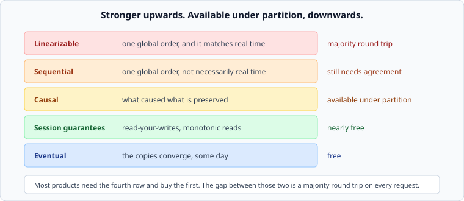

# Consistency models, and the two you actually need

*Week 5 · Day 4 · about 30 minutes*

> By the end of this you can name what a system guarantees, place it on a map, and
> notice when a product needs far less than it is paying for.

---

## Read the primary sources first

| Source | Tier | What it gives you |
|---|---|---|
| [**Jepsen — Consistency models**](https://jepsen.io/consistency) | 1 | The map, with every model defined and the implications drawn. This is the reference |
| [**Jepsen — analyses**](https://jepsen.io/analyses) | 1 | Real databases tested against their own claims. Read one in full |
| [**Spanner**](https://research.google/pubs/spanner-googles-globally-distributed-database-2/) | 1 | What buying the strongest model actually costs, measured, by Google |

Spend twenty minutes on the Jepsen consistency page. It is the best single artefact in
this field and it is free.

---

## A ladder

**Linearizable.** There is one global order of operations, and it respects real time: if
your write finished before my read started, I see it. This is what people mean when they
say "consistent" without thinking, and it costs a majority round trip on every operation.

**Sequential.** One global order that everybody agrees on, but it need not match real
time. Weaker than it sounds and rarely what a product wants.

**Causal.** If A caused B, everyone who sees B sees A. Comments appear after the post they
reply to; the reply never arrives first. Notably, **causal consistency is available under
partition** — it is roughly the strongest thing that is.

**Session guarantees.** Not a global property at all. Per-client promises:

| | Means |
|---|---|
| **Read-your-writes** | you see your own writes. Others may not, yet |
| **Monotonic reads** | you never see time go backwards |
| **Monotonic writes** | your own writes apply in the order you made them |

**Eventual.** If writes stop, the copies converge. It promises nothing about when, and
nothing about what you see in the meantime.

---

## The two you actually need

Almost every product needs **read-your-writes** and **monotonic reads**, and almost
nothing else.

- A user posts and sees their post. Nobody else needs to see it in the same millisecond.
- A user refreshes and does not watch the page go backwards in time.

Those two are cheap. They do not require agreement, a majority, or a round trip. Two
mechanisms, both simple:

**Route the session to one replica.** Sticky routing gives you both guarantees for free,
as long as the replica stays up — and a fallback needs one of the mechanisms below.

**Carry a version token.** The client keeps the version it last saw; reads send it; a
replica behind that version either waits or forwards. Slightly more work, survives
rerouting, and it is what most systems that do this properly actually do.

**A great many designs buy linearizability for the whole system to solve a problem that
two session guarantees would have solved.** Noticing that is one of the highest-value
things in this course, because the cost difference is a round trip on every request.

---

## CAP, and why PACELC is the useful version

The famous statement: under a network **P**artition, you choose **C**onsistency or
**A**vailability.

True, and less useful than its fame suggests, because partitions are rare and the
statement says nothing about the other 99.9% of the time.

**PACELC** extends it: if there is a **P**artition, choose **A** or **C**; **E**lse,
choose **L**atency or **C**onsistency.

The second half is the one that describes your Tuesday. There is no partition; you are
still choosing, on every single request, between waiting for agreement and answering
quickly. Spanner chose consistency and pays in latency; Dynamo chose latency and pays in
conflicts. Both are documented, both are right, and each would be wrong in the other's
place.

> **CAP is about the rare case. PACELC is about the normal one.** Design for the normal
> one and check the rare one.

---

## Consistency and isolation are different words

A common confusion, and a good one to be precise about.

**Consistency** here is about replicas: do the copies agree, and what does a reader see?

**Isolation** is about concurrent transactions on one copy: can one transaction see
another's half-finished work? That is `read committed`, `repeatable read`, `serializable`
— a separate ladder, on a different axis.

A database can be strongly consistent across replicas and offer weak isolation, or the
reverse. When someone says "it's consistent", the useful question is **"consistent in
which sense?"**, and the Jepsen page distinguishes them carefully.

---

## What goes in a design document

Not "the system is eventually consistent". This:

> **Guarantees.** A user always sees their own writes and never sees the timeline go
> backwards, implemented by a version token carried on each read. Other users see a write
> within 2 seconds at p99. There is no global ordering guarantee between two different
> users' writes, and the product does not need one — the only place it would matter is
> the ledger, which lives in the consensus group and *is* linearizable.

Per-client guarantees, a staleness bound with a number, the guarantee that is deliberately
absent, and the one place that pays for more. Four sentences, and it is a better answer
than any single adjective.

---

## Today's lab

`week-05/day-4/session.py` — the two guarantees, implemented.

- `VersionToken` carried by a client across reads and writes
- a replica set with different lag, and a router
- **read-your-writes**: a test that fails without the token and passes with it
- **monotonic reads**: a test where a client bounces between replicas and time runs
  backwards, and the token stops it
- `stale_by_ms(replica)` and a policy that removes a replica from the read pool once it is
  too far behind

The read-your-writes test is the day. You will watch a user's own edit disappear, add
nine lines, and watch it stop happening — without making anything linearizable.

---

> **Sources for this article**
> [Jepsen consistency models](https://jepsen.io/consistency) and
> [analyses](https://jepsen.io/analyses) — **Tier 1**, independent, and the reference for
> this whole article · [Spanner](https://research.google/pubs/spanner-googles-globally-distributed-database-2/)
> — **Tier 1** for the cost of the strongest model. CAP is Brewer's conjecture (2000),
> proved by Gilbert and Lynch (2002); PACELC is Abadi (2012) — both cited by name.
> The "two you actually need" argument is ours — **Tier 3**.
