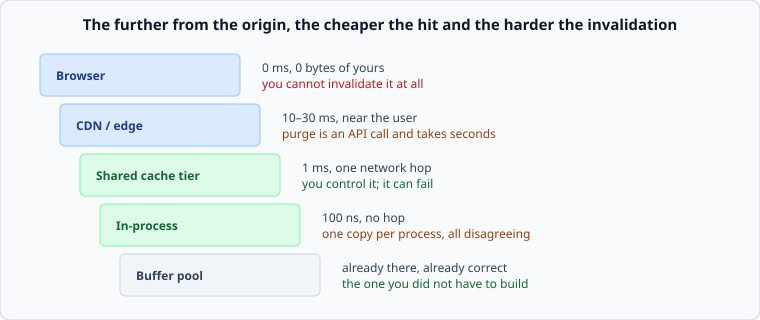

# Where to cache

*Week 6 · Day 1 · about 20 minutes*

> By the end of this you can pick a layer, and say what you gave up on invalidation to
> get the speed.

---

## Read the primary sources first

| Source | Tier | What it gives you |
|---|---|---|
| [**Scaling Memcache at Facebook**](https://www.usenix.org/system/files/conference/nsdi13/nsdi13-final170_update.pdf) §3–4 | 1 | A shared cache tier at enormous scale, with the regional and cross-region complications |
| [**MDN — HTTP caching**](https://developer.mozilla.org/en-US/docs/Web/HTTP/Caching) | 2 | What browsers and proxies actually do, which is not always what you told them to |
| [**RFC 9111 — HTTP Caching**](https://www.rfc-editor.org/rfc/rfc9111) | 2 | The specification, for when the documentation disagrees with reality |

---

## Five layers, one trade



The pattern is monotonic and worth stating as a rule:

> **The further from the origin, the cheaper the hit and the harder the invalidation.**

A browser cache is free and you can never take it back. A database buffer pool is always
correct and does nothing for your network latency.

---

## Layer by layer

**Browser.** Free, zero latency, zero cost to you. And **you cannot invalidate it** — the
value is on a machine you do not control, and it will be used until it expires. Everything
you put here you are committing to for the length of its TTL, which is why the standard
technique is to make the URL contain a version and never invalidate anything at all.

**CDN / edge.** Near the user, so it eliminates the physics from week 1 — a cross-ocean
round trip you never make. Purging is possible but it is an API call that takes seconds
and applies to hundreds of locations. Good for anything shared between users; awkward for
anything personalised, because the cache key has to include the thing that personalises
it and your hit rate collapses.

**Shared cache tier.** One network hop, one copy that every application server sees, and
you control it. This is the layer people mean by "the cache", and it is where week 5's
material bites hardest: it is a replica, it can fail, and when it fails your origin sees
the cold-start multiplier.

**In-process.** As fast as memory and no hop at all. The catch is that you have one copy
per process, so with 200 servers you have 200 caches that all disagree, all expire at
different moments, and cannot be invalidated together. Excellent for small, slow-changing
data — configuration, feature flags, reference tables. A trap for anything a user
notices, because "it worked when I refreshed" is a support ticket you cannot reproduce.

**The database's own buffer pool.** Already there, always correct, no invalidation problem
because it *is* the data. Worth remembering before adding a layer: a database with enough
memory to hold its working set is already a cache, built by people who thought hard about
it.

---

## Choosing

Two questions, in order:

**1. What is the same for everybody?** Shared data caches well at the edge. Personalised
data does not — putting a user id in a CDN cache key gives you one entry per user and a
hit rate near zero.

The useful move is to split the response: the shared 90% cached at the edge, the
personalised 10% fetched separately. That is a real architectural decision that follows
from one question about the data.

**2. How stale may it be, and who has to be told when it changes?** If the answer is
"nobody, it expires" — cache far out, use TTLs, keep it simple. If it is "everyone,
immediately" — cache close, where you can invalidate, and read tomorrow's article
carefully.

---

## Multiple layers, and the multiplied staleness

Real systems have several of these at once, and staleness **adds**:

```
browser 60 s  +  CDN 300 s  +  app cache 60 s   =  up to 420 s stale
```

A user can see a value seven minutes old while every individual TTL looked reasonable.
Nobody chose seven minutes; it is what the layers add up to.

**Write the layers down and add up the TTLs.** Then compare the total with your envelope's
freshness line. This takes two minutes and it is a check almost nobody performs.

---

## What goes in a design document

> Product data is cached at the edge for 300 s and in the shared tier for 60 s; the
> personalised block is never cached and is fetched by a separate request. **Worst-case
> staleness for a shared field is 360 s**, which is inside the 10-minute freshness line.
> Prices are excluded from both and read through, because their line is 5 seconds.

Layers, numbers, the sum, and the exception with its reason.

---

## Today's lab

`cache.py`, from the previous article. `total_staleness(layers)` is the arithmetic above —
two lines, and it catches a class of bug that survives code review routinely.

---

> **Sources for this article**
> [Scaling Memcache at Facebook](https://www.usenix.org/system/files/conference/nsdi13/nsdi13-final170_update.pdf)
> — **Tier 1** · [MDN](https://developer.mozilla.org/en-US/docs/Web/HTTP/Caching) and
> [RFC 9111](https://www.rfc-editor.org/rfc/rfc9111) — **Tier 2**.
> The five-layer table and the staleness-adds rule are ours — **Tier 3**.
