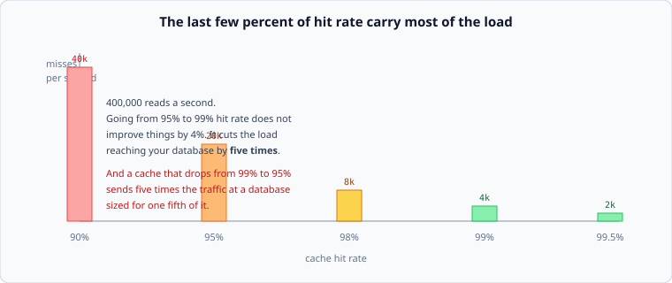

# Why caches work, and what they hide

*Week 6 · Day 1 · about 25 minutes*

> By the end of this you can compute a hit rate from a working set, turn it into
> effective latency and origin load, and say what your system does when the cache is
> empty.

---

## Read the primary sources first

| Source | Tier | What it gives you |
|---|---|---|
| [**Scaling Memcache at Facebook**](https://www.usenix.org/system/files/conference/nsdi13/nsdi13-final170_update.pdf) | 1 | NSDI 2013. Facebook engineers on running one of the largest caching tiers ever built, including everything that went wrong |
| [**Redis — key eviction**](https://redis.io/docs/latest/develop/reference/eviction/) | 1 | What happens when a cache is full, in the project's own documentation |
| [**Memcached wiki**](https://github.com/memcached/memcached/wiki) | 1 | The other one, and its slab allocator — worth knowing why memory accounting is not simple |

Read the Facebook paper's §1–3 today. It is the single best primary source on caching and
you will use it all week.

---

## A cache is a replica you gave no consistency story to

Say that once and week 5 does most of this week's work for you.

A cache is a copy of data somewhere else, which can be stale, which readers might see
instead of the truth. Everything from last week applies: staleness bounds, read-your-writes,
the race between a write and a copy. The only difference is that a cache is *allowed* to
be wrong and has no protocol for becoming right — it just expires.

That framing is worth more than any amount of caching-specific advice, because it puts the
right questions in your head: **what does a reader see, for how long, and who is
responsible for the copy being wrong?**

---

## Why they work at all

Because access is never uniform. From week 1: a small fraction of keys takes a large
fraction of the traffic, so a small amount of memory covers most requests.

```
10,000,000 products
   20,000 of them account for most of an hour's traffic
   20,000 × 2 KB  =  40 MB
```

Forty megabytes covers the bulk of ten million products. That is the whole argument, and
it is arithmetic you already did in week 1 — the working set.

**Compute the working set before discussing the cache.** If it fits in memory, the design
conversation is short. If it does not, you are not building a cache, you are building a
tiered storage system, and that is a different and larger decision.

---

## The hit-rate arithmetic

Two numbers fall out of a hit rate, and the second is the one people miss.

**Effective latency:**

```
effective = hit_rate × hit_latency + (1 − hit_rate) × miss_latency
```

95% hits at 1 ms, misses at 40 ms → `0.95 × 1 + 0.05 × 40 = 2.95 ms`. Good.

**Origin load** — and this is where it gets interesting:

```
origin_qps = total_qps × (1 − hit_rate)
```



At 400,000 reads a second:

| Hit rate | Misses reaching the origin |
|---|---|
| 90% | 40,000/s |
| 95% | 20,000/s |
| 98% | 8,000/s |
| 99% | 4,000/s |
| 99.5% | 2,000/s |

Going from 95% to 99% is not a 4% improvement. **It is a five-fold reduction in the load
your database has to survive**, which very often is the difference between one database
and a sharded fleet.

And read that table backwards, because that is the direction that hurts: a cache whose hit
rate drops from 99% to 95% has just multiplied your database load by five, at a database
sized for one fifth of it. Hit rate is not a performance metric. **It is a capacity
dependency**, and it belongs on the same page as your utilisation numbers.

---

## What a cache hides

Three things, and each is a design decision you should make on purpose.

**It hides staleness.** Nothing in a hit tells you how old the value is. If your envelope
has a freshness line, the TTL is that line and should be derived from it rather than
picked.

**It hides the origin's real capacity.** With a 99% hit rate, your database serves 1% of
traffic and looks comfortable. You have no evidence it could serve more, and you will find
out when the cache is empty.

**It hides variance.** From week 2: a cache makes the *mean* better and the
*distribution* bimodal. A 1 ms hit and a 40 ms miss give a coefficient of variation near
3, which through Kingman is roughly five times the queueing at the same utilisation.

> **The p99 of a cached system is a miss.** Optimising the hit path does nothing for it.

---

## The cold cache

The question that ends most cache discussions, and it should be asked first:

> **What happens when the cache is empty?**

It happens more often than people expect: a deploy, a restart, an eviction storm, a
failover, a new region. And at that moment every request is a miss, so the origin receives
the *full* 400,000/s rather than the 4,000/s it was sized for — a hundred times its
capacity, instantly.

If the honest answer is "the database falls over", then the cache is not an optimisation,
it is a load-bearing component of your availability, and it needs the treatment that
implies: warming, staged rollouts, request coalescing, and an origin with enough headroom
to survive some multiple of its normal load.

Facebook's paper is largely about this class of problem, which is a good indication of how
central it is.

---

## Today's lab

`week-06/day-1/cache.py`:

- an LRU cache with per-entry TTL, and eviction that counts
- `hit_rate`, `effective_latency`, `origin_qps`
- `working_set_bytes` and `fits_in(memory_bytes)`
- `cold_start_multiplier(hit_rate)` — how many times normal load the origin sees when the
  cache is empty. It is `1 / (1 − hit_rate)`, it is a large number, and computing it is
  the point

Read [where to cache](where-to-cache.md) next.

---

> **Sources for this article**
> [Scaling Memcache at Facebook](https://www.usenix.org/system/files/conference/nsdi13/nsdi13-final170_update.pdf)
> (Facebook, NSDI 2013) — **Tier 1** · [Redis](https://redis.io/docs/latest/develop/reference/eviction/)
> and [Memcached](https://github.com/memcached/memcached/wiki) documentation — **Tier 1**.
> The hit-rate arithmetic is arithmetic; the "replica with no consistency story" framing
> is ours — **Tier 3**.
