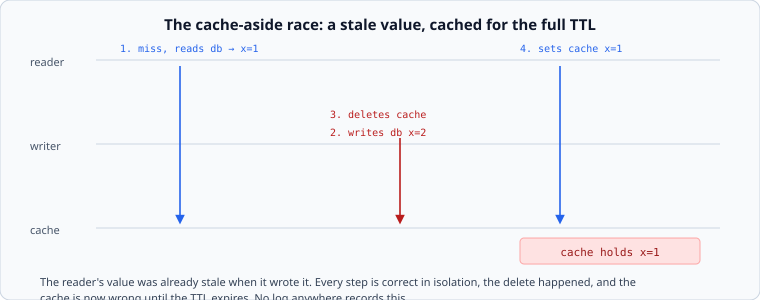

# Invalidation

*Week 6 · Day 2 · about 30 minutes*

> By the end of this you can name the four write strategies, describe the cache-aside
> race precisely, and pick a scheme that does not have it.

---

## Read the primary sources first

| Source | Tier | What it gives you |
|---|---|---|
| [**Scaling Memcache at Facebook**](https://www.usenix.org/system/files/conference/nsdi13/nsdi13-final170_update.pdf) §3.2, §4.1 | 1 | Leases and the stale-set problem, described by the people it happened to |
| [**Redis — key eviction**](https://redis.io/docs/latest/develop/reference/eviction/) | 1 | What a cache does when it is full, which is a different question from invalidation and gets confused with it |
| [**RFC 9111**](https://www.rfc-editor.org/rfc/rfc9111) | 2 | Freshness, revalidation and `stale-while-revalidate`, specified |

The Facebook paper's §3.2 is the primary source for today's race. Read it.

---

## Four ways to handle a write

| Strategy | The write | First read after | Failure mode |
|---|---|---|---|
| **Cache-aside** | write the store, delete the cache entry | miss, then populate | the race below |
| **Write-through** | write the store and the cache together | hit | two systems to keep in step; a partial failure leaves them disagreeing |
| **Write-behind** | write the cache, flush to the store later | hit | fast, and you can lose acknowledged writes — week 5's bill, again |
| **Write-around** | write the store, leave the cache alone | stale until TTL | simple, and stale for the full TTL |

Cache-aside is what almost everyone uses, mostly by default. It is a reasonable choice and
it has one specific problem that everyone meets eventually.

---

## The cache-aside race



1. A reader misses, and reads `x = 1` from the store
2. A writer writes `x = 2` to the store
3. The writer deletes the cache entry — which is empty, so nothing happens
4. The reader, finally, sets the cache to `x = 1`

The cache now holds a stale value **for the whole TTL**, and every step was correct. The
delete happened. The write happened. Nothing logs anything.

The window is small — it needs a reader to be slow between its store read and its cache
write — which makes it worse rather than better: it happens rarely, unreproducibly, and
usually to your most important key, because that is the one being read constantly.

### Three real fixes

**Delete after the write, and delete again after a short delay.** Crude, effective, and
widely used. The second delete lands after any in-flight reader has written its stale
value. It does not close the window, it just makes the exposure a few hundred milliseconds
rather than a full TTL.

**Leases.** The Facebook paper's answer. On a miss, the cache issues a token; only a
reader holding the current token may set the value, and an invalidation invalidates the
token. The stale reader's set is rejected because its token is stale.

Notice the shape — that is week 5's fencing token, in a cache. Same problem, same
solution: a participant may be confused, and a monotonic token makes it harmless.

**Version the key.** Do not invalidate at all. Include a version in the cache key, and a
write publishes a new version; readers of the old key are reading a value that is still
correct for that version, and it ages out.

```
product:42:v7   ->  the value as of version 7
```

No race, because nothing is ever overwritten in place. The cost is that the old entries
sit there until they expire, so you pay in memory for a while. Very often that is the best
trade available, and it is the same insight as week 3's immutable files.

---

## TTL is a requirement, not a habit

`ttl=3600` appears in a lot of code, chosen by nobody.

The TTL **is** the freshness line from your envelope. If the product says a price change
must be visible in 5 seconds, the price TTL is 5 seconds, and if that produces an
unacceptable origin load then either the requirement or the architecture has to move — and
that is a conversation worth having explicitly rather than by accident.

Two more things worth knowing:

**Different fields need different TTLs.** A product's price and its description have
wildly different freshness requirements, and caching them as one object forces the shorter
one on both. Splitting them is a real design decision with a real cost — two lookups
instead of one — and it is Friday's milestone.

**Uniform TTLs synchronise.** Ten thousand entries written at the same moment with the same
TTL all expire at the same moment. Add jitter, for exactly the same reason as retries:
without it you have built a synchroniser. That is tomorrow.

---

## What goes in a design document

> Product data is cache-aside with a versioned key: a write publishes `product:{id}:v{n}`
> and bumps the version pointer. **Rejected: delete-on-write** — the stale-set race would
> leave a wrong price cached for the full TTL, and the envelope allows 5 seconds.
> **Price:** superseded versions occupy memory until they expire, roughly 15% overhead at
> our write rate.

---

## Today's lab

`week-06/day-2/invalidation.py`:

- `CacheAside` with `read` and `write`, and a deliberately reproducible interleaving that
  demonstrates the race — the test drives the steps in order, so it fails every time
  rather than one run in ten thousand
- `delete_after(delay)` — the crude fix, and a test showing what it does and does not
  close
- `LeasedCache` — the Facebook mechanism, and a test showing the stale set being rejected
- `VersionedKeys` — the race made impossible, plus the memory overhead it costs

Write `CacheAside` first and run its race test. Watching a wrong value get cached by
correct code is the day.

---

> **Sources for this article**
> [Scaling Memcache at Facebook §3.2](https://www.usenix.org/system/files/conference/nsdi13/nsdi13-final170_update.pdf)
> — **Tier 1**, and the source for both the race and leases ·
> [Redis](https://redis.io/docs/latest/develop/reference/eviction/) — **Tier 1** ·
> [RFC 9111](https://www.rfc-editor.org/rfc/rfc9111) — **Tier 2**.
> The four-strategy table and the "TTL is a requirement" framing are ours — **Tier 3**.
