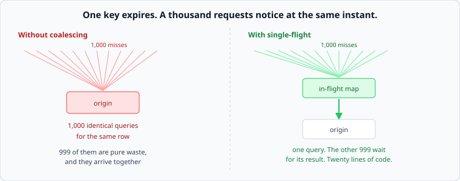

# Stampedes, and the misses you can avoid

*Week 6 · Day 3 · about 30 minutes*

> By the end of this you can stop a thundering herd with twenty lines, and explain why
> a uniform TTL is a synchroniser.

---

## Read the primary sources first

| Source | Tier | What it gives you |
|---|---|---|
| [**Scaling Memcache at Facebook**](https://www.usenix.org/system/files/conference/nsdi13/nsdi13-final170_update.pdf) §3.2.1 | 1 | Leases, presented specifically as stampede prevention. The primary source for this |
| [**Optimal Probabilistic Cache Stampede Prevention**](https://cseweb.ucsd.edu/~avattani/papers/cache_stampede.pdf) | 2 | VLDB 2015. Early recomputation with a proof, rather than folklore |
| [**RFC 9111** — `stale-while-revalidate`](https://www.rfc-editor.org/rfc/rfc9111) | 2 | The HTTP-level version of the same idea |

---

## Three ways a cache hurts you at a miss

**The stampede.** One popular key expires. Every request for it misses at the same
instant, and all of them go to the origin.

**The synchronised expiry.** Ten thousand keys written together, with the same TTL,
expire together. You have built an alarm clock.

**The pointless miss.** Requests for keys that do not exist anywhere. Every one is a full
origin lookup that returns nothing, and nothing gets cached, so it happens again.

Each has a small, well-understood fix, and each of those fixes belongs in a design
document as a named mechanism.

---

## Single-flight



A thousand concurrent requests for the same missing key produce a thousand identical
queries. Nine hundred and ninety-nine of them are pure waste, and they arrive together.

The fix is a map of in-flight loads:

```
on miss for key k:
    if k is already being loaded  ->  wait for that result
    otherwise                     ->  load it, and hand the result to everyone waiting
```

Twenty lines. It converts N concurrent misses into one origin request, and it needs no
extra infrastructure at all.

**This is the most under-used mechanism in this course.** It also generalises well beyond
caches: anywhere many callers want the same expensive thing at the same moment — a config
fetch, a token refresh, a schema lookup — the same twenty lines apply.

One limit worth being honest about: single-flight is per process. A thousand servers each
coalescing their own misses still send a thousand requests. Facebook's leases operate in
the shared cache tier for exactly that reason, and it is the right answer when the herd is
big enough.

---

## Jitter, and early recomputation

**Jitter first, because it is free.** Instead of `ttl=300`, use `ttl=300 ± 10%`. Entries
written together now expire spread over a minute, and the cliff becomes a slope.

Say the rule once and it applies for the rest of the course: **any time many things are
scheduled to happen at the same moment, add jitter.** Retries, renewals, TTLs, cron jobs,
health checks. Without it, you have built a synchroniser, and week 9 will make the same
point about retries.

**Then early recomputation.** Rather than waiting for expiry, each reader decides
probabilistically whether to refresh early, with the probability rising as expiry
approaches. Most requests keep using the cached value; one refreshes it before it expires;
nobody ever sees a miss.

The VLDB paper gives the optimal form. The practical version:

```
refresh early if:  now  >  expiry − delta × beta × log(random())
```

You are not required to derive that. You are required to know that "refresh a bit before
it expires, randomly, so exactly one of us does it" is a real technique with a proof
behind it, not a hack.

The HTTP version is `stale-while-revalidate`: serve the stale value immediately and
refresh in the background. Same idea, standardised, and available at the CDN layer for
free.

---

## Negative caching

A request for a key that does not exist costs a full origin lookup and caches nothing, so
the next identical request does it again. Point a scraper at your product URLs with random
ids and every request reaches your database.

Cache the absence — with a short TTL, because "does not exist" becomes wrong the moment
somebody creates it. Thirty seconds of negative caching turns an unbounded attack into a
bounded one.

And when the key space is large enough that even negative caching is too much memory, the
right structure is a membership filter, which is [tomorrow](../day-4/bloom-filters.md).

---

## What goes in a design document

> Misses are coalesced per process, and the shared tier issues a lease per key so that
> only one server loads a missing key. TTLs carry ±10% jitter. Absences are cached for
> 30 seconds. **Rejected: relying on the cache's own hit rate** — at 99% the origin is
> sized for 4,000 qps and a synchronised expiry of the top keys would send far more than
> that at it.

---

## Today's lab

`week-06/day-3/stampede.py`, on `simlib` — concurrency is the whole subject, so the
requests genuinely overlap in simulated time.

- `SingleFlight` — `do(key, loader)`, with waiters resolved by the one loader's result
- a test with 1,000 concurrent misses asserting the origin was called **once**
- `jittered_ttl(base, fraction, rng)` and a test showing a synchronised expiry becoming a
  spread one
- `should_refresh_early(...)` — the probabilistic version, and a test showing that over
  many readers roughly one refreshes and nobody sees a miss
- `NegativeCache` with its own short TTL

```bash
pytest week-06/day-3 -v
```

---

> **Sources for this article**
> [Scaling Memcache at Facebook §3.2.1](https://www.usenix.org/system/files/conference/nsdi13/nsdi13-final170_update.pdf)
> — **Tier 1** · [Vattani et al., VLDB 2015](https://cseweb.ucsd.edu/~avattani/papers/cache_stampede.pdf)
> — **Tier 2** for early recomputation · [RFC 9111](https://www.rfc-editor.org/rfc/rfc9111)
> — **Tier 2**. The "add jitter to anything synchronised" rule is ours — **Tier 3** — and
> it is the same rule week 9 arrives at from the other direction.
