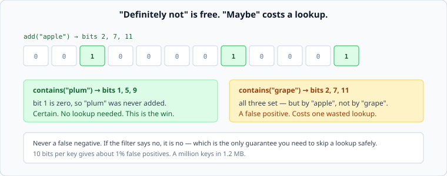

# Bloom filters

*Week 6 · Day 4 · about 25 minutes*

> By the end of this you can size a filter, say what its guarantee actually is, and name
> the three places in this course it would have helped.

---

## Read the primary sources first

| Source | Tier | What it gives you |
|---|---|---|
| **Bloom, B. (1970), "Space/time trade-offs in hash coding with allowable errors"** ([DOI](https://doi.org/10.1145/362686.362692)) | 2 | The original. Paywalled, cited by name |
| [**RocksDB wiki**](https://github.com/facebook/rocksdb/wiki/RocksDB-Overview) | 1 | Where week 3's read amplification went. This is the structure that made it about 1 |
| [**Scaling Memcache at Facebook**](https://www.usenix.org/system/files/conference/nsdi13/nsdi13-final170_update.pdf) | 1 | The surrounding problem: misses are expensive and most of them are avoidable |

---

## One guarantee, in one direction

A bit array and `k` hash functions. To add a key, set the `k` bits it hashes to. To test
a key, check those `k` bits.



| Answer | Means |
|---|---|
| **any bit is 0** | the key was **definitely never added**. Certain |
| **all bits are 1** | the key was **probably** added — or other keys happened to set those bits |

**No false negatives, ever.** That asymmetry is the entire value: a "no" is trustworthy,
so you can skip the expensive lookup on a no, and a "maybe" costs you only the lookup you
would have done anyway.

---

## Sizing it

Two numbers you should be able to produce in a conversation:

```
bits per key ≈ 10   ->  about 1% false positives
bits per key ≈ 15   ->  about 0.1%
```

So a million keys at 1% costs about 1.2 MB. Ten million costs 12 MB. **That is small
enough to change a design**, which is why the structure keeps appearing.

The optimal number of hash functions is about `0.7 × bits_per_key`, which for 10 bits is
7. Real implementations often use fewer, because each hash costs CPU and the accuracy gain
flattens.

The thing to have a feel for is the shape: **halving the false-positive rate costs a fixed
number of extra bits, not double the memory.** Accuracy is cheap here, up to a point, and
that is unusual enough to be worth remembering.

---

## Where it has already come up

Three times in this course, and noticing that is the point of putting it here:

**Week 3, read amplification.** An LSM store's point lookup may check every file. A filter
per file answers "definitely not here" from memory, and read amplification goes from "the
number of files" to about one. This is *the* reason LSM reads are viable.

**Week 6, negative caching.** Requests for keys that do not exist. When the key space is
too large to cache absences individually, a filter over the keys that *do* exist rejects
them without touching the origin.

**Any expensive membership test.** "Have we seen this event id before?", "is this user in
this segment?", "has this URL been crawled?" — anywhere the answer is usually no and
finding out is expensive.

---

## What it cannot do

Being clear about this is most of using it well:

- **No deletion.** Clearing bits would create false negatives, because bits are shared.
  Variants exist (counting filters) at several times the memory
- **No counting, no listing.** It cannot tell you what is in it
- **It fills up.** Add far more keys than it was sized for and every bit is 1, so
  everything is "maybe" and the filter is doing nothing but consuming memory. **A filter
  needs a rebuild policy**, and a design that has one without one is carrying a slowly
  failing component
- **It is not a security boundary.** An attacker who can choose keys can find false
  positives

---

## What goes in a design document

> A membership filter over existing product ids, sized at 10 bits per key — 50 million
> products, 60 MB, about 1% false positives. **A miss on the filter skips the origin
> entirely**, which bounds the cost of requests for ids that do not exist. Rebuilt nightly
> from the catalogue, because a filter that only grows eventually says "maybe" to
> everything.

Size, error rate, what it saves, and the rebuild policy.

---

## Today's lab

`week-06/day-4/bloom.py`:

- `BloomFilter(expected_keys, false_positive_rate)` sizing itself from those two numbers
- `add`, `__contains__`, `bits_per_key`, `estimated_false_positive_rate`
- **a test asserting there is never a false negative** over ten thousand keys — the
  guarantee, checked
- a test measuring the actual false-positive rate against the requested one
- a test filling the filter to five times its design capacity and showing it degrade to
  "maybe" for everything, which is the failure mode people do not plan for

---

> **Sources for this article**
> Bloom (1970) — **Tier 2**, paywalled, cited by name ·
> [RocksDB](https://github.com/facebook/rocksdb/wiki/RocksDB-Overview) and
> [Facebook's memcache paper](https://www.usenix.org/system/files/conference/nsdi13/nsdi13-final170_update.pdf)
> — **Tier 1** for the uses. The sizing rules of thumb are standard results; the "where it
> has already come up" list is ours — **Tier 3**.
