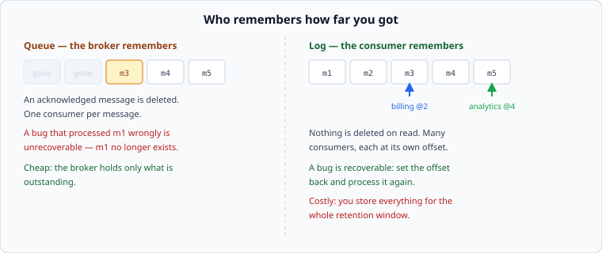

# The log

*Week 7 · Day 1 · about 25 minutes*

> By the end of this you can explain why an append-only sequence with offsets is a
> different thing from a queue, and what each makes possible.

---

## Read the primary sources first

| Source | Tier | What it gives you |
|---|---|---|
| [**Kafka — Design**](https://kafka.apache.org/documentation/#design) | 1 | The project's own account of the log abstraction, partitions, offsets and retention |
| [**Kreps — The Log**](https://engineering.linkedin.com/distributed-systems/log-what-every-software-engineer-should-know-about-real-time-datas-unifying) | 1 | LinkedIn Engineering, 2013. The essay that made this the default way of thinking. Long, and worth all of it |
| [**AWS SQS — developer guide**](https://docs.aws.amazon.com/AWSSimpleQueueService/latest/SQSDeveloperGuide/welcome.html) | 1 | The other model, documented by an operator: visibility timeouts, delete-on-ack |

Read Kafka's Design section today. Read the Kreps essay this week, in one sitting, ideally
not at a desk.

---

## You have already built this

Week 3, day 4: append-only, framed records, read forward, stop at the first bad one.
That was a write-ahead log inside one machine.

**A distributed log is the same structure with the readers moved outside.** Every idea
transfers — order is the structure, replay is free, and a prefix is a state the system
could have been in. That is why this week feels familiar and why it is placed here.

---

## Log against queue



The distinction is not about the software. It is about **who remembers how far you got.**

| | Queue | Log |
|---|---|---|
| On acknowledgement | the message is deleted | nothing happens |
| Consumers per message | one | as many as you like, independently |
| Reprocessing | impossible — it is gone | set the offset back |
| Storage | only what is outstanding | everything, for the retention window |
| Adding a new consumer | sees only new messages | can start from the beginning |

**The queue's failure mode:** a bug processed a message wrongly, you fixed the bug, and
the message no longer exists. Nothing can be done.

**The log's failure mode:** you are storing a week of everything, and that is a real
storage bill and a real compliance question.

Neither is better. But notice that "we might want to reprocess" is very hard to add later
and very cheap to have from the start, which is why so many systems that started as
queues became logs.

---

## Offsets, and what a consumer actually is

A log is an ordered sequence with a number on each record. A consumer is **a position in
that sequence**, and nothing more.

```
partition 0:   [ e0  e1  e2  e3  e4  e5 ]
                              ^        ^
                    billing @3    analytics @5
```

Three consequences that matter in a design:

**A consumer's state is one integer.** Restarting is trivial: read your offset, carry on.
No queue to drain, no in-flight set to reconcile.

**Lag is a subtraction.** `log_end - committed_offset`. It is the metric from week 2 —
how far behind — and it is available for free rather than needing instrumentation.

**Where the offset is committed decides your delivery guarantee.** Commit before
processing and a crash loses the message; commit after and a crash reprocesses it. That
choice *is* at-most-once versus at-least-once, and it is tomorrow.

---

## Partitions, and the order you actually get

A log is partitioned for the same reason anything is — one machine is not enough. Week 4
applies unchanged, and so does its central warning.

**Order is per partition, not global.** Records in one partition are ordered; records in
different partitions have no relationship at all. So the ordering guarantee you get is
whatever your partition key gives you:

```
key = user_id     ->  one user's events are ordered. Two users' are not.
key = order_id    ->  one order's events are ordered.
key = random      ->  nothing is ordered, and throughput is even.
```

This should feel familiar: it is exactly week 4's milestone, where splitting a hot key
destroyed the ordering that made it correct. Same trade, now built into the primitive.

**A global ordering means one partition, which means one machine's throughput.** If
somebody asks for total ordering across a large stream, that is what they are asking for,
and saying so plainly is usually the end of the conversation.

---

## Retention, and the log as a source of truth

Because nothing is deleted on read, the log holds a window of history. Two ways to use it:

**Time or size retention.** Keep seven days, or 500 GB. A consumer that falls further
behind than the window **loses data** — silently, unless somebody is watching lag against
the retention edge. That is an alert worth having and rarely present.

**Compaction.** Keep the latest record per key, for ever. The log becomes a full snapshot
of current state plus its change history, and a new consumer can rebuild everything by
replaying it.

That second mode is what makes the "log as source of truth" idea work: the database
becomes a view of the log rather than the other way round. It is a large architectural
commitment and Kreps's essay is the argument for it.

---

## What goes in a design document

> Click events go to a partitioned log keyed by `campaign_id`, retained 7 days.
> **Ordering is guaranteed per campaign and nowhere else**, which is what the aggregation
> needs. Rejected: a queue — reprocessing after an aggregation bug would be impossible,
> and we expect aggregation bugs. **Price:** 7 days of raw events is 4 TB, and a consumer
> more than 7 days behind loses data, so consumer lag is alerted against the retention
> edge rather than against a fixed number.

---

## Today's lab

`week-07/day-1/log.py`:

- an append-only `Partition` with offsets, and a `Log` that routes by key
- `ConsumerGroup` — independent committed offsets, and lag as a subtraction
- replay: set the offset back and reprocess
- a test showing that two keys in different partitions have **no** ordering relationship,
  and one showing that the same key always does

Read [queues, and the other model](queues-and-brokers.md) next.

---

> **Sources for this article**
> [Kafka documentation](https://kafka.apache.org/documentation/#design) and
> [Kreps, *The Log*](https://engineering.linkedin.com/distributed-systems/log-what-every-software-engineer-should-know-about-real-time-datas-unifying)
> — **Tier 1** · [AWS SQS](https://docs.aws.amazon.com/AWSSimpleQueueService/latest/SQSDeveloperGuide/welcome.html)
> — **Tier 1** for the queue model. The comparison table is ours — **Tier 3**.
