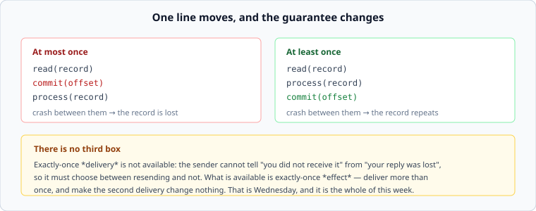

# Delivery guarantees

*Week 7 · Day 2 · about 30 minutes*

> By the end of this you can say which guarantee a system provides from where it commits
> its offset, and explain why exactly-once delivery is not on the menu.

---

## Read the primary sources first

| Source | Tier | What it gives you |
|---|---|---|
| [**Kafka — Message Delivery Semantics**](https://kafka.apache.org/documentation/#semantics) | 1 | The clearest statement of the three guarantees, and of what Kafka's "exactly once" actually means |
| [**AWS SQS — visibility timeout**](https://docs.aws.amazon.com/AWSSimpleQueueService/latest/SQSDeveloperGuide/sqs-visibility-timeout.html) | 1 | At-least-once, and the mechanism that produces it |
| [**Google Pub/Sub — subscriptions**](https://cloud.google.com/pubsub/docs/subscription-overview) | 1 | The same guarantees under different names, which is worth seeing |

---

## Three names, two of which exist

**At most once.** Commit before processing. A crash between the two loses the record.
Nothing is ever processed twice; some things are never processed at all.

**At least once.** Process, then commit. A crash between the two reprocesses the record.
Nothing is ever lost; some things happen twice.

**Exactly once.** Not available as a *delivery* guarantee, and the reason is not
engineering effort.

---

## Why exactly-once delivery cannot exist

A sender transmits a message and waits for an acknowledgement. No acknowledgement arrives.

The sender cannot distinguish:

- the message never arrived, or
- the message arrived, was processed, and the acknowledgement was lost

**These are indistinguishable from outside.** So the sender must choose: resend (and risk
a duplicate) or do not (and risk a loss). There is no third option, and no protocol
creates one — every additional round trip has the same problem one level up.

This is the same shape as week 5's "you cannot tell a crashed node from a slow one", and
it should be starting to feel familiar. The impossibility is not a gap; it is the terrain.

---

## What "exactly once" means when a product says it

Kafka's documentation is careful here and worth reading closely. What real systems provide
is **exactly-once processing within a bounded system**, built from at-least-once delivery
plus one of:

**Idempotent producers and sequence numbers.** The producer numbers its records; the
broker rejects a duplicate it has already accepted. This removes duplicates introduced by
producer retries — a real and common source — and nothing else.

**Transactional writes.** Reading, processing and committing the offset happen in one
atomic unit, so the effect and the record of having done it succeed or fail together. This
works when the effect lands somewhere that can participate in that transaction.

**Idempotent effects.** The general answer, and the only one that works when the effect is
outside the system — a payment, an email, a call to somebody else's API. Deliver as often
as you like; the second delivery changes nothing.

> **Exactly-once delivery is impossible. Exactly-once *effect* is a design choice, and it
> is usually yours to make.**

That is Wednesday, and it is the sentence to carry out of this week.

---

## Choosing between the two that exist

At-least-once is the right default, and the reason is asymmetry: **duplicates are usually
fixable and losses usually are not.**

At-most-once is correct in a narrow set of cases, and being able to name them matters
because otherwise it looks simply worse:

- The data is a sample and the processing is statistical — dropping some metrics points
  is fine, double-counting them corrupts the result
- The record is superseded quickly anyway — a position update, a presence heartbeat
- Reprocessing costs more than the data is worth

For everything else, take at-least-once and make the effect idempotent.

---

## Where the duplicates actually come from

Worth enumerating, because designs often defend against one source and not the others:

| Source | When |
|---|---|
| **Producer retry** | the write succeeded and the acknowledgement was lost |
| **Consumer crash before commit** | the work was done, the offset was not recorded |
| **Visibility timeout expiry** | the consumer was slow, not dead, and somebody else took the message |
| **Rebalance** | a partition moved to another consumer mid-batch. Thursday |
| **Deliberate replay** | you reset an offset to fix a bug, and reprocessed a week |

That last row is the one people forget when reasoning about idempotency, and it is the one
most likely to be *deliberate*. A system whose idempotency only covers accidental
duplicates cannot safely be replayed — which removes the main reason you chose a log.

---

## What goes in a design document

> Consumers commit after processing, so delivery is at-least-once and duplicates are
> expected from all five sources including deliberate replay. **The effect is made
> idempotent by [Wednesday's mechanism]**, so a duplicate changes nothing. Rejected:
> committing before processing — a consumer crash would silently lose click events, and
> the envelope says no acknowledged event may be lost.

---

## Today's lab

`week-07/day-2/delivery.py`, on `simlib` — crashes have to happen at specific instants for
any of this to be demonstrable.

- an at-most-once consumer, and a crash that loses a record
- an at-least-once consumer, and a crash that duplicates one
- a queue with a visibility timeout, and a **slow but healthy** consumer having its
  message redelivered — the failure that looks like a bug and is a configuration choice
- `duplicate_rate(...)` over a run, so "duplicates are rare" becomes a number

The test to sit with is the slow-consumer one: nothing failed, nothing crashed, and the
work was done twice.

---

> **Sources for this article**
> [Kafka — Message Delivery Semantics](https://kafka.apache.org/documentation/#semantics),
> [AWS SQS](https://docs.aws.amazon.com/AWSSimpleQueueService/latest/SQSDeveloperGuide/sqs-visibility-timeout.html)
> and [Google Pub/Sub](https://cloud.google.com/pubsub/docs/subscription-overview) — all
> **Tier 1**. The impossibility argument is standard and long-established; the
> duplicate-sources table is ours — **Tier 3**.
