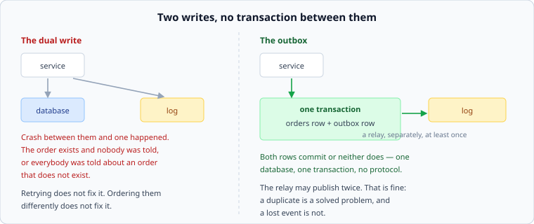

# The dual write problem

*Week 7 · Day 3 · about 20 minutes*

> By the end of this you can spot a dual write in a design, and fix it with a table
> rather than a protocol.

---

## Read the primary sources first

| Source | Tier | What it gives you |
|---|---|---|
| [**Kleppmann — why dual writes are a bad idea**](https://www.confluent.io/blog/using-logs-to-build-a-solid-data-infrastructure-or-why-dual-writes-are-a-bad-idea/) | 3 | The clearest statement of the problem. Analysis rather than first-party, and the origin of how most people now think about it |
| [**Debezium — outbox event router**](https://debezium.io/documentation/reference/stable/transformations/outbox-event-router.html) | 1 | The pattern as production documentation, by a project that implements it |
| [**Debezium documentation**](https://debezium.io/documentation/reference/stable/) | 1 | Change data capture: reading the database's own log instead of asking it |

---

## The problem

Your service does two things that must both happen:

```
db.insert(order)
log.publish(OrderCreated)
```



There is no transaction spanning those two systems. So:

- Crash after the first: the order exists and **nobody was told**. No email, no
  fulfilment, no analytics, and the order sits there looking fine
- Crash after the second: everybody was told about an order that **does not exist**

And the failure is not only crashes. The publish can time out having succeeded, so you
retry and publish twice. Or succeed slowly, so the event arrives before the transaction
that created the order has committed and a consumer reads the database and finds nothing.

**Reordering the two writes does not help** — it moves which side is wrong. **Retrying
does not help** — a retry cannot know whether the first attempt landed. There is no
arrangement of two independent writes that is atomic, and recognising that quickly is the
skill.

---

## The outbox

Write both rows to **the same database, in one transaction**:

```sql
BEGIN;
  INSERT INTO orders  (...);
  INSERT INTO outbox  (event_type, payload);
COMMIT;
```

Both commit or neither does. One database, one transaction, no distributed protocol.

Then a **relay** reads the outbox table and publishes to the log, marking rows as sent.
The relay may crash after publishing and before marking, so it publishes some events
twice — which is fine, because at-least-once with an idempotent effect is exactly the
contract you have already designed for.

That trade is the entire point and worth saying explicitly: **the outbox converts "an
event may be lost" into "an event may be duplicated"**, and you already know how to handle
duplicates.

### What it costs

- Another table, and rows to clean up
- Publishing latency is now the relay's polling interval — often milliseconds, but it is
  not zero and it belongs in your envelope
- The relay is a component that can fall behind, so it needs its own lag metric

---

## Change data capture

The same idea without the extra table: read the database's **own** write-ahead log — the
one from week 3 — and turn committed changes into events.

Nothing to write twice, because there is only ever one write. The database's log is
already an ordered record of everything that committed, which is what you wanted the
event stream to be. Debezium is the well-documented implementation and its documentation
is a good primary source for what this actually involves.

The trade against an outbox:

| | Outbox | CDC |
|---|---|---|
| Events are | what you chose to publish | what actually changed in the tables |
| Coupling | your event schema is yours | consumers see your table schema, and a column rename is a breaking change |
| Operations | a table and a relay | a replication slot and a connector, plus a database that supports it |

The coupling row is the one that decides it in practice. **CDC leaks your schema into
your consumers**, and a well-designed event is usually not the same shape as a row.

---

## Spotting it in a design

Any time a document says "and then we publish an event", ask: **is that in the same
transaction as the state change?** It usually is not, and it usually is not mentioned.

The same shape appears in more places than the obvious one:

- write the database, then invalidate the cache — **week 6's race is a dual write**
- write the database, then send an email
- write two services in sequence and call it a workflow
- write the database, then update the search index

All of them have the same failure and all of them have the same family of answers: make it
one write and derive the rest, or accept the inconsistency and say how it is repaired.

---

## What goes in a design document

> Order creation writes the order and an outbox row in one transaction; a relay publishes
> outbox rows to the log at least once and marks them sent. **Rejected: publishing
> directly after the insert** — a crash between the two loses the event silently, and
> "silently" is the problem rather than "loses". **Price:** publication lag equal to the
> relay's poll interval (p99 200 ms), an outbox table to prune, and duplicate publishes
> on relay restart, which consumers already tolerate.

---

## Today's lab

`idempotency.py`, from the previous article, includes the outbox:

- `dual_write(...)` with a crash point between the two writes, and a test showing the
  order existing with nobody told
- `Outbox` — both rows in one transaction, a relay that publishes and marks
- a test crashing the relay **after** publishing and before marking, showing a duplicate
  rather than a loss — and then showing the consumer's deduplication absorbing it

That last test is the week joining up: the outbox creates duplicates on purpose because
you built the thing that makes duplicates free.

---

> **Sources for this article**
> [Debezium](https://debezium.io/documentation/reference/stable/transformations/outbox-event-router.html)
> — **Tier 1** for the pattern in production documentation ·
> [Kleppmann on Confluent's blog](https://www.confluent.io/blog/using-logs-to-build-a-solid-data-infrastructure-or-why-dual-writes-are-a-bad-idea/)
> — **Tier 3** by our rule, and the origin of the framing, which is the same tier boundary
> we hit in week 5. The "spotting it" list is ours — **Tier 3**.
