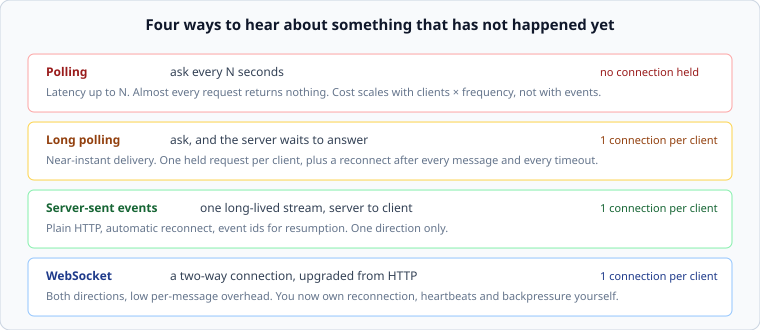

# Push against pull

*Week 8 · Day 1 · about 25 minutes*

> By the end of this you can choose a transport from the requirement, and price the
> choice in requests per second rather than in preference.

---

## Read the primary sources first

| Source | Tier | What it gives you |
|---|---|---|
| [**RFC 6455 — The WebSocket Protocol**](https://www.rfc-editor.org/rfc/rfc6455) | 2 | The specification, including the handshake and why it exists at all |
| [**MDN — WebSockets API**](https://developer.mozilla.org/en-US/docs/Web/API/WebSockets_API) | 2 | What you actually get, and what you do not |
| [**MDN — Server-sent events**](https://developer.mozilla.org/en-US/docs/Web/API/Server-sent_events) | 2 | The simpler option people skip past, including automatic reconnection and event ids |
| [**Slack Engineering — Real-time Messaging**](https://slack.engineering/real-time-messaging/) | 1 | A production system, described by an engineer who runs it. You took this apart in week 1 |

---

## The problem

A client wants to know about something that has not happened yet. HTTP is
request-response, so somebody has to bridge that gap, and the four ways of doing it have
very different costs.



---

## The arithmetic that decides it

Polling's cost is the one people underestimate, because it does not depend on how much is
happening.

```
1,000,000 clients polling every 10 s  =  100,000 requests/second
```

A hundred thousand requests a second, essentially all of which return "nothing new". If
0.1% of clients actually have a message waiting, then **999 requests in every 1,000 are
pure waste** — and the load is identical on a quiet Sunday and during an incident.

Push inverts it: cost scales with **events**, not with clients × frequency.

```
1,000,000 clients, 50,000 events/second  =  50,000 deliveries/second
```

Half the load, and it falls when nothing is happening.

**Do this multiplication in pass 2 whenever a design mentions polling.** It takes ten
seconds and it frequently settles the argument, in either direction — polling wins for
small client counts and long intervals, and the number says which case you are in.

---

## What you pay for push

Not free, and the cost is a different shape: **a held connection per client**.

| Cost | Detail |
|---|---|
| Memory | kilobytes per connection in buffers and state; at a million connections that is gigabytes before any application data |
| File descriptors | one per connection, and the default limits are not designed for this |
| Load balancers | a long-lived connection cannot be rebalanced by the next request, because there is no next request |
| Deploys | restarting a server drops every connection it holds, and they all come back at once |

That last row is the one that produces genuine incidents, and it is week 6's cold cache
wearing different clothes: **a synchronised reconnect is a thundering herd**, and the
answer is the same one — jitter. Thursday.

---

## Choosing

| Requirement | Transport |
|---|---|
| Updates every minute or two are fine | **polling** — and it is genuinely fine, do not apologise for it |
| Server-to-client only, sub-second | **server-sent events** — plain HTTP, automatic reconnect, resumption via event ids |
| Both directions, sub-second | **WebSocket** |
| Both directions, and you need to survive terrible mobile networks | WebSocket, plus a reconnection and replay design you write yourself |

**Server-sent events are under-used.** For notifications, live counters, progress bars,
dashboards — anything where the client only listens — SSE gives you reconnection and
resumption for free, and works through proxies that mangle WebSocket upgrades. People
reach for WebSocket by reflex and then implement reconnection badly.

The rule: **choose the weakest transport that meets the requirement.** Every step up
costs you something you then have to operate.

---

## What goes in a design document

> Clients hold one server-sent events stream per session. **Rejected: polling** — a
> million clients at 10-second intervals is 100,000 requests/second of which about 99.9%
> return nothing. **Rejected: WebSocket** — the client never sends on this channel, so we
> would be operating a bidirectional transport to use half of it, and writing our own
> reconnection. **Price:** one held connection per client, so a deploy drops a million
> connections and they reconnect with jitter over 60 seconds.

---

## Today's lab

`week-08/day-1/transport.py`:

- `polling_qps(clients, interval_s)` and `push_qps(events_per_second)`
- `wasted_fraction(clients, interval_s, event_rate)` — how much of the polling load
  returns nothing
- `connection_memory_bytes(connections, bytes_each)`
- `servers_needed(connections, per_server)` and `reconnect_rate(connections, window_s)`

Read [connections at scale](connections-at-scale.md) next.

---

> **Sources for this article**
> [RFC 6455](https://www.rfc-editor.org/rfc/rfc6455) and
> [MDN](https://developer.mozilla.org/en-US/docs/Web/API/Server-sent_events) — **Tier 2** ·
> [Slack Engineering](https://slack.engineering/real-time-messaging/) — **Tier 1**.
> The arithmetic is arithmetic; the "weakest transport that meets the requirement" rule is
> ours — **Tier 3**.
