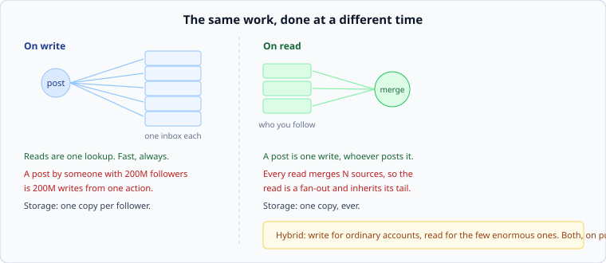

# Fan-out

*Week 8 · Day 2 · about 30 minutes*

> By the end of this you can compute the work a post creates under each strategy, and
> explain why nearly every large system uses both.

---

## Read the primary sources first

| Source | Tier | What it gives you |
|---|---|---|
| [**Slack Engineering — Real-time Messaging**](https://slack.engineering/real-time-messaging/) | 1 | Fan-out to connected clients, and the multiplication a broadcast creates |
| [**Discord — how Discord stores billions of messages**](https://discord.com/blog/how-discord-stores-billions-of-messages) | 1 | The read side: what a channel history costs when it is not pre-computed |
| [**Dean & Barroso — The Tail at Scale**](https://research.google/pubs/the-tail-at-scale/) | 1 | Why a read that merges N sources inherits the p99 of N |

---

## One question, asked at two different times

Somebody posts. Their followers should see it. **When do you do the work?**



**On write:** when the post is made, insert it into every follower's timeline. A read is
then one lookup.

**On read:** store the post once. When somebody reads their timeline, fetch the recent
posts of everyone they follow and merge.

That is the whole choice, and everything else is consequences.

---

## The arithmetic

Take a system with 100 million posts a day, an average of 200 followers, and 500 million
timeline reads a day.

**Fan-out on write:**

```
100M posts × 200 followers  =  20 billion timeline writes/day  =  ~230,000/s
500M reads                  =  one lookup each                 =  ~5,800/s
```

**Fan-out on read:**

```
100M posts                  =  100M writes/day                 =  ~1,200/s
500M reads × 200 sources    =  100 billion fetches/day         =  ~1,160,000/s
```

Both numbers are large; they are large in different places. And the choice follows from
your read/write ratio — which you have been computing since week 1.

> **Fan-out on write pays at write time and makes reads trivial. Fan-out on read pays on
> every read and makes writes trivial. Read-heavy systems choose write; write-heavy
> systems choose read.**

Most social systems are overwhelmingly read-heavy, which is why fan-out on write is the
usual starting point.

---

## Why neither survives contact with a real follower distribution

Follower counts are not distributed evenly. They are extremely skewed — most accounts have
tens, some have millions, one has a hundred million. Week 4's hot key, at the largest scale
it appears in this course.

**What that does to fan-out on write:** a post by an account with 200 million followers is
**200 million writes from one action**. It takes minutes, it saturates whatever is doing
the work, and every ordinary user's post queues behind it. The average fan-out is 200 and
the maximum is a million times that, and systems fall over on maxima.

**What that does to fan-out on read:** an ordinary user following 200 accounts is a 200-way
fan-out on every read. From week 2, that read is as slow as the slowest of 200 — so its
typical latency is the p99.5 of a single fetch.

Neither is acceptable alone. Hence:

---

## The hybrid

**Fan-out on write for ordinary accounts. Fan-out on read for the few enormous ones.**

A timeline read becomes: the pre-computed timeline, plus a live merge of the handful of
huge accounts this user follows. One lookup plus a small merge, and no post ever creates
200 million writes.

The parameters, which belong in your document as numbers:

| | |
|---|---|
| **The threshold** | above how many followers does an account stop being fanned out? |
| **How many** such accounts exist, and therefore how wide the read-side merge is |
| **Who decides**, and when — a static number, or measured and adjusted |

It is not elegant. It is two mechanisms and a rule for choosing between them, and the
reason it wins is that **the distribution has two populations in it, so the design has two
answers.**

That is a general move worth naming: when your workload has a heavy tail, one uniform
strategy will be wrong for one of the populations. Week 4's key splitting, week 6's tail
that a TTL does not help, and this are all the same observation.

---

## Deletion, and other things that make write-fanout awkward

Fan-out on write copies data, and copies have to be maintained:

- **Delete a post** and you must find and remove it from every timeline it was written to
- **Block a user** and their posts must disappear from timelines already computed
- **Change your follower list** and the past does not update — a new follower sees nothing
  historical unless you backfill

Each is solvable, and each is a reason people bound the pre-computed timeline to a few
hundred recent entries and fall back to the read path beyond that. **The pre-computed
timeline is a cache**, which means everything from week 6 applies: it can be wrong, it
needs an invalidation story, and it needs a bound.

---

## What goes in a design document

> Timelines are fanned out on write for accounts under 100,000 followers, which is
> **99.97% of accounts and 84% of posts**. Above that, posts are merged in at read time
> from at most a few dozen accounts a user follows. **Rejected: fan-out on write for
> everyone** — a 200M-follower post is 200M writes, takes minutes, and delays every other
> user's post behind it. **Price:** a read is a lookup plus a merge of up to ~50 sources,
> so its p99 is set by the slowest of those.

Threshold, what fraction it covers, the alternative, and the price in tail latency.

---

## Today's lab

`week-08/day-2/fanout.py`:

- `write_fanout_work(posts, followers)` and `read_fanout_work(reads, following)`
- `hybrid_work(...)` with a threshold, over a **skewed** follower distribution
- `celebrity_write_cost(followers, writes_per_second)` — how long one post takes
- `threshold_for(distribution, max_write_burst)` — pick the threshold from a constraint
  rather than from a round number

The test to read compares the three strategies on the same distribution. The hybrid is not
better at either extreme; it is the only one that is acceptable at both, which is a
different and more useful kind of win.

---

> **Sources for this article**
> [Slack](https://slack.engineering/real-time-messaging/),
> [Discord](https://discord.com/blog/how-discord-stores-billions-of-messages) and
> [The Tail at Scale](https://research.google/pubs/the-tail-at-scale/) — **Tier 1**.
> **The fan-out taxonomy itself is Tier 3** — it is standard vocabulary with no
> authoritative source, and the specific numbers above are illustrative arithmetic rather
> than anybody's measurements. What large social platforms actually run today is not
> publicly documented in any form we could verify.
