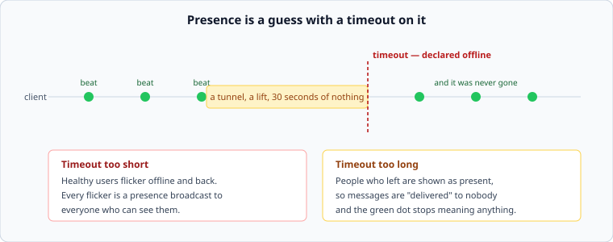

# Presence, heartbeats and delivery

*Week 8 · Day 3 · about 30 minutes*

> By the end of this you can size a presence system, explain why it is more expensive
> than the messages, and design delivery to a device that is frequently absent.

---

## Read the primary sources first

| Source | Tier | What it gives you |
|---|---|---|
| [**Slack Engineering — Real-time Messaging**](https://slack.engineering/real-time-messaging/) | 1 | Presence servers as a separate tier, and the broadcast multiplication |
| [**Discord — scaling Elixir**](https://discord.com/blog/how-discord-scaled-elixir-to-5-000-000-concurrent-users) | 1 | Presence at millions of connections, and the specific thing that broke |
| [**Rick Reed — WhatsApp**](https://www.erlang-factory.com/upload/presentations/558/efsf2012-whatsapp-scaling.pdf) | 1 | Delivery to devices that are usually not there |

---

## Presence is more expensive than messaging

The counter-intuitive result, and it is worth being able to derive rather than assert.

A message goes to the people in one conversation. **A presence change goes to everybody
who can see that person** — every conversation they are in, every member list, every
sidebar.

```
one user goes online
  × 40 channels they are in
  × 30 other members watching each
  = 1,200 notifications, from one event
```

Now multiply by a morning rush where a hundred thousand people arrive within a few
minutes, and presence dwarfs the messages by an order of magnitude. Slack's engineers
describe exactly this multiplication, and it is why presence is a separate tier in their
architecture rather than a field on a user.

**The design consequences follow directly:**

- **Batch it.** Send presence changes every few seconds in a batch rather than
  individually. Nobody needs sub-second presence
- **Subscribe narrowly.** A client watching the channel it has open, rather than all forty
- **Coarsen it.** "Online / away / offline" rather than a timestamp, so most changes are
  not changes at all

---

## Heartbeats, and the guess in the middle



A connection being open does not mean the client is there — a phone in a tunnel keeps a
socket that the network has already discarded. So clients send periodic heartbeats, and
the server declares them gone after a timeout.

Which is week 5, exactly: **you cannot tell a departed client from a slow one.** The
timeout is a guess, and both directions are bad in different ways:

| Too short | Too long |
|---|---|
| healthy users flicker offline and back, and **every flicker is a presence broadcast** | people who left are shown as present, and messages are "delivered" to nobody |

Flapping is the worse failure, because it is *load-generating*: a marginal network causes
presence churn, which causes broadcasts, which cost more than the messages. A system that
gets slower when the network is bad is a system with a feedback loop in it.

The standard mitigations, and each is a decision worth stating:

- **Hysteresis** — go offline after a timeout, come back online instantly. Asymmetric on
  purpose
- **Debounce** — do not broadcast a presence change until it has held for a few seconds
- **Client hints** — a client that is closing can say so, which is much better than being
  found missing

---

## Delivering to a device that is not there

Presence tells you whether to attempt real-time delivery. It does not tell you whether the
message arrived.

The model that works, and it is the whole of this section:

> **The message is stored, and delivery is an optimisation.**

Every message goes to durable per-conversation storage with a sequence number. Real-time
push is a fast path; the slow path is a client reconnecting and asking "what have I missed
since sequence 4,812?".

That inversion is what makes the rest tractable:

- **An offline client** needs no queue of its own. It fetches on reconnect
- **A duplicate push** is harmless, because the client deduplicates by sequence number
- **A missed push** is invisible, because the reconnect catches up
- **Three devices** each track their own position in the same sequence

Compare it with the alternative — a per-device outbound queue — which needs a queue per
device, cleanup for devices that never return, and its own delivery guarantees. Systems
built that way spend a lot of engineering on a problem the sequence number removes.

### Ordering

Per conversation, from a single sequence — which is week 7's per-partition ordering,
arriving in a product feature. Two messages in different conversations have no order, and
nobody has ever noticed or cared.

The messy part is the sender's own message: it appears in their client immediately, before
the server has assigned a sequence number. Every chat product handles this with an
optimistic local echo reconciled by a client-generated id, and it is worth knowing that
the "sending…" state is a distributed systems problem rather than a UI flourish.

### Receipts

Delivered and read receipts are **more traffic than the messages they describe** — one
message to N members produces up to N delivered receipts and N read receipts. Batch them,
coarsen them ("read up to sequence 4,812" rather than per message), and be aware that a
product decision about a small grey tick is a capacity decision.

---

## What goes in a design document

> Presence is a separate tier, batched at 3-second intervals, with a client subscribing
> only to the conversation it has open. Offline is declared after two missed 30-second
> heartbeats and cleared instantly on the next one — **asymmetric on purpose, because
> flapping generates broadcasts and broadcasts are the expensive thing**. Messages are
> durable with a per-conversation sequence; push is best-effort and a reconnecting client
> fetches from its last sequence, so a missed push costs nothing.

---

## Today's lab

`week-08/day-3/presence.py`, on `simlib`:

- `PresenceTracker` with heartbeats, a timeout, and hysteresis
- a **flapping** test: a client on a marginal network, and the broadcast count with and
  without debouncing
- `broadcast_cost(users_online, channels_each, members_each)` — the multiplication above
- `MessageStore` with per-conversation sequences, and `catch_up(since_sequence)`
- a test where every push is dropped and the client still sees every message

That last test is the day: delivery failed completely, and nothing was lost, because
delivery was never the mechanism.

---

> **Sources for this article**
> [Slack](https://slack.engineering/real-time-messaging/),
> [Discord](https://discord.com/blog/how-discord-scaled-elixir-to-5-000-000-concurrent-users)
> and [WhatsApp](https://www.erlang-factory.com/upload/presentations/558/efsf2012-whatsapp-scaling.pdf)
> — all **Tier 1**. The multiplication is arithmetic; the hysteresis and
> store-then-deliver framings are ours — **Tier 3**, though both are visible in how the
> sourced systems behave.
