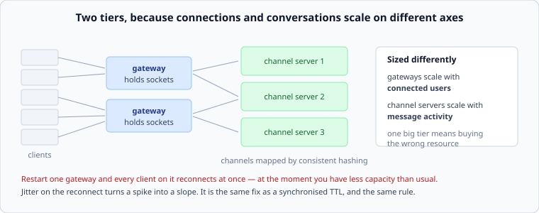

# The gateway tier, and the reconnect storm

*Week 8 · Day 4 · about 25 minutes*

> By the end of this you can split a realtime system into tiers that scale
> independently, and survive restarting one of them.

---

## Read the primary sources first

| Source | Tier | What it gives you |
|---|---|---|
| [**Slack Engineering — Real-time Messaging**](https://slack.engineering/real-time-messaging/) | 1 | Gateway servers, channel servers, and channels mapped by consistent hashing. Read it again with week 4 in mind |
| [**Slack Engineering — Flannel**](https://slack.engineering/flannel-an-application-level-edge-cache-to-make-slack-scale/) | 1 | An edge cache holding the data a connected client needs, so a reconnect is cheap |
| [**Discord — scaling Elixir**](https://discord.com/blog/how-discord-scaled-elixir-to-5-000-000-concurrent-users) | 1 | What happened when a large number of clients reconnected at once |

---

## Two tiers



**Gateways** hold connections. Sized by connected users; do nothing clever; any gateway
can serve any client.

**Channel servers** own conversations. Sized by message activity; stateful, because a
channel's recent history and member list live in memory somewhere.

They are separate because **the two scale on different axes.** A million idle users is a
gateway problem and not a channel-server problem; a thousand very busy channels is the
reverse. A single combined tier means adding capacity for one when you needed the other,
and Slack's description of theirs is the clearest published example of the split.

---

## Mapping channels to servers

Each channel is owned by one channel server, chosen by consistent hashing — which is week
4, unchanged, and worth noticing as a reuse rather than a new idea.

Everything from that week applies:

- **Adding a server** moves about 1/N of channels, not all of them
- **Virtual nodes** keep the distribution even and spread a failed server's load
- **A hot channel** — the all-company announcement, the incident channel everyone joins —
  is a hot key, and no amount of adding servers helps

That last one is worth a design decision: a channel with 50,000 members in it is
qualitatively different from one with 12, and the usual answer is to treat very large
channels differently — read-mostly, fanned out through a different path, presence
suppressed. Two populations, two answers, as in yesterday's fan-out.

---

## The reconnect storm

The failure this tier exists to survive.

Restart a gateway holding 100,000 connections. All 100,000 clients notice within a second
and reconnect. They arrive at the remaining gateways **together**, at the moment the fleet
has less capacity than usual.

And a reconnect is not cheap. It is a TLS handshake, an authentication, a subscription
list, and a catch-up fetch — far more expensive than the steady state it replaces.

```
100,000 reconnects, all at once   ->  100,000/s of the most expensive operation you have
100,000 reconnects over 60 s      ->  1,700/s
```

Three orders of magnitude, from one decision.

**The fixes, and all of them are ones you have already met:**

- **Jitter the reconnect.** The client waits a random interval. Same rule as week 6's TTLs
  and week 9's retries: anything synchronised needs jitter
- **Exponential backoff** on repeated failures, so a struggling fleet is not hammered
- **Make reconnection cheap.** This is what Slack's Flannel is for — the data a client
  needs on connect is held at the edge, so a reconnect does not become a fan-out of
  requests into the core
- **Roll deploys slowly.** One gateway at a time, waiting for reconnections to settle

The interesting one is the third, because it changes the *cost* rather than the *rate*.
Rate limiting alone leaves you with a slow recovery; making the operation cheap makes the
recovery fast and the storm survivable.

---

## The thing that makes this hard to test

A reconnect storm only happens at scale, during a deploy, in production. It is invisible
in staging, where restarting a server disconnects eleven clients.

So the mitigation has to be designed in rather than discovered, and the number to have is:
**what is our reconnect capacity, and what does a full-tier restart produce against it?**
If nobody has that number, the answer to "what happens if we restart everything" is
unknown, and it is usually unknown right up until somebody does.

---

## What goes in a design document

> 1M connections across 26 gateways, 40,000 each. Channels are assigned to channel servers
> by consistent hashing with 256 virtual nodes. **A gateway restart drops 40,000
> connections, which reconnect with jitter over 60 seconds — 670/s against a measured
> accept capacity of 6,000/s.** A full-tier restart is therefore rolled one host at a time
> with a 90-second settle, taking about 40 minutes. Reconnect cost is bounded by an edge
> cache holding the client's channel and member data.

Capacity, the storm arithmetic, the deploy consequence, and the mechanism that makes a
reconnect cheap.

---

## Today's lab

`week-08/day-4/gateway.py`:

- `GatewayTier` — connections assigned to hosts, and a `restart(host)` that returns the
  clients needing to reconnect
- `channel_owner(channel, ring)` — week 4's hash ring, reused
- `reconnect_rate(clients, window_s)` and a test comparing an instant storm with a jittered
  one
- `rolling_restart_seconds(hosts, connections_each, accept_capacity, settle_s)` — how long
  a safe deploy takes, which is a number product managers should see

---

> **Sources for this article**
> [Slack Engineering](https://slack.engineering/real-time-messaging/),
> [Flannel](https://slack.engineering/flannel-an-application-level-edge-cache-to-make-slack-scale/)
> and [Discord](https://discord.com/blog/how-discord-scaled-elixir-to-5-000-000-concurrent-users)
> — all **Tier 1**. The reconnect arithmetic is arithmetic. The claim that reconnect storms
> are invisible in staging is ours — **Tier 3** — and is an argument rather than a
> measurement.
