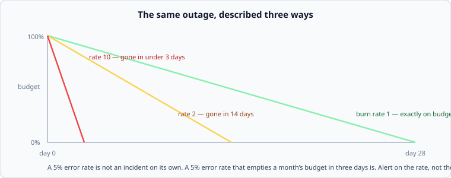

# SLOs, and spending an error budget

*Week 9 · Day 1 · about 30 minutes*

> By the end of this you can turn a reliability target into a budget, alert on how fast
> it is being spent, and explain why an unused budget is a problem.

---

## Read the primary sources first

| Source | Tier | What it gives you |
|---|---|---|
| [**Google SRE Book — Service Level Objectives**](https://sre.google/sre-book/service-level-objectives/) | 1 | SLI, SLO, SLA. You read this in week 1; read it again now that you have designs to apply it to |
| [**Google SRE Book — Embracing Risk**](https://sre.google/sre-book/embracing-risk/) | 1 | The argument that 100% is the wrong target, and error budgets as a resource to spend |
| [**Google SRE Workbook — Alerting on SLOs**](https://sre.google/workbook/alerting-on-slos/) | 1 | Burn-rate alerting, worked properly, with the multi-window scheme |

Read *Embracing Risk* today. It is the argument that makes the rest of the week coherent,
and it is short.

---

## Three initials, and only one of them is yours

**SLI** — the *indicator*. A number you measure: the fraction of requests that returned
non-5xx, the fraction served under 200 ms.

**SLO** — the *objective*. The target you chose: 99.9% of requests non-5xx over 28 days.

**SLA** — the *agreement*. A contract, with money attached, and always looser than the
SLO — because you want to find out you are in trouble before a customer's lawyer does.

The SLO is the interesting one because it is **a decision, not a discovery.** Nobody found
out the service should be 99.9%; somebody chose it, and the choice had a price.

---

## The budget

The inversion that makes the whole practice work:

> 99.9% available over 28 days means you are **permitted** 40 minutes of failure.

Not tolerated — permitted. It is a resource, and the SRE book's argument is that spending
it deliberately is the point:

- ship faster, and spend budget on the risk
- run a migration during business hours
- do a controlled failure test

And the corollary people find uncomfortable: **a team that never uses its error budget has
set its target too high.** They are paying — in velocity, in on-call load, in
infrastructure — for reliability nobody asked for. Consistently finishing the month at
99.99% against a 99.9% objective is not excellence, it is a mispriced target.

---

## Burn rate, and why it is the thing to alert on



A 5% error rate is not, by itself, an incident. A 5% error rate that will empty a month's
budget in three days is.

```
burn rate = (observed error rate) / (error rate the budget allows)
```

At burn rate 1 you finish the window exactly on budget. At 10, a 28-day budget is gone in
under three days.

**Alerting on burn rate rather than on an error count** fixes the two failures every
threshold alert has:

| Threshold alerting | Burn-rate alerting |
|---|---|
| "more than 100 errors/minute" — meaningless without knowing the traffic | scale-free by construction |
| pages for a 30-second blip that costs 0.1% of the budget | pages when the budget is genuinely at risk |
| silent about a slow leak that eats the month | catches the slow leak, on a long window |

The workbook's scheme uses **several windows at once**: a fast one to catch a severe
outage in minutes, and a slow one to catch a slow leak over hours. A single window is
either too twitchy or too slow, and cannot be both.

---

## Choosing the number

Not by copying. Three questions, in order:

**1. What does the user actually notice?** If a request fails and the client retries
transparently, that is not a failure from the user's perspective. Measure at the boundary
where a human would notice.

**2. What does the next nine cost?** Each is roughly a tenfold increase in effort. From
99.9% to 99.99% is not a slightly better version of the same system; it removes every
manual step from your recovery path, because 4 minutes a month is less than a human takes
to read a page.

**3. What is the ceiling anyway?** Your dependencies have their own availability, and
theirs multiply:

```
your service depends on 4 things, each 99.95%
ceiling = 0.9995^4 = 99.8%
```

**You cannot promise 99.9% on top of that**, whatever you do to your own code. This
multiplication is the single most useful thing to compute before agreeing to a target, and
it is the one people never do.

---

## Measuring it honestly

A few traps worth knowing, because an SLO measured wrongly is worse than none:

- **Measure where the user is**, not inside your service. A request that never reached you
  because your load balancer was full is a failure, and your service's own logs will never
  show it.
- **A slow response is a failed one** past some threshold. An SLO on availability alone
  is met by a service that answers everything in nine seconds.
- **Weight by request, not by minute.** "Minutes where the error rate exceeded X" hides an
  outage that hit 2% of traffic and all of your largest customer.

---

## What goes in a design document

> **SLO:** 99.9% of message sends return success within 500 ms, measured at the edge, over
> a 28-day window. That permits 40 minutes of budget. **Ceiling from dependencies:** four
> at 99.95% gives 99.8%, so this objective requires either fewer dependencies on the send
> path or retries that mask their failures — we chose the second, and week 9's retry
> budget bounds the cost. Alerting is burn-rate based: page at 14x over 1 hour, ticket at
> 6x over 6 hours.

Target, budget, ceiling, and how you find out — four sentences, and most documents have
none of them.

---

## Today's lab

`week-09/day-1/slo.py`:

- `error_budget_minutes(target, window_days)` and `budget_remaining(...)`
- `burn_rate(observed_error_rate, target)` and `time_to_exhaustion(...)`
- `dependency_ceiling(availabilities)` — the multiplication above
- `nines_needed(dependency_ceiling, desired)` — whether the target is even reachable
- `should_page(burn_rate, window_hours)` — the workbook's multi-window scheme, simplified

Run `dependency_ceiling` on your own Project 2 before you write a target for it.

---

> **Sources for this article**
> [Google SRE Book — SLOs](https://sre.google/sre-book/service-level-objectives/),
> [Embracing Risk](https://sre.google/sre-book/embracing-risk/) and
> [SRE Workbook — Alerting on SLOs](https://sre.google/workbook/alerting-on-slos/) — all
> **Tier 1**. The dependency-ceiling multiplication is arithmetic; the measuring-honestly
> list is ours — **Tier 3**.
