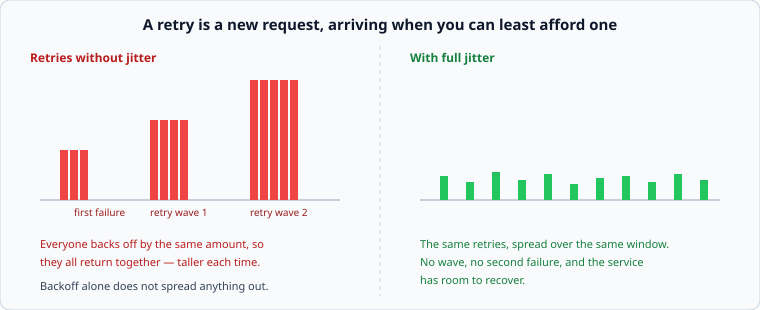

# Retries, backoff, and jitter

*Week 9 · Day 2 · about 30 minutes*

> By the end of this you can retry without making an outage worse, and you can say why
> backoff alone does not spread anything out.

---

## Read the primary sources first

| Source | Tier | What it gives you |
|---|---|---|
| [**AWS Builders' Library — Timeouts, retries and backoff with jitter**](https://aws.amazon.com/builders-library/timeouts-retries-and-backoff-with-jitter/) | 1 | The definitive practitioner account. Read all of it |
| [**AWS — Exponential backoff and jitter**](https://aws.amazon.com/blogs/architecture/exponential-backoff-and-jitter/) | 1 | The simulation that compares jitter strategies, with numbers |
| [**Google SRE Book — Addressing Cascading Failures**](https://sre.google/sre-book/addressing-cascading-failures/) | 1 | Retries as the feedback loop that turns slow into failing |

---

## A retry is a new request

Obvious, and consistently forgotten. When a service is failing, every client retries, and
those retries are **additional load arriving exactly when the service is least able to
absorb it.**

Week 2's curve is the mechanism: the service is past the knee, latency rises, clients time
out, clients retry, arrival rate goes up, the service goes further past the knee. That is
a feedback loop with positive gain, and it does not settle — it runs to collapse.

**Retries turn a degradation into an outage.** Everything below is about making them safe.

---

## Four rules

### 1. Only retry what is safe to retry

A retry is a duplicate. Week 7's whole subject, and the prerequisite for everything else
here: **if the operation is not idempotent, retrying it is a correctness bug**, not a
reliability feature.

And only retry what might succeed:

| Retry | Do not retry |
|---|---|
| timeouts, connection failures | 400 — it will be wrong again |
| 503, 502 | 401, 403 — credentials will not improve |
| 429, **but only after `Retry-After`** | 404 |
| 500, cautiously | anything you cannot make idempotent |

### 2. Back off exponentially

```
attempt 1: wait 100 ms
attempt 2: wait 200 ms
attempt 3: wait 400 ms
```

This gives the service room. It does not, on its own, do the thing people think it does.

### 3. Jitter, because backoff alone synchronises



Ten thousand clients fail at the same moment and all back off by 100 ms. **They all come
back at the same moment.** Then they all back off 200 ms and come back together again,
in a taller wave.

Exponential backoff without jitter is a synchroniser. The AWS post measures the
alternatives; the practical summary:

| Strategy | Wait |
|---|---|
| Plain exponential | `base × 2^n` — synchronised |
| **Full jitter** | `random(0, base × 2^n)` — the usual recommendation |
| **Decorrelated jitter** | `random(base, previous × 3)` — spreads well and grows faster |

Full jitter is the default answer and it is one line. You have now met this rule four
times — TTLs, lease renewals, reconnects, retries — and it is always the same fix.

### 4. Budget the retries

The rule that actually bounds the damage, and the one people have not heard of.

A client with 3 retries can triple the load on a failing dependency. **A retry budget caps
retries as a fraction of total requests** — say 10% — across the whole client, not per
request:

```
if retries in the last minute > 10% of requests in the last minute:
    do not retry. Fail fast.
```

Healthy conditions have few failures, so the budget is never near its limit and every
request gets its retries. During an outage the budget is exhausted immediately and the
client stops adding load — which is precisely when you wanted it to stop.

**This converts retry from an unbounded multiplier into a bounded one**, and it is the
single highest-value thing in this article.

---

## Retries at every layer multiply

The failure that surprises people. Three retries at each of three layers is **27 attempts**
for one user action, and each layer thinks it is being modest.

```
client 3 × gateway 3 × service 3 = 27 requests to the database
```

The rule: **retry at one layer.** Usually the one closest to the user, because it knows
whether anybody is still waiting. Everything below it fails fast and reports upward.

If you take one thing from this article into a design review, take this one — it is
common, it is invisible in each component's own code, and it is catastrophic in
aggregate.

---

## Timeouts come first

A retry without a timeout is not a retry, it is a hang. And the timeout should come from
your latency budget (week 1), not from a library default:

```
budget 200 ms, three hops -> ~60 ms each -> a 30-second default timeout is not a safety
net, it is a decision to break the SLO rather than fail fast
```

---

## What goes in a design document

> Calls to the profile service retry twice on timeout and 5xx, with full jitter over a
> 100 ms base, bounded by a **10% retry budget** across the client. **Rejected: retrying
> at the gateway as well** — three layers of three retries is 27 requests for one user
> action. Timeouts are 60 ms, derived from the 200 ms end-to-end budget. Non-idempotent
> calls carry an idempotency key, so a retry cannot double-charge.

---

## Today's lab

`week-09/day-2/retry.py`, on `simlib`:

- `backoff_delays(attempts, base_ms, strategy)` for `"exponential"`, `"full_jitter"`,
  `"decorrelated"`
- `arrival_spread(delays)` — how wide a retry wave is, so synchronisation is a number
- `RetryBudget(window_ms, ratio)` with `allow()` and `record()`
- `total_attempts(layers, retries_each)` — the multiplication above
- a simulation of 10,000 clients failing together, with and without jitter, counting the
  **peak arrival rate** in each case

The last one is the day: same clients, same failure, same backoff strategy — and the
peak arrival rate differs by more than an order of magnitude, because jitter spreads them
across the whole backoff window instead of stacking them at the end of it.

---

> **Sources for this article**
> [AWS Builders' Library](https://aws.amazon.com/builders-library/timeouts-retries-and-backoff-with-jitter/)
> and [the AWS jitter post](https://aws.amazon.com/blogs/architecture/exponential-backoff-and-jitter/)
> — **Tier 1**, and the source for the jitter strategies and the retry budget ·
> [Google SRE Book](https://sre.google/sre-book/addressing-cascading-failures/) — **Tier 1**
> for the feedback loop. The layer-multiplication framing is ours — **Tier 3**.
