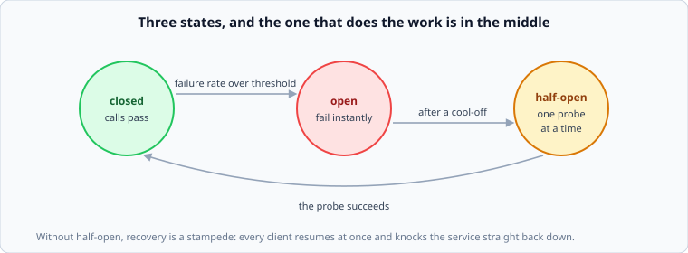

# Circuit breakers and bulkheads

*Week 9 · Day 3 · about 30 minutes*

> By the end of this you can stop a failing dependency from consuming your service, and
> stop one customer's traffic from consuming everyone's.

---

## Read the primary sources first

| Source | Tier | What it gives you |
|---|---|---|
| [**AWS Builders' Library — Workload isolation using shuffle sharding**](https://aws.amazon.com/builders-library/workload-isolation-using-shuffle-sharding/) | 1 | Isolation done properly, with the combinatorics. The best idea in this week |
| [**Google SRE Book — Addressing Cascading Failures**](https://sre.google/sre-book/addressing-cascading-failures/) | 1 | How one component's failure becomes everyone's |
| [**resilience4j — CircuitBreaker**](https://resilience4j.readme.io/docs/circuitbreaker) | 2 | A current implementation's documentation: states, thresholds, half-open |
| [**Netflix Hystrix — How it works**](https://github.com/Netflix/Hystrix/wiki/How-it-Works) | 1 | Archived, and the origin of most people's mental model. Read it as history |

---

## The problem: a slow dependency consumes you

From week 2. Your service calls a dependency that slows from 20 ms to 5 seconds. Your
threads wait; Little's Law says concurrency is throughput × latency, so your pool fills;
now requests that never touch that dependency are queued behind ones that do.

**One dependency's degradation has become your total outage**, and nothing about your
service is broken.

Two mechanisms address it, and they are complementary rather than alternatives.

---

## The circuit breaker

Stop calling something that is failing. Three states:

**Closed.** Calls pass through, failures are counted.

**Open.** The failure rate crossed a threshold, so calls **fail instantly** without being
attempted. No thread waits, no timeout is consumed, and the dependency gets a rest.

**Half-open.** After a cool-off, let **one** call through. If it succeeds, close. If it
fails, open again.

Half-open is the state that does the real work. Without it, recovery is a stampede: the
breaker closes, every waiting client resumes at once, and the recovering service is
knocked straight back down. **A breaker without half-open is a slower way to have the same
outage twice.**

### What it buys and what it costs

**Buys:** your threads are not consumed, so requests not touching that dependency stay
fast. Failure is instant, which is a much better experience than a timeout. And the
dependency gets the quiet it needs to recover.

**Costs:** you now fail requests that might have succeeded. Above the threshold, some
calls would still have worked and are refused anyway — a deliberate trade of some
availability for isolation.

**The tuning trap:** thresholds that are too sensitive open on normal variance, and every
open breaker is an outage you caused. A breaker on a dependency with a naturally high
error rate needs a threshold well above that rate, and a breaker on a low-traffic path
needs a minimum request count or it will trip on two failures out of three.

---

## Bulkheads

Named after a ship: a hole in one compartment does not sink the vessel.

Give each dependency its **own** connection pool and thread budget. A dependency that
slows down fills its own pool and stops. Requests using other dependencies are unaffected,
because there is nothing shared to exhaust.

Contrast with one shared pool, where the slow dependency's requests occupy every slot and
everything queues behind them regardless of what it needs.

The cost is efficiency: partitioned pools cannot share capacity, which is week 2's pooling
result — ten pools at 80% behave worse than one pool of ten at 80%. **You are buying
isolation with efficiency, deliberately.**

---

## Shuffle sharding

The best idea in this week, and the least known.

Ordinary sharding: 8 customers, 8 servers, one each. One customer's bad traffic takes down
one server and one customer — themselves. Fine.

But you rarely have one server per customer. With 100 customers on 8 servers, plain
sharding puts ~12 customers per server, so one bad customer takes out the 12 who share
their server.

**Shuffle sharding** gives each customer a random *pair* of servers instead of one. With 8
servers there are 28 possible pairs, so two customers share a **full** pair only 1 time in
28. A bad customer degrades their two servers; other customers on those servers still have
one good server each.

The combinatorics are the point, and they are dramatic:

| Servers | Shard size | Distinct shards | Chance two customers fully overlap |
|---|---|---|---|
| 8 | 1 | 8 | 1 in 8 |
| 8 | 2 | 28 | 1 in 28 |
| 100 | 5 | 75,287,520 | vanishingly small |

**With 100 servers and a shard of 5, a single bad customer affects a fraction of one
percent of the others.** No extra hardware, no new component — just a different assignment
function. The AWS article works through it properly and it is worth the read.

---

## What goes in a design document

> Each dependency has its own pool: 40 connections for the profile service, 20 for search,
> 100 for the message store. **A breaker opens per dependency at a 50% failure rate over a
> 20-request minimum, cools off for 10 seconds, and half-opens with a single probe.**
> Rejected: one shared pool — a slow search would consume every thread and stop message
> delivery, which is the failure we most need not to have. Customers are shuffle-sharded
> across the API tier, shard size 3 of 40, so one abusive tenant degrades at most a small
> fraction of the others.

---

## Today's lab

`week-09/day-3/breaker.py`, on `simlib`:

- `CircuitBreaker` with the three states, a minimum request count, and half-open probing
- a test where the dependency recovers and **the breaker without half-open re-opens
  immediately** while the one with it recovers cleanly
- `Bulkhead` — per-dependency limits, and a test where a slow dependency starves a shared
  pool and does not starve bulkheaded ones
- `shuffle_shard(customer, servers, shard_size)` and `overlap_probability(...)`, so the
  combinatorics are a number you produced

---

> **Sources for this article**
> [AWS Builders' Library](https://aws.amazon.com/builders-library/workload-isolation-using-shuffle-sharding/)
> — **Tier 1**, and the source for shuffle sharding ·
> [Google SRE Book](https://sre.google/sre-book/addressing-cascading-failures/) —
> **Tier 1** · [Hystrix](https://github.com/Netflix/Hystrix/wiki/How-it-Works) — **Tier 1**,
> archived, and read as history · [resilience4j](https://resilience4j.readme.io/docs/circuitbreaker)
> — **Tier 2**. The tuning-trap list is ours — **Tier 3**.
