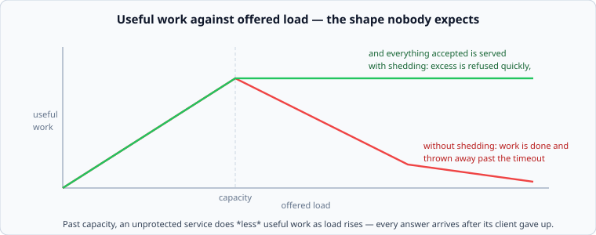

# Load shedding, and degrading on purpose

*Week 9 · Day 4 · about 30 minutes*

> By the end of this you can refuse work deliberately, in priority order, and explain
> why an unprotected service does less useful work as load rises.

---

## Read the primary sources first

| Source | Tier | What it gives you |
|---|---|---|
| [**AWS Builders' Library — Using load shedding to avoid overload**](https://aws.amazon.com/builders-library/using-load-shedding-to-avoid-overload/) | 1 | The definitive account. You met it in week 2; this is the week it is the subject |
| [**Google SRE Book — Handling Overload**](https://sre.google/sre-book/handling-overload/) | 1 | Per-client quotas, criticality levels, and shedding by priority |
| [**AWS Builders' Library — Implementing health checks**](https://aws.amazon.com/builders-library/implementing-health-checks/) | 1 | Why a health check that only checks the process is worse than none |

---

## Goodput, and the shape nobody expects



**Goodput** is useful work: responses that reached a client that was still waiting.

Below capacity, goodput tracks load. Past capacity, an unprotected service's goodput
**falls** — because every request is queued so long that its client has already timed out,
so the work is done and thrown away. At sufficient overload a service can be completely
busy and produce almost nothing.

The AWS article's argument follows: **refusing work is how you protect the work you
accepted.** A service that serves 80% of requests and rejects 20% quickly has done its job
far better than one that accepts everything and completes nothing in time.

That is uncomfortable to design deliberately, and it is the difference between a system
that degrades and one that collapses.

---

## Shedding in priority order

Not all requests are equal, and the ordering is a product decision that engineers usually
make by accident.

| Priority | Example |
|---|---|
| **Critical** | a payment, a message send, a login |
| **Important** | a timeline read, a search |
| **Best effort** | prefetch, analytics, background sync, a recommendation |
| **Sheddable** | a page-view beacon, a "seen" receipt |

Shed from the bottom. Under 20% overload you drop prefetches and nobody notices; under
100% you are down to logins and payments, and the product is degraded but working.

Two implementation notes that matter:

- **The priority must be on the request** — set by the client or the edge — because by the
  time it reaches the busy service, you do not want to be computing it.
- **Retries inherit the priority of what they retry**, or a shed best-effort request comes
  back as three more.

Google's SRE book calls this criticality and it is one of the higher-leverage things you
can add to an existing system, because it needs no new components.

---

## Admission control

Shedding decides *what* to refuse. Admission control decides *how many* to accept, and it
is where week 2 comes back.

The signal to use is **queue age**, not depth and not CPU:

```
if the oldest request in the queue is older than the client's timeout:
    refuse new work — it will be dead on arrival too
```

That is a self-tuning rule with no magic number: it refuses exactly when the queue has
become useless, whatever the current capacity happens to be.

The LIFO result from week 2 belongs here too. Under sustained overload, serving the
**newest** request first is better: the old ones have already lost their clients. It is
unfair, and under overload you are choosing who to disappoint, and disappointing people
who have already left is the cheapest choice available.

---

## Degrading on purpose

The best failure mode is not "refuse", it is "answer with less".

| Full | Degraded |
|---|---|
| personalised recommendations | the popular items |
| live inventory count | "in stock" / "out of stock" |
| full search with facets | the top 10, no facets |
| exact unread count | "99+" |
| fresh timeline | a cached one from 5 minutes ago |

Each of these is a **product decision made in advance**, and that is the only way it can
be made — nobody designs a graceful degradation at 3am. A design document that lists its
degraded modes has done something most never do.

The connection to week 6: **a stale cached answer is a degraded answer**, and serving one
while the origin is overloaded is often the best available outcome. `stale-while-revalidate`
and "serve stale on error" are load-shedding mechanisms wearing a caching name.

---

## Health checks that lie

A health check that returns 200 whenever the process is running is worse than no health
check, because it removes exactly the instances that need removing — none — and keeps
sending traffic to a host whose dependencies are dead.

The AWS article distinguishes them clearly:

| Check | Answers | Risk |
|---|---|---|
| **Liveness** — is the process up? | almost always yes | tells you nothing |
| **Shallow** — can it serve a trivial request? | usually right | can still miss a broken dependency |
| **Deep** — can it reach its dependencies? | genuinely useful | **a shared dependency failing marks every host unhealthy at once** |

That last row is the trap and it is a real outage shape: a deep health check on a shared
database means one database problem removes your entire fleet from the load balancer, and
now you have no service at all rather than a degraded one.

The usual resolution is to fail deep checks *partially* — mark a host degraded rather than
dead, and never let more than a fraction of the fleet be removed at once. That last clause
is a real setting in real load balancers, and it exists because of exactly this.

---

## What goes in a design document

> Requests carry a criticality set at the edge. Above 85% utilisation the service sheds
> best-effort work; above 95% it sheds everything but sends and logins. **Admission
> control refuses new work when the oldest queued request exceeds the client timeout**,
> which needs no threshold to tune. Degraded modes, in order: recommendations become
> popular items, unread counts become "99+", timelines serve from cache up to 5 minutes
> stale. Health checks are shallow, with a deep check that marks a host degraded rather
> than removing it, and at most 30% of the fleet may be removed at once.

---

## Today's lab

`week-09/day-4/shedding.py`, on `simlib`:

- `goodput(offered, capacity, timeout_ms, service_ms)` — the curve above, computed
- `PriorityShedder` with four levels and utilisation thresholds
- `admit(oldest_queue_age_ms, client_timeout_ms)` — the self-tuning rule
- `healthy_fleet_fraction(hosts, failing, max_removable)` — the guard against a shared
  dependency removing everything

The first test shows goodput **falling** as load rises past capacity, and the same load
with shedding holding flat. That curve is the whole week in one picture.

---

> **Sources for this article**
> [AWS Builders' Library — load shedding](https://aws.amazon.com/builders-library/using-load-shedding-to-avoid-overload/)
> and [health checks](https://aws.amazon.com/builders-library/implementing-health-checks/)
> — **Tier 1** · [Google SRE Book — Handling Overload](https://sre.google/sre-book/handling-overload/)
> — **Tier 1** for criticality. The degraded-modes table is ours — **Tier 3**, and it is a
> product decision rather than a technical one.
