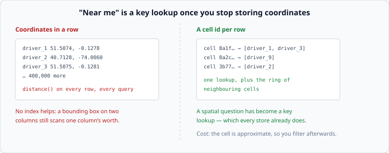

# Geospatial: turning "near me" into a key lookup

*Week 10 · Day 1 · about 30 minutes*

> By the end of today you can answer a proximity query without scanning, and say what
> a cell system costs you at the edges.

---

## Read the primary sources first

| Source | Tier | What it gives you |
|---|---|---|
| [**H3 documentation**](https://h3geo.org/docs/) | 1 | Uber's hexagonal grid, documented by the team that built it. Resolutions, neighbours, and why hexagons |
| [**S2 Geometry**](https://s2geometry.io/) | 1 | Google's. A different shape of answer to the same problem, with the space-filling curve explained |
| [**Uber — DeepETA**](https://www.uber.com/blog/deepeta-how-uber-predicts-arrival-times/) | 1 | What sits on top: a routing engine's estimate corrected by a model, at the highest query rate in the company |
| [**DeeprETA (arXiv)**](https://arxiv.org/pdf/2206.02127) | 1 | The same, by the same authors, with the architecture and the loss function |

Read the H3 documentation's introduction and the "resolution table" today. The table is
the thing you will actually use.

---

## Why the general answer fails

The query is "which drivers are within 2 km of this passenger?" and there are 400,000
drivers whose positions change every few seconds.

```sql
SELECT * FROM drivers WHERE distance(lat, lng, ?, ?) < 2000
```

That computes a distance for **every row**, every time. And no index rescues it: an index
on `(lat, lng)` is an ordering, and week 3's rules apply — you can range-scan on `lat`,
then you are filtering on `lng` by hand. A bounding box narrows it to a stripe of the
planet, which for a global service is still a great deal of stripe.

**This is the first problem in the course where the general mechanisms do not fit.** That
is why it is here.

---

## The move: give every location a key



Divide the world into **cells**, each with an id. Store the cell id with each row. Now
"near me" becomes:

```
my_cell = cell_of(lat, lng, resolution)
candidates = lookup(my_cell) + lookup(neighbours(my_cell))
answer = [c for c in candidates if actual_distance(c) < 2000]
```

A spatial question has become a **key lookup**, which every storage system you have met
already does well. Weeks 3 and 4 apply unchanged: the cell id is a partition key, it can
be indexed, it can be cached, and hot cells are hot keys.

The cost is that the cell is approximate, so you filter afterwards — a cheap exact check
over a small candidate set rather than an expensive one over everything.

---

## Choosing a resolution

The one real decision, and it is the same trade every time:

| Cells too large | Cells too small |
|---|---|
| a lookup returns thousands of candidates to filter | one query has to read many cells |
| central London is one cell and one hot key | the neighbour ring is large and the reads multiply |

The rule: **pick the resolution where a typical cell holds a manageable number of items**,
and accept reading a ring of neighbours. H3's resolution table gives average cell areas,
which turns this from a guess into arithmetic — resolution 8 is roughly 0.7 km² and
resolution 9 about 0.1 km², so a city centre at resolution 9 is a few hundred metres
across.

Then the part people miss: **density is not uniform.** A resolution that works in central
London gives one driver per cell in the countryside and ten thousand in a city on New
Year's Eve. That is week 4's hot key and week 8's two populations, in a new costume, and
the answer is the same shape — treat dense regions differently, at a finer resolution.

---

## Hexagons, squares, and why anyone cares

**Squares** (geohash, quadtrees) are simple and nest perfectly: a cell splits into exactly
four children, and the id is a prefix of its children's. Prefix matching gives you the
hierarchy free.

**Hexagons** (H3) have one property squares do not: **every neighbour is the same
distance away.** A square has four edge-neighbours at distance 1 and four corner-neighbours
at distance √2, so "the ring around me" is not a circle and any flow or smoothing
computation is distorted. For movement, routing and demand smoothing — Uber's actual
problems — that distortion matters, which is why they built H3.

The cost: hexagons do not nest exactly. A resolution-9 cell is not cleanly seven
resolution-8 cells, so the hierarchy is approximate. **A perfect hierarchy or uniform
neighbours; not both.**

---

## The edges, which is where the bugs are

Three, and all three are worth knowing before you write any of this:

**A point near a cell boundary** has its nearest neighbours in a different cell. Searching
only your own cell silently misses them. **Always search the ring**, and the ring is the
reason the resolution choice has a floor.

**Distance is not straight.** Two locations 200 m apart with a river between them are a
2 km drive. A cell search finds candidates; it does not rank them. That is what a routing
engine is for, and Uber's DeepETA is a model correcting a routing engine's estimate — a
two-stage design worth noticing, because the first stage is cheap and approximate and the
second is expensive and applied to few candidates.

**Moving points churn.** A driver crossing a boundary is a delete and an insert. At
400,000 drivers reporting every 4 seconds that is 100,000 writes a second before anybody
has requested anything, and it is the reason live-location systems keep position in memory
and treat durability as optional.

---

## What goes in a design document

> Driver positions are keyed by hexagonal cell at resolution 9 (about 0.1 km²), held in
> memory with a 30-second TTL and no durability — **a lost position is corrected by the
> next report 4 seconds later**. A search reads the passenger's cell plus its ring, giving
> a candidate set of about 40, then filters by true distance and ranks by routed time.
> **Dense cells are re-keyed at resolution 10** above 500 occupants, because otherwise a
> city centre is one hot key.

---

## Today's lab

`week-10/day-1/geo.py` — a square-cell system, because the arithmetic is visible:

- `cell_of(lat, lng, resolution)` and `neighbours(cell)`
- `CellIndex` with `insert`, `move` and `search(cell, ring)`
- `haversine_m(a, b)` for the exact filter
- a test showing that **searching only your own cell misses a neighbour 50 m away**
- `candidates_at_resolution(density_per_km2, resolution)` — choosing the resolution from
  a density rather than by feel
- `churn_writes_per_second(objects, report_interval_s)` — the number that decides whether
  positions are durable

---

> **Sources for this article**
> [H3](https://h3geo.org/docs/) and [S2](https://s2geometry.io/) — **Tier 1**, both by the
> teams that built them · [Uber DeepETA](https://www.uber.com/blog/deepeta-how-uber-predicts-arrival-times/)
> and [DeeprETA](https://arxiv.org/pdf/2206.02127) — **Tier 1**. Uber's blog refuses
> automated fetches, so that one is verified by hand. The resolution-choosing procedure and
> the three edges are ours — **Tier 3**.
