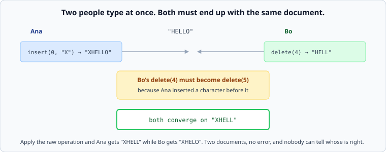

# Collaborative editing: converging without a lock

*Week 10 · Day 2 · about 30 minutes*

> By the end of today you can say what "converge" actually requires, and why two people
> typing in the same document is a harder problem than it looks.

---

## Read the primary sources first

| Source | Tier | What it gives you |
|---|---|---|
| [**Apache Wave — Operational Transform**](https://svn.apache.org/repos/asf/incubator/wave/whitepapers/operational-transform/operational-transform.html) | 2 | The clearest free write-up of OT, from the project that tried hardest to ship it |
| [**Shapiro et al. — A comprehensive study of CRDTs**](https://inria.hal.science/inria-00555588) | 2 | The paper that named and organised them. §1–3 is the part you need |
| [**crdt.tech**](https://crdt.tech/) | 3 | A maintained index of the literature and implementations |
| [**Automerge documentation**](https://automerge.org/docs/) | 1 | A current implementation, documented by its authors, including what it costs |
| [**Yjs documentation**](https://docs.yjs.dev/) | 1 | The other widely-used one, with a different set of trade-offs |

**Google Docs itself is not a source here**, and that is worth noticing. The technique it
uses comes from the Jupiter paper (Nichols et al., 1995), which is not freely available,
and Google has published very little about its own implementation. This is a week-1 lesson
in a week-10 topic: the most famous instance of a technique is often the least documented.

---

## The problem

Two people edit `"HELLO"` at the same moment. Ana inserts `"X"` at position 0. Bo deletes
position 4.

Apply each other's operation naively and Ana has `"XHELL"` while Bo has `"XHELO"`. **Two
documents, no error, and no way to tell whose is right.**

Week 5's conflict material does not save you here. Last-write-wins throws away somebody's
typing. Version vectors detect the conflict and hand it back, and "here are two versions of
your document, please merge" is not a product.

What you need is stronger: **both sides apply both operations, in whatever order they
arrive, and end up identical.** That is convergence, and there are two families of answer.

---

## Operational transformation

Keep the operations, and **transform** each one against the operations it did not know
about.

Bo's `delete(4)` arrives at Ana, who has already inserted a character before position 4.
So the operation is rewritten as `delete(5)` before being applied. Both sides now hold
`"XHELL"`.

The transformation function is the whole system, and it must satisfy a property that is
easy to state and hard to satisfy: **transforming in either order gives the same result.**
Get it wrong for one pair of operation types and documents diverge, rarely, under
concurrency, in a way that is very hard to reproduce.

| Good | Hard |
|---|---|
| operations are small — a position and a character | correctness is a proof obligation, not a test |
| the document is stored plainly, so it is easy to read and search | usually needs a **central server** to order operations |
| memory does not grow with edit history | the number of operation-pair cases grows quickly with the number of operation types |

The central server is the important row. The practical OT systems — including the Jupiter
model behind Google Docs — put one server in the middle to decide an order, and each client
reconciles against it. That is a much smaller problem than full peer-to-peer OT, and it is
why the technique shipped at all.

---

## CRDTs

Change the data structure so that **merging is commutative, associative and idempotent** —
and then order stops mattering.

For text, the usual approach gives every character a unique, densely-ordered identifier
rather than a position. An insert says "between id A and id B", which stays meaningful
however many other operations arrive first. There is no transformation because there is
nothing to transform.

| Good | Hard |
|---|---|
| no central server needed; genuinely peer-to-peer | metadata per character, so the document is much larger than its text |
| offline editing for a week, then merge | tombstones for deleted characters persist |
| correctness is a property of the type, not a proof about every operation pair | the intent can still be wrong even when the result converges |

That last row deserves care, because it is the honest limit of both families. Two people
who edit the same sentence in incompatible ways get a *converged* document, and it can
still be nonsense — CRDTs guarantee that everyone sees the same nonsense. **Convergence is
not correctness**, and no algorithm decides which of two conflicting intentions should win.

Modern implementations have made the metadata cost far smaller than the early papers
implied, and Automerge and Yjs both document their own overheads — which is the right
place to get a number rather than repeating one from a paper.

---

## Choosing

| If | Then |
|---|---|
| there is a central server anyway, and documents are large | **OT** — smaller documents, plain storage |
| clients must work offline for long periods | **CRDT** — merging after a week is the same operation as merging after a second |
| peer-to-peer with no coordinating server | **CRDT** — OT essentially needs one |
| the data is not text — a set, a counter, a map | **CRDT**, and a simple one. Most of the difficulty is text-specific |

That last row is where most people should start. **A set that only grows, a counter that
only increments, a last-writer-wins register with a proper clock** — these are CRDTs, they
are a few lines each, and they solve a large share of real "two clients disagreed"
problems without any of the text machinery.

---

## What goes in a design document

> The document body is a sequence CRDT; presence and cursors are ephemeral and not part of
> it. **Rejected: operational transformation** — clients must support a week offline, and
> OT's transformation is defined against a server-ordered history the client will not have.
> **Price:** the stored document is roughly 3x its text size and grows with edit history,
> so it is compacted when no client has been offline longer than the retention window.

---

## Today's lab

`week-10/day-2/crdt.py` — the simple CRDTs first, then a text sequence:

- `GCounter` and `PNCounter` — merge, and the test that merging is idempotent
- `GSet` and `TwoPhaseSet` — and the surprise that a removed element can never return
- `LWWRegister` with a proper causal clock rather than wall time
- `RGA`, a sequence CRDT — insert-between-ids, tombstones, and a test where two clients
  apply operations **in opposite orders and converge**

The convergence test is the day. It generates random concurrent edits, applies them in
different orders on two replicas, and asserts the documents are identical — which is the
property the whole family exists to provide.

---

> **Sources for this article**
> [Apache Wave OT whitepaper](https://svn.apache.org/repos/asf/incubator/wave/whitepapers/operational-transform/operational-transform.html)
> and [Shapiro et al.](https://inria.hal.science/inria-00555588) — **Tier 2** ·
> [Automerge](https://automerge.org/docs/) and [Yjs](https://docs.yjs.dev/) — **Tier 1**,
> current implementations documented by their authors · [crdt.tech](https://crdt.tech/) —
> **Tier 3**, an index.
> **Unknown:** what Google Docs actually does today. The Jupiter paper (1995) is the cited
> ancestor and is not freely available; Google has published almost nothing about the
> current implementation, so anything you read describing it is inference.
