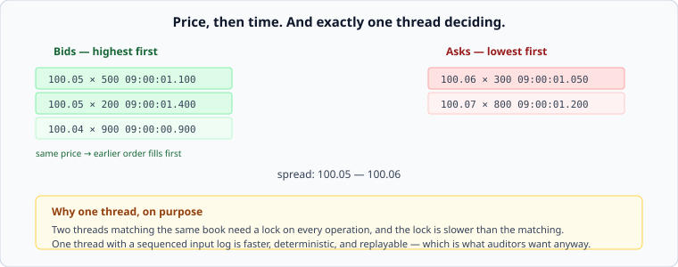

# Matching engines: determinism as a requirement

*Week 10 · Day 3 · about 30 minutes*

> By the end of today you can explain why the fastest design here is single-threaded,
> and why "replay produces the identical result" is a business requirement.

---

## Read the primary sources first

| Source | Tier | What it gives you |
|---|---|---|
| [**LMAX Disruptor**](https://lmax-exchange.github.io/disruptor/disruptor.html) | 1 | An exchange documenting its own design: one thread, a ring buffer, and why locks lost |
| [**Nasdaq TotalView-ITCH specification**](https://www.nasdaqtrader.com/content/technicalsupport/specifications/dataproducts/NQTVITCHspecification.pdf) | 1 | The real wire protocol. Read the message types — they tell you what the system actually is |
| [**Google SRE Book — Addressing Cascading Failures**](https://sre.google/sre-book/addressing-cascading-failures/) | 1 | Because an exchange is still a service, and overload still applies |

The ITCH specification is unusually worth skimming. Reading a real protocol's message list
tells you more about a domain in ten minutes than any explanation: *add order*, *order
executed*, *order cancelled*, *trade*, *system event*. That is the whole domain model.

---

## The order book

Two sorted collections. Bids descending, asks ascending.



A new order matches against the other side while the prices cross. **Price then time**: the
best price wins, and among equal prices the earliest order wins.

That second rule is where the systems difficulty lives. "Earliest" must be well-defined, and
well-defined for orders arriving from different machines over different network paths —
which is week 5's problem, with money and regulators attached.

---

## Determinism is the requirement

Most systems in this course want to be *correct*. This one has to be **reproducible**:

> Given the same sequence of inputs, the system must produce exactly the same sequence of
> outputs, every time.

Not approximately, not statistically. Exactly — because a disputed trade is settled by
replaying the log, and if a replay can produce a different answer there is nothing to
settle the dispute with.

That single requirement forces most of the design:

**One sequencer.** Something must assign a total order to incoming orders. This is week 5's
consensus, and it is why exchanges have a single logical sequencing point rather than a
distributed agreement on the hot path — the round trip would dominate the latency budget.

**A sequenced input log.** Every input is written before it is processed, in order. Week 3's
write-ahead log, at the centre of the design rather than underneath it.

**No wall-clock reads in the matching logic.** A timestamp read during processing makes a
replay produce different output. Time is an *input*, stamped by the sequencer and carried in
the log.

**No concurrency in the matching itself.** Two threads produce a non-deterministic
interleaving. Which brings us to the interesting part.

---

## Why the fastest design is single-threaded

Counter-intuitive, and the LMAX Disruptor paper is the primary source.

Two threads matching against the same book need a lock on every operation. Lock
acquisition, cache-line contention between cores, and the memory barriers involved cost
more than the matching does — the matching itself is a comparison and a subtraction.

One thread, with the book in memory on one core, does the whole thing in cache with no
coordination at all. LMAX reported handling very high order rates on a single thread, and
the point is not the specific number but the direction: **removing concurrency made it
faster, not slower.**

The concurrency goes somewhere it does not hurt:

```
gateways (many)  ->  sequencer (one)  ->  matcher (one thread)  ->  publishers (many)
```

Parse, validate, authenticate and risk-check in parallel before the sequencer. Publish
results in parallel after the matcher. The single-threaded core does only the part that
must be ordered.

**That is the transferable idea**, and it is much wider than exchanges: *find the part that
genuinely must be serialised, make it as small as possible, and parallelise everything on
either side of it.*

---

## Fairness, which is a design decision

Price-time priority sounds neutral and is not. If order arrival time is stamped at the
sequencer, whoever is closest to the sequencer wins ties — which is why exchanges sell
colocation, and why "fair" is a policy question the system implements rather than a
property it has.

Alternatives exist and are used: a random tie-break, a periodic batch auction that removes
sub-millisecond advantage entirely, or pro-rata allocation across orders at the same price.
**Each is a different market**, and choosing is not an engineering decision, though
implementing it is.

Worth knowing so you can ask the question. A brief that says "match fairly" has not said
anything yet.

---

## What goes in a design document

> Orders are validated and risk-checked in parallel at the gateways, then assigned a
> sequence number and timestamp by a single sequencer, then matched by **one thread** with
> the book in memory. **Rejected: a lock-protected book across cores** — contention costs
> more than the matching, and non-deterministic interleaving would make a replay produce a
> different result, which the dispute process depends on. **Price:** the matcher's
> throughput is one core's, and the sequencer is a single point of failure requiring hot
> standby with a shared input log.

---

## Today's lab

`week-10/day-3/orderbook.py`:

- `OrderBook` with `add`, `cancel`, and price-time matching that returns fills
- partial fills, and the resting remainder
- `replay(log)` — and the test that asserts **byte-identical output from the same input**,
  which is the requirement rather than a nicety
- `sequence(orders, arrival_times)` — the sequencer, and a test showing that two orders
  with equal timestamps need a stated tie-break rule or the result is not deterministic

The replay test is the point. Run it twice, in two processes if you like, and the fills
must be identical — no wall clock, no dictionary iteration order, no randomness anywhere in
the matching path.

---

> **Sources for this article**
> [LMAX Disruptor](https://lmax-exchange.github.io/disruptor/disruptor.html) — **Tier 1**,
> an exchange documenting its own design ·
> [Nasdaq ITCH](https://www.nasdaqtrader.com/content/technicalsupport/specifications/dataproducts/NQTVITCHspecification.pdf)
> — **Tier 1**, a real protocol specification.
> **Unknown:** what any modern exchange's matching engine actually looks like today. The
> Disruptor material is from around 2011, the domain is secretive, and the systems have
> certainly moved on. The *constraints* — determinism, sequencing, replay — have not.
