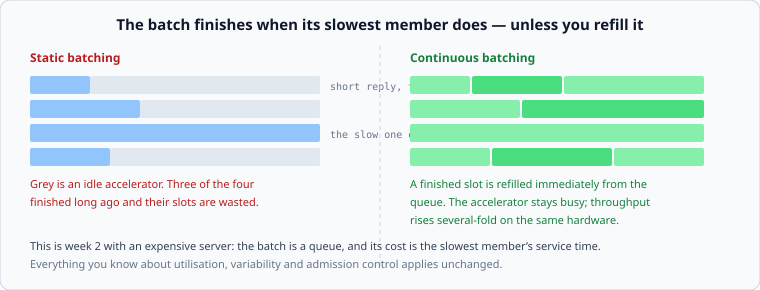

# Serving models, and serving media

*Week 10 · Day 4 · about 30 minutes*

> By the end of today you can size an inference service, and explain why a video
> platform's architecture is decided by its bandwidth bill.

---

## Read the primary sources first

| Source | Tier | What it gives you |
|---|---|---|
| [**Efficient Memory Management for LLM Serving with PagedAttention**](https://arxiv.org/abs/2309.06180) | 2 | The vLLM paper. Why serving is a memory-management problem, and what continuous batching buys |
| [**NVIDIA Triton Inference Server**](https://docs.nvidia.com/deeplearning/triton-inference-server/user-guide/docs/index.html) | 1 | Production serving documented by the vendor: dynamic batching, model instances, queue policy |
| [**OpenAI — Scaling PostgreSQL for 800 million users**](https://openai.com/index/scaling-postgresql/) | 1 | What is *around* the model. Notice how much of it is ordinary systems work |
| [**Netflix Open Connect**](https://openconnect.netflix.com/) | 1 | The other half of today: when bandwidth dominates everything else |

---

## Part one: serving a model

### The unit of work is unusual

An ordinary request has a roughly fixed cost. A generation request produces tokens one at a
time, and **you do not know how many until it stops**. So the service time is unknown at
admission and varies by two orders of magnitude between requests.

From week 2, that is an enormous coefficient of variation, and everything follows:

- **Latency has two numbers**, not one: time to the first token, and time between
  subsequent tokens. Users experience them completely differently, and an average of the
  two describes nothing
- **Queueing is severe** at high utilisation, because Kingman's variability term is large
- **Admission control cannot use "requests in flight"** — one request may be a hundred
  times another. Capacity is measured in tokens, not requests

### Batching, and why the naive version wastes most of the hardware

Accelerators are efficient on large batches and idle on small ones, so requests are
processed together.

**Static batching** collects N requests, runs them together, and returns when *all* are
done. The batch finishes when its slowest member does — so if one request generates 2,000
tokens and three generate 50, three slots sit idle for the rest of the batch.

**Continuous batching** refills a finished slot immediately from the queue. The
accelerator stays busy, and the throughput improvement on the same hardware is large — the
vLLM paper reports several-fold on their workloads.

Notice what that is: **the batch is a queue, and its cost is the slowest member's service
time.** Week 2, on expensive hardware. Everything you know about utilisation, variability
and admission control applies without modification, which is the useful thing to carry into
a design conversation about inference.

### Memory is the constraint

The other thing the vLLM paper is about. Serving keeps per-request state — the attention
key/value cache — proportional to the tokens generated so far. Reserve the maximum for
every request and most of the memory is unused; the paper's contribution is allocating it
in pages instead, which is virtual memory arriving in a new place.

The design consequence you need without the internals: **concurrency is bounded by memory,
not by compute**, and the bound moves as requests get longer. A capacity plan in requests is
wrong; a capacity plan in tokens is right.

### What goes in a design document

> Inference is served with continuous batching; capacity is planned in tokens per second
> rather than requests, and admission control is by queued token count. **Two latency
> objectives:** p99 time-to-first-token under 800 ms, and inter-token latency under 60 ms.
> Long generations are a separate priority class so a 4,000-token request cannot delay
> interactive ones. **Rejected: static batching** — three quarters of accelerator time
> would be idle at our length distribution.

---

## Part two: serving media

A different constraint entirely, and it inverts the usual economics.

For most systems, compute and storage dominate and bandwidth is a line item. For video,
**bandwidth is the bill** — large enough that the architecture is arranged around reducing
it, and everything else is secondary.

Three consequences, and each is visible in Netflix's Open Connect material:

**Deliver from as close to the user as possible.** Not for latency — for the cost of the
bytes crossing networks. Open Connect exists because putting appliances inside internet
service providers removes transit cost entirely.

**Encode once, serve many times.** Transcoding is expensive and happens once per title per
format; delivery happens millions of times. Spending far more on encoding to reduce the
bytes delivered is obviously correct at that ratio, and it is why per-title encoding
optimisation is worth doing at all.

**Popularity decides placement.** A small fraction of titles is most of the traffic, so
caches hold that fraction and everything else comes from further away — week 6's working
set, at a scale where it determines where physical hardware is installed.

### What goes in a design document

> Playback is served from edge appliances holding the top 5% of titles by predicted
> regional demand, refreshed nightly during off-peak hours. **The design is arranged around
> egress cost rather than latency**: 90% of bytes must be served from inside the viewer's
> ISP, and the placement algorithm optimises for that rather than for hit rate.

---

## The thing both halves have in common

An expensive, scarce resource — an accelerator, or a byte crossing a network — and an
architecture arranged around keeping it busy or avoiding it.

That is the general shape of a specialised system, and it is the question to ask when you
meet a domain you do not know: **what is the expensive thing here, and what is the design
doing to avoid spending it?** Answer that and most of the architecture explains itself.

---

## Today's lab

`week-10/day-4/serving.py`:

- `static_batch_utilisation(lengths)` and `continuous_batch_utilisation(lengths)` — the
  waste, computed on a skewed length distribution
- `tokens_per_second(batch_size, ms_per_token_step)` and `capacity_in_requests(...)` — why
  planning in requests is wrong
- `time_to_first_token(queue_tokens, throughput)` and the two-objective split
- `egress_cost(bytes_served, cost_per_gb, edge_fraction)` — the media half, where a
  percentage point of edge coverage is a large number

---

> **Sources for this article**
> [vLLM / PagedAttention](https://arxiv.org/abs/2309.06180) — **Tier 2** ·
> [NVIDIA Triton](https://docs.nvidia.com/deeplearning/triton-inference-server/user-guide/docs/index.html),
> [OpenAI](https://openai.com/index/scaling-postgresql/) and
> [Netflix Open Connect](https://openconnect.netflix.com/) — **Tier 1**. OpenAI's site
> refuses automated fetches, so that one is verified by hand.
> **Unknown:** how any large provider actually serves its own models. OpenAI publishes
> infrastructure posts and not architecture, so anything you read describing ChatGPT's
> serving stack is inference — which is a good final example of the week-1 lesson.
