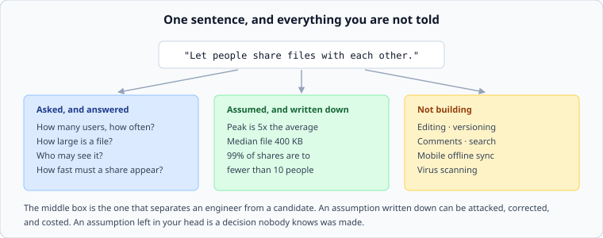

# Designing from one line

*Week 11 · Day 1 · about 25 minutes*

> By the end of this you can turn a sentence into a page of requirements, and you know
> which questions are worth the time and which are not.

---

## There is no primary source for this

The same admission as week 1, and for the same reason: this is craft, not specification.

What exists is evidence of how people who do it well behave, and the closest thing to a
primary source is [Amazon's working-backwards practice](https://aws.amazon.com/builders-library/)
— write the outcome first, then design towards it — which the Builders' Library reflects
throughout without ever naming as a method.

Everything below is **Tier 3**: ours, argued rather than cited, and you should treat it
that way.

---

## Every brief so far told you the scale

Ten weeks of briefs with a table of numbers in them. That was scaffolding, and this week it
is gone.

> **"Let people share files with each other."**

That is the whole brief for Project 3, and it is what a real one looks like. The numbers
exist — somebody knows them, or nobody does and they must be assumed — and getting them is
your job.



---

## Three kinds of unknown

Not all missing information is the same, and treating it as if it were is what makes
requirements-gathering feel endless.

**Load-bearing and knowable.** Somebody can tell you, and the answer changes the design.
*How many users? How large is a file? How fast must a share appear?* **Ask these.** They
are worth the interruption.

**Load-bearing and unknowable.** Nobody knows yet — it is a new product, or the honest
answer is "we will find out". *What is the peak-to-average ratio in year two?*
**Assume, write it down, and say what changes if you are wrong.** This is the category
that separates an engineer from a candidate, and it is almost always the largest.

**Not load-bearing.** The answer does not change anything you would build. *What colour is
the button? Which cloud?* **Do not ask.** Asking these is how a design conversation
consumes forty minutes and produces nothing, and it is a very common failure in interviews
because asking questions feels like progress.

The discipline is the sorting, not the asking.

---

## The questions that are usually load-bearing

A starting set, not a script. Recite these and you sound like somebody performing an
interview technique; use them to find the two or three that matter here and you sound like
somebody who has built something.

| | Why it moves the design |
|---|---|
| How many users, and how many active at once? | every number downstream |
| Reads or writes — which dominates, and by how much? | decides caching, fan-out, storage shape |
| How large is one item? | storage, bandwidth, whether it fits in memory |
| Is one entity far more popular than the rest? | the two-population question, five weeks running |
| How stale may a reader be? | decides replication, caching, consistency |
| What must never be lost? | usually a subset, and the subset is the interesting part |
| Who may see it? | often the hardest requirement in the whole system |
| What are we **not** building? | the one nobody asks, and the most useful |

That last row is worth ninety seconds and buys you the rest of the session.

---

## Write the assumptions where they can be attacked

An assumption in your head is a decision nobody knows was made. An assumption on the page
is a thing a colleague can correct, an interviewer can probe, and you can revisit when the
numbers arrive.

```
ASSUMED (not given):
- peak is 5x average                     ← if it is 20x, the queue tier triples
- median file 400 KB, p99 20 MB          ← if p99 is 2 GB, this is a different system
- 99% of shares reach fewer than 10 people  ← the fan-out design depends on this
```

Note the second column. **An assumption without a consequence is decoration.** The
sentence "if it is 20x, the queue tier triples" is what makes it a design artefact rather
than a disclaimer.

---

## When the answer is "it depends"

Sometimes a genuine fork appears: two plausible answers to a load-bearing question, and
nobody can settle it now.

The wrong response is to design for both. The right one is to **design for one, name the
fork, and say what the other would cost:**

> We assume files are shared with small groups (median 3, p99 12). **If the product turns
> out to be broadcast — one file shared with thousands — the fan-out design is wrong and
> the permission check moves from per-recipient to per-link.** That is a two-week change
> and we would want to know by month three.

An interviewer hearing that knows you have thought about the shape of the uncertainty,
which is more valuable than a design that covers every case and commits to nothing.

---

## How long to spend

In a 45-minute interview: **five to eight minutes.** Long enough to get the numbers that
move the design; short enough that you spend the rest designing.

The failure modes at each end are equally bad and one of them is much more common:

- **Too short** — you design for a scale nobody asked for, and the whole thing is answering
  the wrong question
- **Too long** — ten minutes of questions with no design is indistinguishable from not
  knowing how to design, and it is the more common failure by a wide margin

The transition is a sentence, and it is worth having ready: *"That is enough to work with.
I am going to assume X and Y, and I will flag it if a decision turns on either."*

---

## Today

Read [writing the document](../day-2/writing-the-document.md) as well, then start Project 3
with pass 1 only. Today's output is one page: requirements, envelope, assumptions with
consequences, and non-goals. No architecture.

Resist starting the design. The single most common failure in this milestone is a document
whose pass 1 was written after the boxes were drawn, and it is visible from across a room.

---

> **Sources for this article**
> **Tier 3 throughout — ours.** The closest primary evidence is the
> [AWS Builders' Library](https://aws.amazon.com/builders-library/) (Tier 1), which
> repeatedly demonstrates working backwards from an outcome without naming it as a method.
> The three-kinds-of-unknown taxonomy and the timing advice are arguments, not findings.
