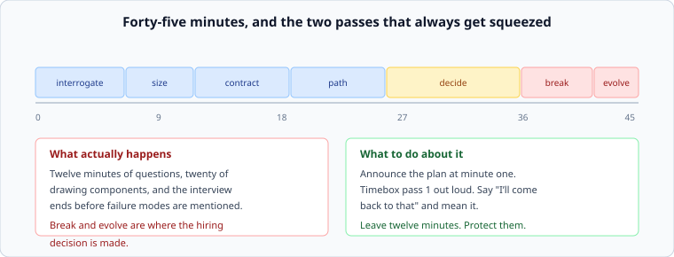

# The forty-five minutes

*Week 12 · Day 2 · about 25 minutes*

> By the end of this you can run all seven passes inside forty-five minutes, and protect
> the two that always get squeezed.

---

## The shape of the failure

Twelve minutes of questions. Twenty minutes drawing components. Then the interviewer says
"we're nearly out of time" and failure modes were never mentioned.

**Break and evolve are where the hiring decision is made**, and they are at the end, so
they are what gets cut. Every other failure in a design interview is downstream of this
one.

---

## A budget, announced out loud

The single most effective thing you can do in the first minute is say what you are going to
do:

> "I'll spend about five minutes on requirements and scale, then the data model and the
> main request paths, then the interesting decisions, and I want to leave ten minutes for
> failure modes. Stop me if you'd rather go somewhere else."

Three things happen. The interviewer knows you have a method. They can redirect you early
rather than at minute thirty. And **you have made the time budget a shared object** rather
than a private anxiety.

A working split:

| Minutes | Pass | If you are over |
|---|---|---|
| 0–6 | interrogate | assume, say so, move |
| 6–11 | size | one significant figure, out loud |
| 11–20 | contract and path | one read and one write. Not every endpoint |
| 20–33 | decide | this is the pass they are assessing |
| 33–42 | break | protect this |
| 42–45 | evolve | one sentence is enough |

---

## The sentences that buy you time

Interviews are lost by drifting, and drifting is recoverable with a phrase. Have these
ready:

**"I'll assume X — tell me if that's wrong."** Ends a question you cannot resolve, in four
seconds, without pretending you did not notice.

**"I'll come back to that."** Then actually do. It is the difference between deferring and
avoiding, and interviewers can tell.

**"That's a bigger question than we have time for — the short version is…"** For a rabbit
hole you can see the bottom of and do not need to visit.

**"Before I go further, is this the part you want?"** At minute twenty, when you are about
to spend ten minutes on something they may not care about. This one is worth more than the
others combined.

---

## Doing arithmetic out loud

The thing that most reliably separates a strong candidate, and it is a performance you can
rehearse:

> "Ten million daily users, three actions each — thirty million a day. Divided by roughly a
> hundred thousand seconds, call it three hundred a second. Peak at five times, so fifteen
> hundred. Each response about twenty kilobytes, so thirty megabytes a second out. So reads
> fit on a handful of machines and the interesting problem is somewhere else."

Sixty seconds. Note the last sentence: **the point of the arithmetic was to find out where
the difficulty is**, and saying so demonstrates that you know why you did it.

Round aggressively, say the rounding, and never apologise for it. "Call it a hundred
thousand seconds in a day" is correct behaviour, not sloppiness.

---

## When you do not know

You will be asked something you have not met. The good answer has three parts:

1. **Say so, once, without apologising.** "I haven't worked with that."
2. **Reason from what you do know.** "But it's a fan-out problem, and the question is
   whether the work happens at write time or read time — which depends on the read/write
   ratio."
3. **Say how you would find out.** "I'd look for whether anyone operating one has published
   how they do it, and I'd want to know the ratio before choosing."

That answer scores well. A confident invented answer scores badly and is easy to detect —
the interviewer knows the domain, and the pattern is unmistakable.

---

## What to draw, and when

Draw late. A diagram before the numbers is a diagram you will defend rather than derive.

When you do draw, draw the **request path** rather than the component inventory: a numbered
list of hops for one read and one write, and then the boxes if they help. A box no request
passes through should not be on the board — and if you find yourself drawing one, that is
information about your design.

---

## Today

Three timed designs, forty-five minutes each, on briefs you have not seen. Use
`ai/interviewer.md`, which will hold you to the clock and introduce a twist at minute
thirty.

Score each with `week-12/day-4/scoring.py`. Keep the scores — Friday compares your first to
your tenth, and that comparison is evidence rather than encouragement.

---

> **Sources for this article**
> **None. Ours.** The time budget is a teaching device that works; the phrases are ours;
> the arithmetic-out-loud advice follows from week 1. Treat published interview advice —
> including this — as Tier 3 at best.
